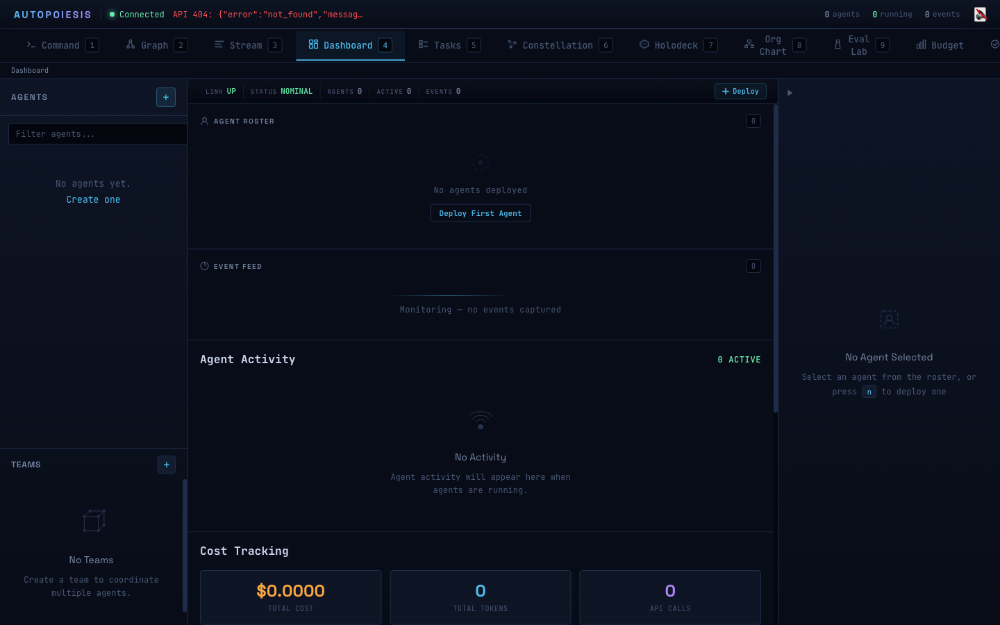
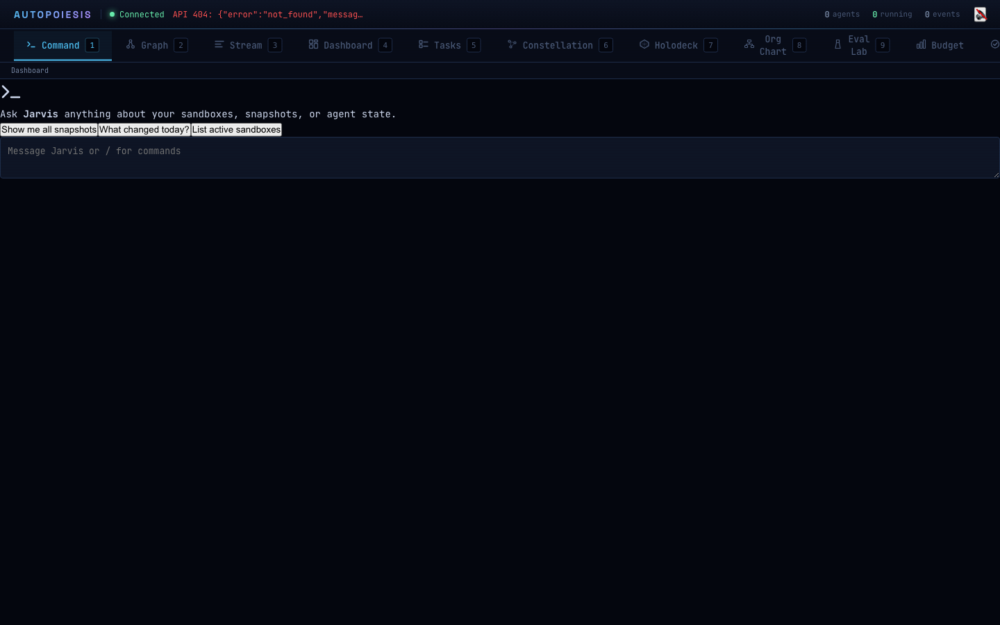
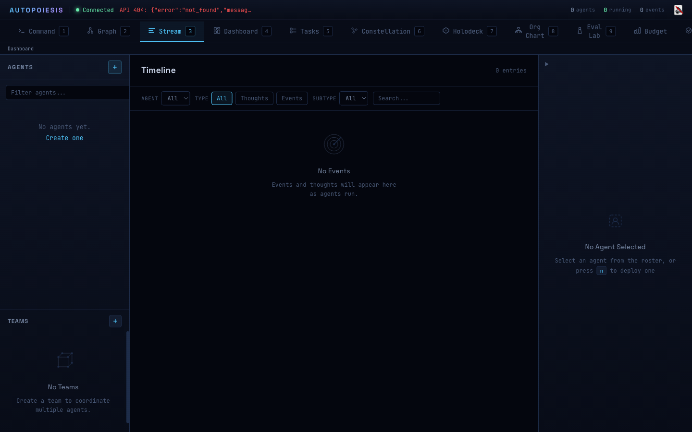
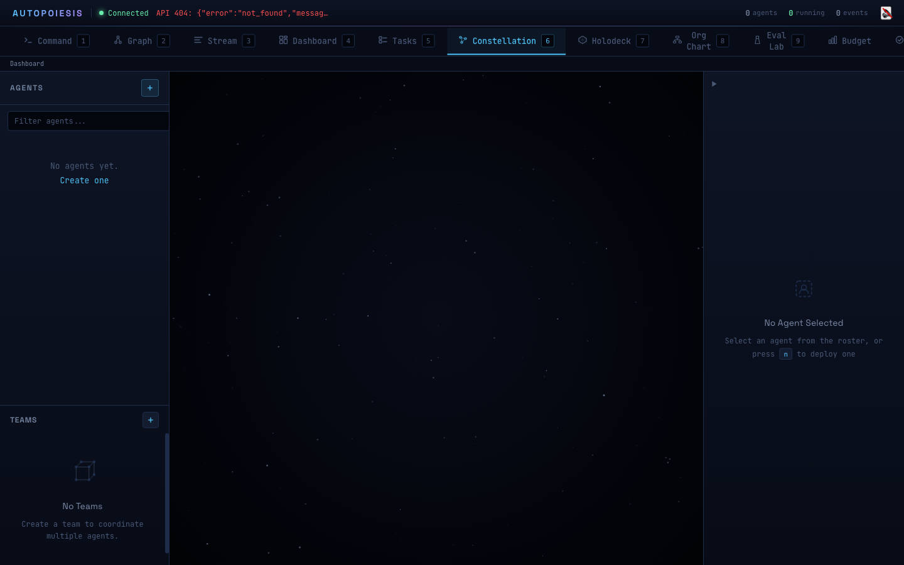

# Code That Rewrites Itself: Building Self-Modifying AI Agents with Autopoiesis

*Part 1 of 5 in a series on the Autopoiesis agent platform*

---

Here is something that bothers me about agent frameworks: you cannot look inside the agent.

You create an agent. You give it tools and a system prompt. It runs. Tokens go in, actions come out. If something goes wrong midway through a chain of ten tool calls, your debugging options are "add more logging" or "stare at the trace." You cannot pause the agent, inspect its internal state, fork it into two copies, and let one copy try a risky approach while the other stays safe. You cannot diff what the agent believed at step 4 versus step 7. You cannot serialize the agent's entire mind to a file and reload it tomorrow.

The reason is simple: in most frameworks, agent state is scattered across mutable Python objects, closure variables, and framework internals. It is opaque by design.

Autopoiesis takes a different approach. An agent's entire cognitive state -- thoughts, decisions, capabilities, memory, lineage -- is represented as plain data structures that you can read, write, serialize, diff, fork, and merge. Not as a bolted-on export feature. As the fundamental representation.

The trick that makes this work is an old one: homoiconicity. The word sounds academic, but the practical consequence is concrete. In a homoiconic language, the agent's thoughts are stored in the same format as the code that processes them. S-expressions. Lists. Data structures you can manipulate with the same tools you use to manipulate code. The agent's state *is* a program. The program *is* data. And that turns out to unlock a set of capabilities that are genuinely hard to build any other way.

---

> **Lisp in 60 Seconds**
>
> If you have never written Lisp, here is everything you need to follow the code in this post:
>
> ```lisp
> ;; Function calls use prefix notation:
> ;; (function arg1 arg2)  is like  function(arg1, arg2)
>
> ;; :keyword is a named constant (like an enum value or symbol)
> ;; '(1 2 3) is a literal list (like [1, 2, 3])
>
> ;; Define a function:
> ;; (defun greet (name) (format t "Hello ~A" name))
> ;;   is like: function greet(name) { printf("Hello %s", name) }
>
> ;; Local variable:
> ;; (let ((x 1)) body)  is like  let x = 1; body
>
> ;; Assignment:
> ;; (setf x 1) is like x = 1
>
> ;; Chained calls read inside-out:
> ;; (print (+ 1 2))  means  print(1 + 2)
>
> ;; Everything returns a value. There are no statements, only expressions.
> ;; defvar creates a global variable.
> ;; let* is like let, but each binding can see the previous ones.
> ```
>
> That is genuinely all you need. The parentheses stop being scary after about five minutes.

---

## The Homoiconic Advantage

Let me show you what this looks like in practice. Here is the actual API from the Autopoiesis demo:

```lisp
;; Create a persistent agent
(let* ((agent (make-persistent-agent
               :name "scout"
               :capabilities '(:search :analyze :report))))

  ;; The agent perceives something -- returns a NEW agent
  (let* ((after-perceive (persistent-perceive agent '(:input "analyze auth module")))
         (after-reason   (persistent-reason after-perceive)))

    ;; Check thought counts
    (pvec-length (persistent-agent-thoughts after-perceive))  ; => 1
    (pvec-length (persistent-agent-thoughts after-reason))    ; => 2

    ;; The original agent is UNCHANGED
    (pvec-length (persistent-agent-thoughts agent))           ; => 0
    ))
```

Read that carefully. `persistent-perceive` does not modify `agent`. It returns a brand new agent struct with the perception appended to its thought vector. The original agent still has zero thoughts. `persistent-reason` takes the post-perception agent and returns yet another new agent with a reasoning thought added. Every cognitive operation is a pure function from one agent state to the next.

This is not an implementation detail. It is the whole point.

Because the agent is an immutable struct backed by persistent data structures (more on those in a moment), you can hold references to any number of prior states simultaneously. The agent after perceiving is one value. The agent after reasoning is another. The original agent is a third. They all exist at the same time, and they share structure -- the underlying persistent vector of thoughts uses structural sharing so that "copying" an agent's thought history is O(1), not O(n).

### What the agent looks like as data

Every persistent agent can be serialized to a pure S-expression with a single function call:

```lisp
(persistent-agent-to-sexpr agent)
;; =>
;; (:persistent-agent
;;   :id           "a1b2c3d4-..."
;;   :name         "scout"
;;   :version      0
;;   :timestamp    3920481234
;;   :membrane     ()
;;   :genome       nil
;;   :thoughts     ()
;;   :capabilities (:search :analyze :report)
;;   :heuristics   nil
;;   :children     nil
;;   :parent-root  nil
;;   :metadata     ())
```

That is the agent's entire state. A nested list. You can write it to a file, send it over the network, store it in a database, diff it against another agent's state, or deserialize it back with `sexpr-to-persistent-agent`. Try doing that with a LangChain `AgentExecutor` or a CrewAI `Agent`.

### O(1) Forking

Because persistent data structures share structure, forking an agent is instantaneous regardless of how much state it has accumulated:

```lisp
;; Fork returns two values: the child and the updated parent
(multiple-value-bind (child updated-parent)
    (persistent-fork after-reason :name "scout-alpha")

  ;; The child shares the parent's thoughts -- same object in memory
  (eq (persistent-agent-thoughts child)
      (persistent-agent-thoughts after-reason))   ; => T

  ;; Parent now tracks the child in its lineage
  (persistent-agent-children updated-parent)       ; => ("child-uuid-...")

  ;; Child can evolve independently
  (let ((child2 (persistent-perceive child '(:input "found vulnerability"))))
    (pvec-length (persistent-agent-thoughts child2))      ; => 3 (inherited 2 + new 1)
    (pvec-length (persistent-agent-thoughts child))       ; => 2 (unchanged)
    (pvec-length (persistent-agent-thoughts after-reason)) ; => 2 (unchanged)
    ))
```

The fork operation creates a new agent struct that literally points to the same persistent vector of thoughts. No copying. When the child adds a new thought, only the child gets a new vector node; the parent's vector is untouched. This is the same technique that Git uses for its object store and that Clojure uses for its immutable collections.

This means you can fork an agent that has accumulated thousands of thoughts and the fork takes the same time as forking an agent with zero thoughts. You can maintain a forest of agent variants exploring different strategies without memory blowing up, because they all share the common prefix of their thought history.

---

## Architecture Overview

Autopoiesis is organized into three core layers, each building on the one below it:

```
                    +---------------------------+
                    |      Agent Layer           |
                    |  cognitive loop, learning  |
                    |  capabilities, spawning    |
                    +---------------------------+
                              |
                    +---------------------------+
                    |      Core Layer            |
                    |  persistent structs        |
                    |  (pmap, pvec, pset)        |
                    |  s-expr utilities          |
                    +---------------------------+
                              |
                    +---------------------------+
                    |    Substrate Layer          |
                    |  datom store (EAV triples) |
                    |  Linda coordination        |
                    |  LMDB persistence          |
                    +---------------------------+
```

**Substrate** is a datom store -- think of it as an embedded database that stores facts as Entity-Attribute-Value triples. "Agent scout has status running" becomes the datom `("scout" :agent/status :running)`. The substrate provides atomic transactions (`transact!`), queries, and Linda-style coordination (`take!`) for multi-agent claiming of work items.

**Core** provides the persistent data structures that make immutability practical. `pmap` (persistent map), `pvec` (persistent vector), and `pset` (persistent set) are thin wrappers around the `fset` library that give you O(log n) updates that return new structures while sharing memory with the old ones. The core also includes S-expression utilities for hashing, diffing, and patching arbitrary nested data.

**Agent** is where cognition lives. The cognitive loop follows a cycle: **perceive** (observe the environment) -> **reason** (analyze observations) -> **decide** (choose an action) -> **act** (execute) -> **reflect** (learn from the outcome). Each phase is a pure function that takes an agent and returns a new agent. The loop also includes capability registration, heuristic learning, and the extension compiler that lets agents write and safely load new code.

Beyond these three core layers, optional extensions provide orchestration (conductor tick loop, timer scheduling, event queues), team coordination (five multi-agent strategies), swarm evolution (genetic algorithms over agent genomes), and a natural language interface (Jarvis) for conversational control.

---

## Getting Started

### Prerequisites

You need [SBCL](http://www.sbcl.org/) (Steel Bank Common Lisp) with [Quicklisp](https://www.quicklisp.org/beta/) and [Bun](https://bun.sh/) for the web console. The fastest path uses [Tilt](https://tilt.dev/) for dev orchestration:

```bash
git clone https://github.com/pyrex41/autopoiesis && cd autopoiesis

# Start everything: backend + frontend
tilt up --port 14400

# Open the web console
open http://localhost:14403
```

Tilt brings up four services: the dev dashboard (14400), WebSocket API (14401), REST API (14402), and the SolidJS Command Center (14403).

### Creating your first agent via the REST API

```bash
curl -X POST http://localhost:14402/api/agents \
  -H "Content-Type: application/json" \
  -d '{"name": "scout", "capabilities": ["search", "analyze"]}'
```

Or from the REPL:

```lisp
(ql:quickload :autopoiesis)

(defvar *agent*
  (autopoiesis.agent:make-persistent-agent
    :name "scout"
    :capabilities '(:search :analyze :report)))

;; Run a full cognitive cycle
(defvar *after-cycle*
  (autopoiesis.agent:persistent-cognitive-cycle *agent* '(:input "hello world")))

;; The original is untouched; *after-cycle* has the full thought trace
```

### The Command Center

The web frontend is a SolidJS application with 15 views for managing agents at scale:


*The Command Center dashboard showing live agent status, thought streams, and lineage trees.*


*The conversational Jarvis interface for natural language agent control.*


*Real-time agent thoughts as they flow through the cognitive cycle.*


*Agent network visualization showing forked lineages and team relationships.*

The dashboard gives you a live view of your agent swarm: which agents are active, what they are thinking, how they are related. You can fork agents, inspect their thought history, compare two agent states side-by-side, and control everything through either the UI or the Jarvis natural language chat pane.

---

## What is Next

This post covered the foundational insight: representing agent state as immutable, serializable data structures unlocks capabilities that mutable-state frameworks cannot match. Forking, diffing, time-travel, safe self-modification -- they all fall out naturally when the agent's mind is plain data.

In the next post, we will look at how Autopoiesis orchestrates multiple agents working together, with five coordination strategies and a substrate-backed event queue that lets agents claim work atomically.

---

*This is Part 1 of a 5-part series on the Autopoiesis agent platform.*

- **Part 1: Code That Rewrites Itself** (you are here)
- [Part 2: Multi-Agent Orchestration](part-2.md)
- [Part 3: Git for Agent State](part-3.md)
- [Part 4: The Eval Lab](part-4.md)
- [Part 4b: Under the Hood — Shen Prolog](part-4b.md)
- [Part 5: Logic Meets Learning](part-5.md)

[GitHub Repository](https://github.com/pyrex41/autopoiesis) | [Documentation](https://github.com/pyrex41/autopoiesis/blob/main/packages/core/docs/QUICKSTART.md)
