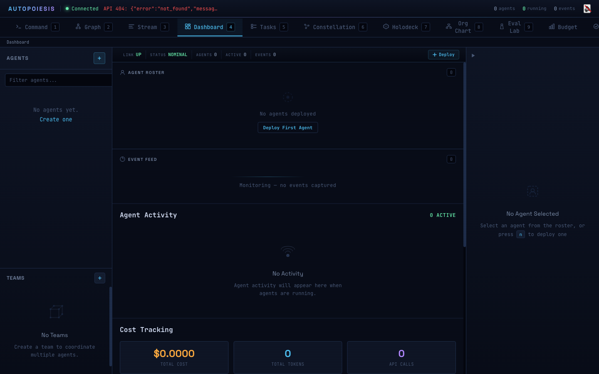
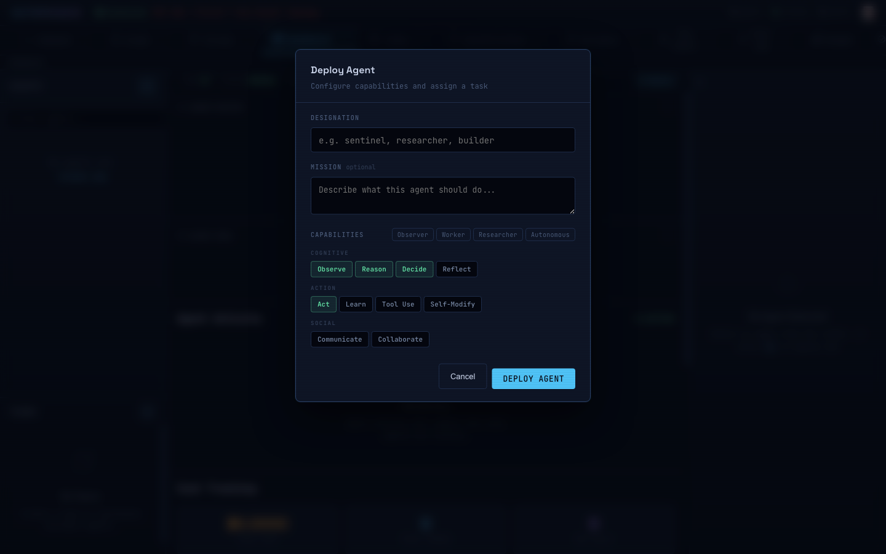
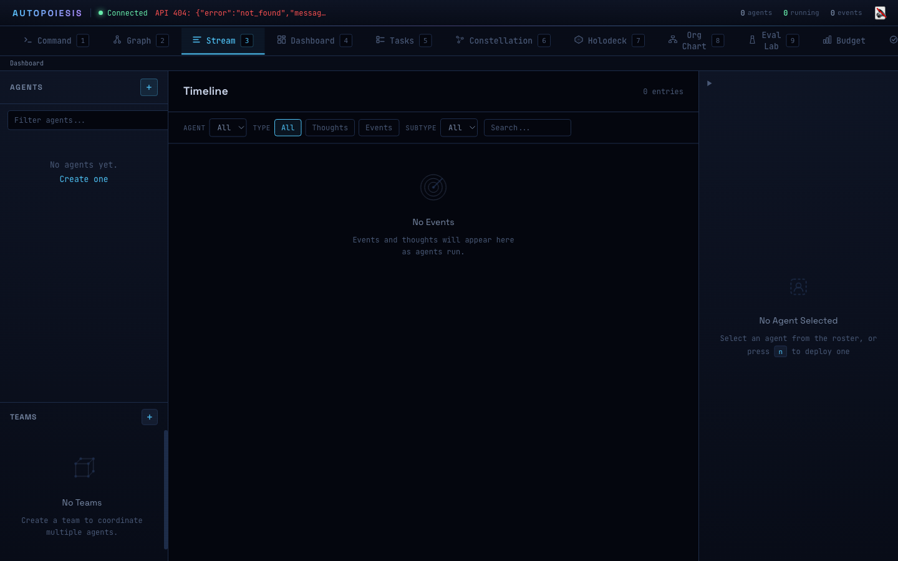
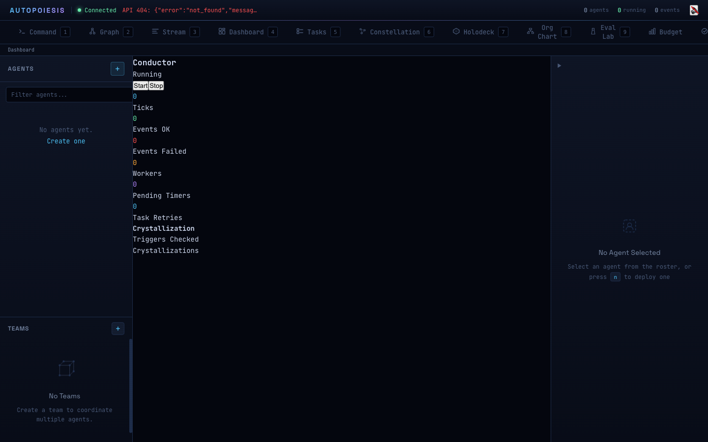

# Multi-Agent Orchestration in the Command Center

*Part 2 of 5 in the Autopoiesis series*

---

Most agent frameworks give you one agent at a time. You define a prompt, maybe wire up some tools, hit "run," and hope for the best. That works for simple tasks --- summarize this document, answer this question.

But interesting problems are not simple. A thorough code review needs a security perspective, a performance perspective, and a style perspective --- simultaneously. A research task benefits from multiple agents exploring different hypotheses in parallel, then synthesizing what they found. A complex deployment pipeline needs agents handing off work in stages.

If your framework treats multi-agent coordination as an afterthought --- or doesn't address it at all --- you end up building your own orchestration layer on top. And that layer is always brittle, always ad-hoc, always the part that breaks at 2am.

Autopoiesis treats multi-agent coordination as a first-class concern. Agents are immutable values. Teams are real objects with real coordination strategies. And the Command Center gives you a live view of everything that is happening. Let's walk through how it all works.

## The Cognitive Cycle: The Atom of Agent Computation

Before we talk about teams, you need to understand what a single agent actually *does* when it thinks. In Autopoiesis, every agent runs a five-phase cognitive cycle:

**Perceive** -- take in information from the environment.
**Reason** -- analyze recent observations and available heuristics.
**Decide** -- choose an action based on reasoning.
**Act** -- execute the chosen action (the one phase with side effects).
**Reflect** -- review what happened and assess the outcome.

Here is the actual implementation. This is not pseudocode:

```lisp
(defun persistent-cognitive-cycle (agent environment)
  "Run the perceive->reason->decide->act->reflect pipeline.
   Returns the final agent with all cycle thoughts appended.
   The original AGENT is never modified."
  (let* ((a1 (persistent-perceive agent environment))
         (a2 (persistent-reason a1))
         (a3 (persistent-decide a2))
         (decision-thought (pvec-last (persistent-agent-thoughts a3)))
         (action (getf (getf decision-thought :content) :action))
         (a4 (persistent-act a3 action))
         (a5 (persistent-reflect a4)))
    a5))
```

Notice the variable names: `a1`, `a2`, `a3`, `a4`, `a5`. Each phase returns a *new* agent. The original is never touched. This is not a stylistic choice --- it is the foundation that makes everything else possible. When agents are immutable values, you can fork them, diff them, snapshot them, and run multiple copies in parallel without locks or race conditions.

Each phase appends a typed thought to the agent's thought vector. A perception creates an `:observation` thought. Reasoning creates a `:reasoning` thought. And so on. The agent's thought stream is a complete, ordered log of everything it has ever experienced and decided. Think of it like an append-only event log, except the log *is* the agent.

```lisp
(defun persistent-perceive (agent environment)
  "Perceive ENVIRONMENT and record an observation thought.
   Returns a new agent with the observation appended to thoughts."
  (let* ((content (cond
                    ((listp environment) environment)
                    ((stringp environment) (list :raw environment))
                    (t (list :raw (princ-to-string environment)))))
         (thought (make-persistent-thought :observation content
                    :extra (list :source :environment)))
         (new-thoughts (pvec-push (persistent-agent-thoughts agent) thought)))
    (copy-persistent-agent agent :thoughts new-thoughts)))
```

The `pvec-push` call returns a new persistent vector with the thought appended. The old vector is untouched. The `copy-persistent-agent` call returns a new agent struct with the updated thoughts slot. The old agent is untouched. This is structural sharing --- the new vector shares all of its existing data with the old one, only allocating space for the new element.

## Creating Agents

You have three ways to bring an agent into existence.

**Through the Command Center UI.** The create dialog lets you name the agent, assign capabilities, and optionally attach it to a team. Point and click.


**Through the REST API.** If you are integrating Autopoiesis into an existing system:

```bash
curl -X POST http://localhost:8080/api/agents \
  -H "Content-Type: application/json" \
  -d '{"name": "security-reviewer", "capabilities": ["code", "security", "analyze"]}'
```

**Through Lisp directly.** If you are working at the REPL or building custom orchestration:

```lisp
(make-persistent-agent
  :name "security-reviewer"
  :capabilities '(:code :security :analyze))
```

The capabilities list is stored as a persistent set (`pset`). When the agent's cognitive cycle reaches the "act" phase, it checks whether the requested capability exists in its set before invoking it:

```lisp
(if (pset-contains-p (persistent-agent-capabilities agent)
                      capability-name)
    (invoke-capability capability-name args)
    (list :status :no-op :reason :capability-not-available))
```

Capabilities are not just labels --- they gate what the agent can actually do.



## Teams and Coordination Strategies

A single agent running its cognitive cycle is useful. Multiple agents coordinating on a shared goal is where things get interesting. Autopoiesis provides five coordination strategies out of the box, each implemented as a strategy object with a clean protocol:

```lisp
;; Create a strategy from a keyword
(make-strategy :parallel)
(make-strategy :leader-worker)
(make-strategy :pipeline)
(make-strategy :debate)
(make-strategy :consensus)
```

**Parallel.** Every agent receives the same task and works independently. Results are collected and either returned as a set, or the best one is selected. This is your "get three opinions" strategy. Good for code review, brainstorming, or any task where diverse perspectives add value.

```lisp
(defclass parallel-strategy ()
  ((selection-method :initarg :selection-method
                     :initform :all
                     :type (member :all :first :best)))
  (:documentation "All agents work the same task in parallel."))
```

**Leader-Worker.** One agent decomposes the task and delegates subtasks to workers. The leader collects results and synthesizes a final answer. This is your "tech lead with a team" pattern.

**Pipeline.** Output from one agent feeds as input to the next. Agent A writes code, agent B reviews it, agent C writes tests. Each stage transforms the work product.

**Debate.** Agents argue positions. A moderator (or voting mechanism) determines which argument prevails. Useful when you need adversarial reasoning --- red team / blue team, pro / con analysis.

**Consensus.** Agents propose, discuss, and converge. Unlike debate, the goal is agreement rather than winner-take-all. Good for design decisions where buy-in matters.

A team is a real object with lifecycle state, a member list, and an associated workspace:

```lisp
(defclass team ()
  ((id       :initarg :id       :initform (make-uuid))
   (strategy :initarg :strategy :initform nil)
   (leader   :initarg :leader   :initform nil)
   (members  :initarg :members  :initform nil)
   (status   :initarg :status   :initform :created
             :type (member :created :active :paused :completed :failed))
   (task     :initarg :task     :initform nil)
   (config   :initarg :config   :initform nil)))
```

Every strategy implements the same protocol: `strategy-initialize`, `strategy-assign-work`, `strategy-collect-results`, `strategy-handle-failure`, and `strategy-complete-p`. Swap out the strategy object and the team's coordination pattern changes completely. The agents do not need to know or care.



## The Command Center

The Command Center is a SolidJS frontend with 11 views, each showing a different facet of the running system. It connects to the platform over WebSocket for real-time updates and REST for queries.

**Dashboard.** System status at a glance --- active agents, running teams, event throughput, conductor health. This is your landing page.

**Constellation.** A force-directed graph of agents and teams. Agents cluster by team membership. Connections show communication patterns. You can see at a glance which agents are collaborating and which are isolated.

**Timeline.** A filterable, scrollable feed of every thought and event in the system. Filter by agent, by thought type, by time range. This is your debugging view --- when an agent makes a bad decision, scroll back through its reasoning to understand why.

**DAG Explorer.** The snapshot graph, visualized. More on this in Part 3, but briefly: every agent state is a node, parent-child relationships are edges, and you can color-code by branch, agent, depth, or time.

**Tasks.** Active work items, their assignments, and their status. See which teams are working on what, and how far along they are.

**Evolution Lab.** If you are using the swarm layer, this shows genome fitness over generations. Watch your agents get better at their jobs in real time.

And more --- org chart, budget tracking, approvals workflow, audit log. The Command Center is not a dashboard bolted onto the side. It is the primary interface for operating a multi-agent system.





## Why This Matters

The combination of immutable agents, typed coordination strategies, and a real-time operational UI gives you something that no prompt-chaining framework can: **legibility**. You can see what your agents are doing, why they are doing it, and how they are coordinating. When something goes wrong, you can trace the exact sequence of perceptions, reasoning, and decisions that led to the failure.

Multi-agent systems are not harder to build. They are harder to *understand*. Autopoiesis makes them understandable.

---

*Next in the series:*
- [Part 1: Why Lisp? The Homoiconic Advantage for Agent Systems](/blog/part-1)
- **Part 2: Multi-Agent Orchestration in the Command Center** (you are here)
- [Part 3: Git for Agent State: Snapshots, Branches, and Time Travel](/blog/part-3)
- [Part 4: Self-Extending Agents: When Code Writes Code](/blog/part-4)
- [Part 5: From Prototype to Production: Security, Monitoring, and Deployment](/blog/part-5)
