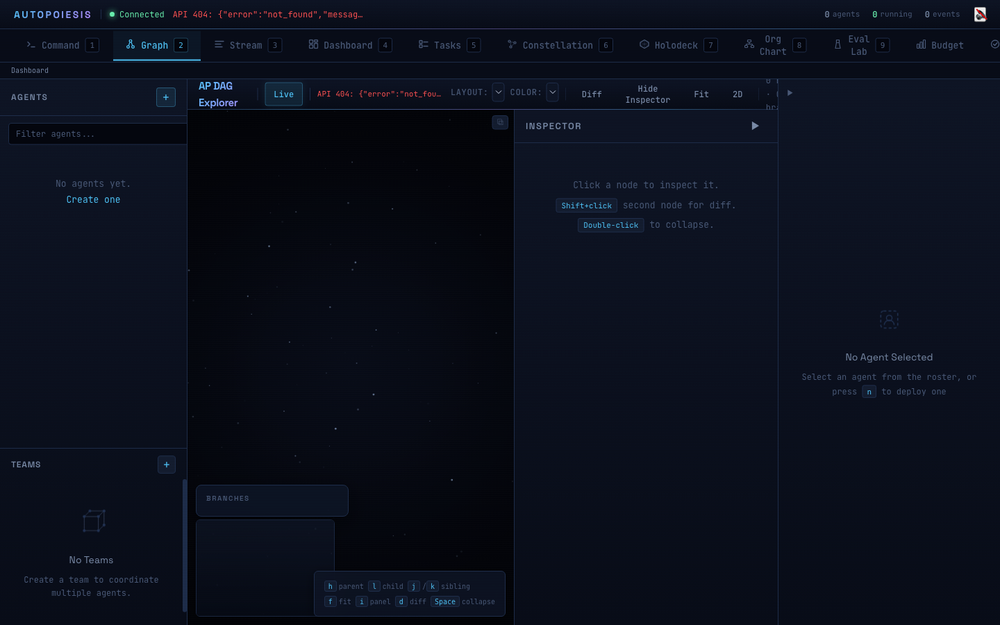

# Git for Agent State: Snapshots, Branches, and Time Travel

*Part 3 of 5 in the Autopoiesis series*

---

When your agent makes a bad decision, can you rewind? When you want to explore two different reasoning paths, can you branch? When something breaks in production, can you diff the agent's state before and after to understand what changed?

Most frameworks treat agent state as a black box. You get a final output. Maybe some logs. If you want to understand what happened inside, you are on your own.

Autopoiesis treats agent state like source code --- versioned, branched, and diffable. If you have ever used git, you already understand the mental model. A snapshot is a commit. A branch is a branch. A diff is a diff. Except instead of versioning files, you are versioning the complete cognitive state of an AI agent.

## The Snapshot Model

A snapshot captures the complete state of an agent at a point in time. Every slot --- thoughts, capabilities, heuristics, membrane, genome, metadata --- is serialized into an S-expression and stored.

```lisp
(defclass snapshot ()
  ((id          :initarg :id          :initform (make-uuid))
   (timestamp   :initarg :timestamp   :initform (get-precise-time))
   (parent      :initarg :parent      :initform nil)
   (agent-state :initarg :agent-state :initform nil)
   (hash        :initarg :hash        :initform nil)
   (metadata    :initarg :metadata    :initform nil)))
```

The `parent` slot is the key. It points to the previous snapshot's ID, forming a chain. When you branch, you get two snapshots pointing to the same parent. The result is a DAG --- a directed acyclic graph --- exactly like git's commit graph.

The `hash` slot enables content-addressable storage. It is computed from the agent state via SHA256:

```lisp
(defun make-snapshot (agent-state &key parent metadata tree-entries)
  "Create a new snapshot of AGENT-STATE."
  (let ((snap (make-instance 'snapshot
                             :agent-state agent-state
                             :parent parent
                             :metadata metadata
                             :tree-entries tree-entries)))
    (setf (snapshot-hash snap)
          (sexpr-hash agent-state))
    snap))
```

If two agents arrive at identical states through different paths, they produce the same hash. This is not just an optimization --- it tells you something meaningful. Convergent evolution in your agent population is detectable automatically.

## O(1) Forking: The Killer Feature

Here is the question that determines whether multi-agent architectures are practical or theoretical: **how expensive is it to create a new agent from an existing one?**

In most frameworks, you would deep-copy the agent's state. If the agent has accumulated a thousand thoughts, you copy a thousand thoughts. If it has a large memory store, you copy the entire store. This is O(n) in the size of the state, which means forking gets more expensive over time --- exactly when you want it most.

Autopoiesis forks agents in O(1). Constant time, regardless of how much state the agent has accumulated.

This works because every piece of agent state is stored in a persistent data structure. "Persistent" here does not mean "saved to disk" --- it means the data structure preserves all previous versions of itself when modified. The new version shares structure with the old version. Only the parts that actually change allocate new memory.

The platform wraps the `fset` library to provide three persistent collections:

```lisp
;; Persistent map: like a hash table that never mutates
(pmap-empty)              ; => empty map
(pmap-put map :key "val") ; => new map with :key added (old map unchanged)
(pmap-get map :key)       ; => "val"

;; Persistent vector: like an array that never mutates
(pvec-empty)              ; => empty vector
(pvec-push vec thought)   ; => new vector with thought appended (old vec unchanged)
(pvec-ref vec 0)          ; => first element

;; Persistent set: like a hash set that never mutates
(pset-empty)              ; => empty set
(pset-add set :analyze)   ; => new set with :analyze added (old set unchanged)
(pset-contains-p set :analyze) ; => T
```

Here is verified output from the persistent data structures demo:

```
m1 (empty): 0 entries
m4 (3 puts): 3 entries
m4[:name] = scout
m4[:role] = analyzer
m2 still has only 1: 1

v1 length: 0
v4 length: 3
v4[0] = thought-1
v4[2] = thought-3
v1 still empty: 0
```

Every "modification" returns a new collection. The old collection is completely untouched. Under the hood, these are tree structures where new versions share nodes with old versions --- only the path from the changed node to the root is copied.

Here is what a fork looks like:

```lisp
(defun persistent-fork (agent &key name)
  "O(1) fork of AGENT. Creates a child sharing all persistent data.
   Returns (values child updated-parent)."
  (let* ((child-id (make-uuid))
         (child (%make-persistent-agent
                  :id          child-id
                  :name        (or name
                                   (format nil "~a/fork" (persistent-agent-name agent)))
                  :version     0
                  :timestamp   (get-precise-time)
                  :membrane    (persistent-agent-membrane agent)
                  :genome      (persistent-agent-genome agent)
                  :thoughts    (persistent-agent-thoughts agent)
                  :capabilities (persistent-agent-capabilities agent)
                  ...)))
    ...))
```

Look at what happens with the `:thoughts` slot. It does not copy the thought vector. It points to the *same* persistent vector. The child agent and the parent agent literally share the same object in memory.

The demo script proves this. Here is the verified output from running the persistent agent demo:

```lisp
;; Fork an agent that has been through perceive and reason
(multiple-value-bind (child updated-parent)
    (persistent-fork after-reason :name "scout-alpha")

  ;; The child's thoughts are the SAME OBJECT as the parent's
  (eq (persistent-agent-thoughts child)
      (persistent-agent-thoughts after-reason))
  ;; => T
```

```
Forked child: scout-alpha
Thoughts shared (eq): T
Parent tracks child: T
```

In Common Lisp, `eq` means pointer equality --- same object in memory, not just equal values. The child did not get a copy of the parent's thoughts. It got the *actual same thoughts*. Zero allocation.

When the child later perceives something new, `pvec-push` creates a new vector that shares all existing elements with the original and adds the new one. The parent's thought vector is unaffected:

```lisp
(let ((child2 (persistent-perceive child '(:input "found vulnerability"))))
  ;; Child after work: 3 thoughts
  (pvec-length (persistent-agent-thoughts child2))
  ;; Original child: still 2 thoughts
  (pvec-length (persistent-agent-thoughts child))
  ;; Parent: still 2 thoughts
  (pvec-length (persistent-agent-thoughts after-reason)))
```

Verified output:

```
Child after work — thoughts: 3
Original child unchanged — thoughts: 2
Parent unchanged — thoughts: 2
```

Three agents, three different thought counts, but sharing the vast majority of their underlying data. This is analogous to git's copy-on-write for files --- a new branch does not duplicate the entire repository, just tracks what diverges.

## The DAG Explorer

The Command Center includes a visual DAG explorer for agent snapshots, built with the dagre layout algorithm on an HTML canvas. Every snapshot is a node, every parent-child relationship is an edge.


*The DAG explorer view. The structural sharing and forking demonstrated in the Lisp output above is the same data model this view renders -- snapshots as nodes, parent-child relationships as edges.*

The visualization supports five color schemes, selectable in real time:

- **Branch** -- each named branch gets a distinct color from the palette. You can immediately see which line of development a snapshot belongs to.
- **Agent** -- color by agent identity. When multiple agents contribute snapshots to the same DAG, you can see who did what.
- **Depth** -- color by distance from root. Deeper nodes are warmer. Useful for understanding how far an agent has evolved.
- **Time** -- color by timestamp. See the chronological progression of the system.
- **Mono** -- single accent color for clean structural views.

Selecting a node shows its metadata: agent name, timestamp, hash, branch membership. The inspector panel gives you the full serialized state if you want to dig in.

## Diffing Agent State

When you have two snapshots, the natural question is: what changed? Autopoiesis computes structural diffs over the serialized S-expression state:

```lisp
(defun snapshot-diff (old-snapshot new-snapshot)
  "Compute the diff between two snapshots.
   Returns a list of edit operations."
  (sexpr-diff
   (snapshot-agent-state old-snapshot)
   (snapshot-agent-state new-snapshot)))
```

The result is a list of edit operations --- additions, removals, modifications --- over the nested S-expression structure. You can also apply a diff to produce a new snapshot:

```lisp
(defun snapshot-patch (snapshot edits)
  "Apply EDITS to SNAPSHOT, creating a new snapshot."
  (let ((new-state (sexpr-patch
                    (snapshot-agent-state snapshot)
                    edits)))
    (make-snapshot new-state :parent (snapshot-id snapshot))))
```

For agents specifically, there is a higher-level diff function:

```lisp
(defun persistent-agent-diff (agent1 agent2)
  "Compute a structural diff between two persistent agents."
  (sexpr-diff (persistent-agent-to-sexpr agent1)
              (persistent-agent-to-sexpr agent2)))
```

This tells you exactly which thoughts were added, which capabilities changed, how the membrane evolved. When debugging a multi-agent system, this is invaluable. Instead of staring at log files trying to figure out why agent B started misbehaving after cycle 47, you diff cycle 46 and cycle 47 and see exactly what changed.

## Branching and Time Travel

Named branches work exactly like git branches. A branch is a pointer to a snapshot head:

```lisp
(defun create-branch (name &key from-snapshot)
  "Create a new branch."
  (let ((branch (make-branch name :head from-snapshot)))
    (setf (gethash name *branch-registry*) branch)
    branch))

(defun switch-branch (name)
  "Switch to branch NAME."
  (let ((branch (gethash name *branch-registry*)))
    (setf *current-branch* branch)
    branch))
```

The practical workflow looks like this. You have an agent that has been running for a while. You want to try a different approach without losing the current line of work:

```lisp
;; Snapshot current state
(let ((snap (make-snapshot (persistent-agent-to-sexpr agent)
                           :parent current-head)))

  ;; Create a branch for the experiment
  (create-branch "experiment/aggressive-pruning"
                 :from-snapshot (snapshot-id snap))

  ;; Fork the agent and let it try the new approach
  (multiple-value-bind (experimental-agent _)
      (persistent-fork agent :name "aggressive-pruner")

    ;; Run the experimental agent...
    ;; If it works, merge the branch
    ;; If it fails, switch back --- the original is untouched
    ))
```

You can list all branches with `list-branches`, check what you are currently on with `current-branch`, and navigate the full history by following parent pointers from any snapshot.

And there is merge. When two agents have diverged and you want to combine their learnings:

```lisp
(defun persistent-agent-merge (agent1 agent2)
  "Append-only merge of two agents.
   - Thoughts: concatenated (agent1 then agent2)
   - Capabilities: set union
   - Genome: latest-wins (by timestamp)
   - Membrane: latest-wins (by timestamp)
   - Heuristics: append deduplicated
   - Metadata: merged (latest-wins by timestamp)")
```

The merge strategy is conservative and predictable. Thoughts are concatenated, not interleaved --- you get a complete record from both agents. Capabilities are unioned --- the merged agent can do everything either parent could. For conflicting scalar values, the more recent timestamp wins. No surprises.

## Why This Matters

The "git for agent state" model solves three problems that every serious agent system eventually hits:

**Debugging.** When an agent does something unexpected, you need to understand the full causal chain. Snapshots give you that chain. Diffs show you exactly what changed between "working" and "broken."

**Experimentation.** You want to try a new prompt, a new heuristic, a new capability set --- without blowing up your production agent. Branches let you experiment freely. If the experiment fails, the original agent is right where you left it.

**Reproducibility.** Content-addressable hashing means you can verify that an agent's state is exactly what you think it is. Two agents with the same hash are provably identical. This matters for auditing, for compliance, and for your own sanity.

Agent systems are complex. Complexity without observability is chaos. Autopoiesis gives you the version control primitives to keep that complexity under control.

---

*All posts in this series:*
- [Part 1: Why Lisp? The Homoiconic Advantage for Agent Systems](/blog/part-1)
- [Part 2: Multi-Agent Orchestration in the Command Center](/blog/part-2)
- **Part 3: Git for Agent State: Snapshots, Branches, and Time Travel** (you are here)
- [Part 4: Self-Extending Agents: When Code Writes Code](/blog/part-4)
- [Part 5: From Prototype to Production: Security, Monitoring, and Deployment](/blog/part-5)
