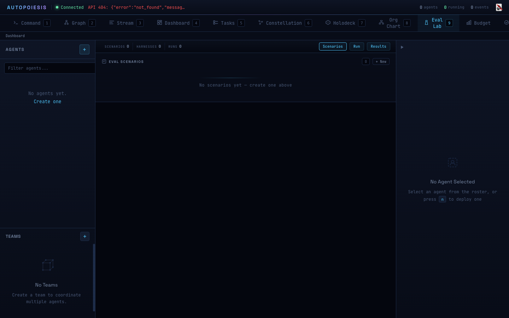

# The Eval Lab: Benchmarking Agents Like Software

*Part 4 of the Autopoiesis Series*

You wouldn't ship software without tests. You wouldn't deploy a web service without integration tests, load tests, and a CI pipeline that catches regressions before they reach production. So why do most teams ship agents based on vibes?

"It seems to work." "The output looks good." "I tried it a few times and it handled the edge case."

That is not engineering. That is hope.

The Eval Lab is our answer. It treats agent evaluation like software testing -- scenarios with defined inputs, verifiers with pass/fail criteria, repeated trials for statistical confidence, and comparison matrices that show you exactly which harness configuration performs best on which task. Not vibes. Metrics.

If you've ever stared at two LLM outputs and tried to decide which one is "better" by reading them, you already know why this matters. The Eval Lab replaces subjective comparison with structured, repeatable measurement.

## The Eval Architecture

The system has five core concepts. If you've used any testing framework, the mental model maps directly.

**Scenarios** define *what* to test. Each scenario has a prompt (the task you give the agent), a verifier (how to check if the output is correct), and an optional rubric (criteria for LLM-as-judge scoring). Scenarios are stored as substrate entities -- first-class data in the system, not config files sitting in a directory somewhere.

```lisp
(create-scenario
 :name "Binary Search"
 :description "Implement binary search on a sorted array"
 :prompt "Write a function called binary-search that takes a sorted array..."
 :domain :coding
 :tags '(:basic :algorithm :search)
 :verifier '(:type :contains :value "binary")
 :rubric "Evaluate for: correctness, O(log n) complexity, edge cases...")
```

**Harnesses** define *how* to run a scenario. A harness normalizes any execution shape -- a single provider invocation, an agentic loop (Ralph), a multi-agent team, a shell command, a sandboxed container -- into a uniform interface. You call `harness-run-scenario`, and you get back a result plist with `:output`, `:duration`, `:cost`, `:turns`, `:exit-code`, and `:passed`. Every harness speaks the same protocol.

**Trials** are repeated runs. You never run a scenario once. LLMs are stochastic -- the same prompt can produce different quality output each time. Run it three times, five times, ten times. The Eval Lab pre-creates all trial entities when you set up a run, then executes them sequentially or in parallel.

**Runs** are the matrix. A run combines N scenarios with M harnesses and T trials per combination. That gives you N x M x T total trials. The system pre-creates every trial entity, tracks progress as each one completes, and marks the run as `:complete` or `:failed` when it finishes.

**Metrics** are computed from the trial results. Hard metrics (pass rate, duration, cost, turns) come from the verifier and execution data. Squishy metrics (quality scores, dimensional ratings) come from the LLM-as-judge.

## 18 Built-In Benchmarks

The Eval Lab ships with 18 scenarios across six domains. You can use them out of the box or as templates for your own.

### Coding (7 scenarios)

The basics: FizzBuzz, Reverse String, Binary Search. These aren't meant to be hard -- they're calibration. If your agent can't nail FizzBuzz, you have a configuration problem, not a benchmark problem.

Data structures: Stack Implementation, Hash Map. These test whether the agent produces working, complete implementations with proper error handling.

File I/O: CSV Parser (handling quoted fields and escaped quotes), JSON Formatter (pretty-printing with correct indentation). Parsing tasks reveal whether an agent handles edge cases or just the happy path.

### Refactoring (2 scenarios)

Extract Method gives the agent a long `processOrder` function and asks it to break it into three well-named helpers. Add Error Handling gives it a fragile `initializeApp` and asks for comprehensive error handling covering file-not-found, invalid JSON, missing fields, and connection failures. These test structural understanding, not just code generation.

### Research (2 scenarios)

Compare Approaches asks for a microservices vs. monolith analysis for a specific use case (10K concurrent users, e-commerce). Summarize Technical Document asks for an explanation of the CAP theorem with concrete examples. Both test whether the agent produces balanced, specific analysis rather than generic filler.

### Tool Use (2 scenarios)

Git Workflow tests whether the agent knows the right commands and sequences them correctly. API Integration tests error handling, retry logic, and proper header management. These matter because agents that can't use tools reliably are agents that can't do real work.

### Reasoning (2 scenarios)

Debug Logic Error presents an `isPrime` function where the return values are swapped -- it returns `true` when it finds a divisor and `false` when it doesn't. The agent needs to identify the bug, explain *why* it's wrong, and provide the fix. Multi-Step Problem tests arithmetic reasoning with a "buy 2, get 1 free" promotion across five items at different prices.

### Sandbox (3 scenarios)

These are different. The prompts are actual shell commands: `mkdir -p src tests && echo 'def hello()...' > src/main.py`. The verifiers check the filesystem state *after* execution. Create Project Structure uses the `:file-exists` verifier. Refactor File Organization uses `:tree-matches` to check that specific paths exist in the resulting tree. Write Configuration File checks that `config.json` was created. These scenarios test agents that operate on real environments, not agents that produce text.

## Running an Eval

The Eval Lab ships with 18 built-in scenarios that load successfully. From the REPL, loading them is straightforward:

```lisp
(load-builtin-scenarios)
(list-scenarios)  ;; => 18 scenarios across 6 domains
```

To create and execute a run, the platform provides this API:

```lisp
;; Create a run: 5 coding scenarios x 2 harnesses x 3 trials = 30 trials
(create-eval-run
 :name "Claude vs GPT on Coding"
 :scenarios (list-scenarios :domain :coding)
 :harnesses '("claude-code" "gpt-4o")
 :trials 3)

;; Execute with parallel harness dispatch and LLM judging
(execute-eval-run run-id :parallel t :judge t)
```

Note: creating and executing eval runs requires the substrate store to be active (via `with-store`), since scenarios and trials are stored as substrate entities. The scenario definitions load and can be listed without the store, but running trials needs the full system context.

The REST API exposes the same flow: `POST /api/eval/runs` to create, `POST /api/eval/runs/:id/execute` to kick it off. Progress updates stream back via SSE events as each trial completes, so the Eval Lab UI can show real-time progress bars and fill in the results table as data arrives.

The `:on-trial-complete` callback fires after each trial, giving you a hook for logging, notifications, or streaming updates to a frontend. Every trial records its status (`:pending`, `:running`, `:complete`, `:failed`) as a substrate entity, so you can query progress at any time.

## LLM-as-Judge

Not everything has a deterministic verifier. "Is this a good refactoring?" isn't a yes/no question. That's where the LLM-as-judge comes in.

The judge receives a structured prompt containing the task description, the evaluation rubric, the expected output (if any), and the agent's actual output. It scores on a 1-10 scale across multiple dimensions -- correctness, completeness, code quality, whatever the rubric specifies -- and returns structured JSON:

```json
{
  "score": 8,
  "dimensions": {"correctness": 9, "completeness": 7, "code_quality": 8},
  "reasoning": "The implementation handles all core cases correctly..."
}
```

For subjective evaluations, one judge isn't enough. The `run-judge` function accepts a `:num-judges` parameter. Run three judges, five judges -- whatever gives you confidence. The system computes an agreement metric: `1.0 - (std_dev / 4.5)`. A standard deviation of 0 means perfect agreement (score = 1.0). A standard deviation of 4.5 (the theoretical maximum for a 1-10 scale) means complete disagreement (score = 0.0). If your judges can't agree, your rubric probably isn't specific enough.

Dimension scores are aggregated using medians, not means. Medians are robust to outlier judges. The reasoning strings from all judges are preserved so you can audit why they scored the way they did.

## Comparison Matrices

The real power shows up when you compare. `compare-harnesses` takes a run ID and produces a structured comparison:

- **Per-scenario breakdown**: For each scenario, see every harness's pass rate, average duration, average cost, and average judge score
- **Aggregate rollup**: Overall pass rate, total cost, average turns, and dimension scores for each harness

The ASCII formatter (`format-comparison-table`) gives you a quick terminal view:

```
Eval Run: Claude vs GPT on Coding

Harness                        Pass Rate  Avg Duration  Avg Cost   Turns    Score
------------------------------ ---------- ------------- ---------- -------- --------
claude-code                        86.7%        12.34s    0.0420$     3.2      7.8
gpt-4o                             73.3%         8.91s    0.0180$     2.1      6.5
```

For tracking improvement over time, `compute-normalized-gain` implements Hake's g -- a normalized gain metric from educational research. It measures what fraction of the *possible* improvement you actually achieved: `g = (pass_enhanced - pass_baseline) / (1.0 - pass_baseline)`. A gain of 0.7 means you captured 70% of the remaining room for improvement. This is more meaningful than raw pass-rate deltas because it accounts for how close you already were to perfect.

Cross-run comparison via `compare-runs` lets you track these metrics across versions of your agent, prompt changes, or model upgrades.



## Why This Matters

Every agent framework lets you build agents. Almost none of them help you measure whether your agents are actually good. You end up with a production agent that "usually works" and no way to quantify how a prompt change, model swap, or tool update affects performance.

The Eval Lab gives you the feedback loop. Define your scenarios once. Run them against every configuration change. Compare the results. Ship the one that actually performs better, and have the data to prove it.

Scenarios are substrate entities, so they participate in everything else the platform does -- snapshots, time-travel, replication. Your eval suite is versioned data, not files you hope stay in sync with your code.

In the next post, we'll look at how to ground agent reasoning in formal logic -- giving agents not just the ability to generate answers, but to *verify* them against rules that can't be hallucinated away.

---

*This is Part 4 of the Autopoiesis series.*

- [Part 1: Cognition as Data](/blog/part-1) -- S-expressions, homoiconicity, and why agent state should be code
- [Part 2: Orchestrating the Orchestra](/blog/part-2) -- Conductors, workers, and multi-agent coordination
- [Part 3: Time Travel for Agents](/blog/part-3) -- Snapshots, branching, and content-addressable agent state
- **Part 4: The Eval Lab** -- Benchmarking agents like software
- [Part 4b: Under the Hood — Shen Prolog](part-4b.md)
- [Part 5: Logic Meets Learning](/blog/part-5) -- Prolog-powered agent reasoning
- [Part 6: Specs That Compile Themselves](part-6.md)
