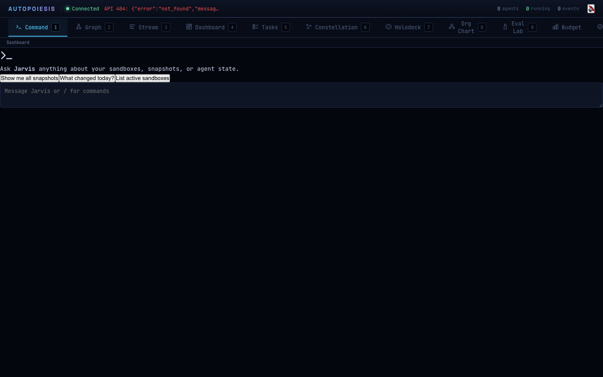

# Logic Meets Learning: Prolog-Powered Agent Reasoning

*Part 5 of the Autopoiesis Series*

LLMs are powerful pattern matchers. They've read the entire internet and can synthesize it into remarkably coherent responses. They're also confident liars. Ask an LLM whether a deployment is safe and it will give you a plausible-sounding answer every single time, even when the answer is wrong, even when the consequences of being wrong are severe.

Logic programs are the opposite. Prolog doesn't guess. It doesn't pattern-match from training data. It derives what the rules allow, and *nothing else*. If you haven't defined a rule that lets it conclude "this deployment is safe," it won't. There's no hallucination in logic programming -- just sound or unsound inference.

What if you could have both? An agent that uses an LLM for creative reasoning -- generating hypotheses, synthesizing information, writing code -- but falls back to formal logic for verification and safety constraints. The LLM proposes; Prolog disposes.

The Shen Prolog extension bridges this gap. It adds a logic programming layer to any Autopoiesis agent. Rules are defined as S-expression data that survive forking, time-travel, and serialization. The agent's cognitive cycle gains a Prolog-powered reasoning phase that augments (not replaces) its existing intelligence. And because rules are data -- not interpreter state -- they participate in everything the platform already does: structural sharing, snapshots, evolution.

## A 60-Second Prolog Primer

If you've never seen Prolog, here's the core idea. You define **facts** and **rules**, then ask **queries**.

A fact is a simple assertion: "Alice is Bob's parent." A rule derives new facts from existing ones: "X is Y's ancestor if X is Y's parent, or X is the parent of someone who is Y's ancestor." A query asks: "Is Alice an ancestor of Charlie?"

The runtime works backward from the query, trying to prove it by chaining rules together. If it finds a chain of facts and rules that proves the query, it succeeds. If it exhausts all possibilities without proving it, it fails. There's no "maybe," no confidence score -- just proved or not proved.

This makes Prolog perfect for verification. You define what "correct" means as rules, and then you ask whether a given situation satisfies those rules. The answer is deterministic and auditable.

## Rules as Data

In traditional Prolog, rules live in the interpreter's global state. You `assert` them and they exist until you `retract` them. This is fine for a standalone Prolog program, but it's terrible for an agent platform where you need rules to survive serialization, participate in forking, and travel through time with the rest of the agent's state.

Autopoiesis stores rules as S-expressions -- data that maps to Prolog predicates but lives in the platform's persistent data structures.

```lisp
(define-rule :member
  '((mem X [X | _] <--)
    (mem X [_ | Y] <-- (mem X Y))))
```

The `define-rule` function takes a keyword name and a list of clause S-expressions. The `<--` arrow separates the head (what the rule concludes) from the body (what it requires). This is standard Prolog notation, just written as S-expressions.

Under the hood, these clauses get compiled into Shen Prolog's `defprolog` form via `compile-rule-into-shen` and evaluated in the Shen runtime. But the source of truth is always the S-expression data in `*rule-store*`, not the compiled state in the interpreter.

Why does this matter? Three reasons:

**Forking.** When you fork an agent (O(1) via structural sharing -- see Part 3), the forked agent gets its own copy of the knowledge base. Rules are stored in the agent's metadata pmap, so forking is just a pointer copy. The child can add rules without affecting the parent.

**Serialization.** `rules-to-sexpr` dumps the entire rule store to a list of `(name . clauses)` pairs. `sexpr-to-rules` loads them back. No special serialization logic, no binary formats -- just S-expressions all the way down. Rules round-trip through snapshots, backups, and network transfer.

**Evolution.** In the swarm layer (covered in the architecture docs), agents undergo crossover and mutation. Because rules are data in persistent maps, the evolutionary operators can recombine rule sets from different agents without any special-case code. An agent that evolved a good set of safety rules can pass them to its descendants.

## The Reasoning Mixin

The integration point is a CLOS mixin class. If you want an agent with Prolog reasoning, you mix it in:

```lisp
(defclass prolog-agent (agent shen-reasoning-mixin) ())
```

That's it. The mixin adds a `knowledge-base` slot (a list of `(rule-name . clauses)` pairs) and specializes the `reason` generic function with an `:around` method.

Here's what happens during the cognitive cycle. When the platform calls `reason` on an agent that has the mixin, the `:around` method fires first. It loads the agent's knowledge base into Shen (`load-agent-knowledge`), queries each rule against the current observations, collects any derived facts, and appends them to the observations before calling the next method. The LLM-based reasoning then runs with *augmented* input -- it sees both the raw observations and whatever Prolog derived from them.

```lisp
;; The :around method (simplified from source)
(defmethod reason :around ((agent shen-reasoning-mixin) observations)
  (let* ((prolog-results (reason-with-prolog agent observations))
         (augmented (if prolog-results
                        (append observations
                                (list :prolog-derived prolog-results))
                        observations)))
    (call-next-method agent augmented)))
```

This is augmentation, not replacement. If Shen isn't loaded, the mixin is inert -- `reason-with-prolog` returns nil and the original observations pass through unchanged. If Shen is loaded but no rules match, same thing. The agent never breaks because of the Prolog layer; it only gets smarter when the rules have something to say.

Knowledge base management is straightforward:

```lisp
(let ((agent (make-instance 'prolog-agent :name "safety-checker")))
  ;; Add rules
  (add-knowledge agent :ancestor
    '((ancestor X Y) <-- (parent X Y))
    '((ancestor X Y) <-- (parent X Z) (ancestor Z Y)))

  ;; Rules persist with the agent
  (remove-knowledge agent :ancestor)
  (clear-knowledge agent))
```

Thread safety comes from `*shen-lock*` -- a global lock that serializes all Shen calls. Shen uses mutable global state internally, so this is non-negotiable. The lock is acquired in `load-agent-knowledge` before clearing and reloading rules, ensuring no cross-agent contamination even when multiple agents reason concurrently.

## Practical Example: Deployment Safety

Let's build something real. Suppose you have an agent that reviews code before deployment. The LLM is great at reading code and understanding intent, but you want hard constraints that can't be hallucinated away.

```lisp
(defclass deploy-agent (agent shen-reasoning-mixin) ())

(let ((agent (make-instance 'deploy-agent :name "deploy-checker")))
  ;; Rule: a module is deploy-safe if it's tested and all deps are tested
  (add-knowledge agent :deploy-safe
    '((deploy-safe Module) <-- (tested Module) (all-deps-tested Module)))

  ;; Rule: code quality requires specific files
  (add-knowledge agent :quality-check
    '((quality-check Tree) <--
      (has-file Tree "README.md")
      (has-file Tree "tests/")
      (has-file Tree "src/")))

  ;; Rule: deployment is approved only if both safety AND quality pass
  (add-knowledge agent :approved
    '((approved Module Tree) <--
      (deploy-safe Module)
      (quality-check Tree))))
```

When this agent runs its cognitive cycle, the reasoning phase queries each rule against the current observations. If the project tree doesn't have a `tests/` directory, the `quality-check` rule fails, the `approved` rule fails, and the agent's observations get augmented with that failure. The LLM-based reasoning layer then sees `:prolog-derived ((:derived :quality-check nil))` in its input and can explain *why* the deployment shouldn't proceed.

The key insight: the LLM can generate nuanced, context-specific explanations, but the *decision* about whether quality checks pass is deterministic. No amount of prompt engineering will make the agent approve a deployment that's missing its test directory. The rules are the rules.

For persistent agents, the knowledge base travels with the agent state. `save-knowledge-to-pmap` serializes the knowledge base into the agent's metadata pmap. `load-knowledge-from-pmap` restores it. When you fork an agent or restore from a snapshot, the rules come along automatically:

```lisp
;; Save knowledge to persistent storage
(save-knowledge-to-pmap agent)  ; returns updated metadata pmap

;; Later, restore from a pmap
(load-knowledge-from-pmap agent restored-pmap)
```

## Compositional Verification

The Shen package also adds two new verifier types to the Eval Lab (covered in Part 4): `:prolog-query` and `:prolog-check`.

**`:prolog-query`** verifies eval scenario output against a named rule in `*rule-store*`. You define rules that describe what "correct" looks like, then reference them from your eval scenarios:

```lisp
;; Define a rule for what a valid project structure looks like
(define-rule :valid-project
  '((valid-project Tree) <--
    (has-file Tree "src/main.py")
    (has-file Tree "README.md")
    (has-file Tree "tests/test_main.py")))

;; Use it in a scenario
(create-scenario
  :name "Project Scaffolding"
  :prompt "Create a Python project with src, tests, and a README"
  :verifier '(:type :prolog-query)
  :expected :valid-project)
```

When the eval harness runs this scenario, the verifier queries the `:valid-project` rule against the sandbox's after-tree. If all three files exist, it passes. If any are missing, it fails. The verification logic is declarative and composable -- you build complex checks from simple predicates.

**`:prolog-check`** uses inline check specifications rather than named rules. This is convenient for one-off checks:

```lisp
(create-scenario
  :name "Config File Creation"
  :prompt "Create a production config.json"
  :verifier '(:type :prolog-check)
  :expected '(:all
              (:files-exist ("config.json"))
              (:output-contains "done")))
```

The `:all` combinator requires every sub-check to pass. You can also use `:files-exist`, `:output-contains`, and `:file-count-above` as standalone checks.

Here's the clever part: **CL fallback**. When Shen isn't installed in the runtime, the verifiers don't just fail -- they inspect the Prolog clause structure and try to dispatch to native Common Lisp checks. The function `clauses-to-cl-check` recognizes patterns like `(has-file Tree "path")` and converts them to `(:files-exist ("path"))` specs that run without Shen. This means you can write eval scenarios using Prolog-style verification and they'll still work in environments where Shen isn't available. The logic degrades gracefully from formal Prolog to pattern-matched CL.




## The Series in Perspective

This is Part 5, and it's worth stepping back to see how the pieces fit together.

In [Part 1](/blog/part-1), we established the foundation: agent cognition represented as S-expressions, code-as-data and data-as-code. Every thought, observation, and decision is a data structure that can be inspected, transformed, and serialized.

In [Part 2](/blog/part-2), we showed how that foundation enables orchestration. When agent state is data, a conductor can manage multiple agents, route events, and coordinate workflows without reaching into opaque objects.

In [Part 3](/blog/part-3), we leveraged the data foundation for time-travel. Content-addressable snapshots, branching, and O(1) forking via structural sharing -- all possible because agent state is transparent, immutable data.

In [Part 4](/blog/part-4), we built the Eval Lab on top of all this. Scenarios, harnesses, trials, and comparison matrices that treat agent evaluation like software testing. Scenarios are substrate entities. Results are substrate entities. Everything is queryable, versionable data.

And now, in Part 5, we've added formal logic. Prolog rules stored as S-expression data in persistent maps. Rules that survive forking, serialization, and evolution. A reasoning mixin that augments (not replaces) LLM intelligence with deterministic, auditable inference. Eval verifiers that express correctness as logic programs.

Each capability builds on the homoiconic foundation. None of this is possible when agent state is opaque objects in memory, when configuration lives in YAML files, when the runtime can't inspect its own cognition. The S-expression substrate makes every layer composable with every other layer -- not through special-purpose integration code, but because everything speaks the same language: data.

That's the thesis of Autopoiesis. Agents aren't black boxes. They're programs that can read, write, and reason about themselves. And when you build on that foundation, capabilities like eval, time-travel, and logic verification aren't bolt-on features -- they're natural consequences of the architecture.

The code is on [GitHub](https://github.com/pyrex41/autopoiesis). Contributions welcome.

---

*This is Part 5 of the Autopoiesis series.*

- [Part 1: Cognition as Data](/blog/part-1) -- S-expressions, homoiconicity, and why agent state should be code
- [Part 2: Orchestrating the Orchestra](/blog/part-2) -- Conductors, workers, and multi-agent coordination
- [Part 3: Time Travel for Agents](/blog/part-3) -- Snapshots, branching, and content-addressable agent state
- [Part 4: The Eval Lab](/blog/part-4) -- Benchmarking agents like software
- [Part 4b: Under the Hood — Shen Prolog](part-4b.md)
- **Part 5: Logic Meets Learning** -- Prolog-powered agent reasoning
