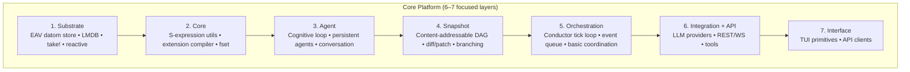
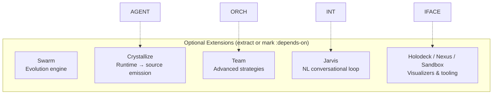

# Autopoiesis Architecture Layers

## Overview

Autopoiesis adopts a three-layer mental model to reduce cognitive load while preserving all functionality. The platform is organized into **6-7 focused core layers** that represent the unique homoiconic agent substrate, with additional powerful capabilities available as optional extensions.

## Core Platform (6–7 focused layers)

The core platform provides the essential building blocks for self-configuring agents with time-travel debugging, homoiconic cognition, and safe runtime extension.



### 1. Substrate Layer
**Foundation:** EAV datom store with Linda coordination (take!), reactive hooks, and LMDB persistence.

- **Datom store:** EAV triples with monotonic transaction stamping
- **Linda coordination:** Atomic `take!` for safe concurrent state transitions
- **Reactive dispatch:** `defsystem` macro with topological ordering
- **Interning:** Symbolic name → compact integer mapping
- **Persistence:** Optional LMDB backend for crash-safe storage

### 2. Core Layer
**Homoiconic foundation:** S-expression utilities, cognitive primitives, and safe extension compiler.

- **Structural operations:** S-expression diff/patch/hash with SHA-256
- **Cognitive primitives:** Five CLOS classes (Observation, Decision, Action, Reflection, Thought)
- **Persistent structures:** FSet wrappers (pmap, pvec, pset) with structural sharing
- **Extension compiler:** Sandboxed code generation with forbidden-symbol validation
- **Error recovery:** Condition/restart system with graceful degradation

### 3. Agent Layer
**Cognitive engine:** Five-phase cognitive loop with persistent agents and conversation.

- **Cognitive cycle:** perceive → reason → decide → act → reflect
- **Capabilities:** `defcapability` macro with parameter specs and permissions
- **Persistent agents:** O(1) forking via structural sharing, immutable cognition
- **Learning:** n-gram analysis, heuristic generation with confidence decay
- **Conversation:** Turn DAG with content-addressed blobs, O(1) context forking

### 4. Snapshot Layer
**Time-travel debugging:** Content-addressable DAG with branching and structural diffing.

- **DAG persistence:** SHA-256 structural hashing for deduplication
- **Branches:** Lightweight named pointers into immutable history
- **Diff/patch:** S-expression edit operations with path navigation
- **Time-travel:** Common ancestor finding, DAG traversal, lazy loading
- **Consistency:** Six-check verification with automatic repair

### 5. Orchestration Layer
**Coordination:** Conductor tick loop with substrate-backed event queue and worker management.

- **Conductor:** 100ms heartbeat with timer heap and scheduled actions
- **Event queue:** Substrate-backed with atomic claiming via `take!`
- **Workers:** Thread-safe management as substrate entities
- **CLI subprocess:** Streaming JSON parsing with timeout and backoff
- **Webhooks:** HTTP endpoint for external event injection

### 6. Integration + API Layer
**Connectivity:** Multi-provider LLM support, REST/WebSocket APIs, and tool mapping.

- **Providers:** Direct API (Anthropic, OpenAI) and CLI subprocess (Claude Code)
- **Tool mapping:** Bidirectional kebab-case ↔ snake_case conversion
- **MCP integration:** JSON-RPC 2.0 over stdio with tool discovery
- **API server:** REST (Hunchentoot), WebSocket (Clack/Woo), SSE
- **Serialization:** JSON and MessagePack with type safety

### 7. Interface Layer
**Human interaction:** Terminal UI primitives and API clients for operator control.

- **CLI session:** Blocking requests with condition variables
- **Navigator:** History stack and viewport management
- **2D visualization:** ANSI terminal timeline with hjkl navigation
- **Human override:** Approve/reject agent decisions with commentary
- **API clients:** Go SDK and apcli command-line tool

## Optional Extensions

These powerful capabilities extend the core platform for specific use cases but are not required for the fundamental homoiconic agent experience.



### Swarm Layer
**Evolutionary optimization:** Genome-based evolution of agent configurations.

- **Genomes:** S-expression encoding of capabilities and parameters
- **Evolution:** Crossover, mutation, tournament/roulette selection
- **Fitness:** Thought diversity, capability breadth, genome efficiency
- **Persistent integration:** Extract genomes, evolve, patch back

### Crystallize Layer
**Runtime persistence:** Emit learned capabilities and heuristics as source code.

- **Capability emission:** Runtime capabilities → Lisp source files
- **Heuristic crystallization:** Learned patterns → declarative rules
- **Genome export:** Evolved configurations → versioned artifacts
- **Git integration:** Export to version-controlled repositories

### Team Layer
**Multi-agent coordination:** Five strategies for collaborative agent work.

- **Strategies:** Leader-worker, parallel, pipeline, debate, consensus
- **Workspace:** Shared memory via substrate datoms
- **Task assignment:** Atomic claiming via Linda `take!`
- **Synchronization:** CV-based await, no polling

### Jarvis Layer
**Conversational interface:** NL→tool dispatch with human-in-the-loop.

- **Conversational loop:** Pi RPC provider integration
- **Tool invocation:** Natural language → capability execution
- **Supervisor integration:** Checkpoints and risk assessment
- **Human approval:** Blocking input for high-risk operations

### Holodeck / Nexus / Sandbox
**Visualization and isolation:** 3D ECS visualization, TUI cockpit, and container sandboxing.

- **Holodeck:** Bevy/Rust 3D visualization with ECS components
- **Nexus:** Ratatui TUI cockpit with WebSocket connectivity
- **Sandbox:** Squashd container integration for isolated execution

## Implementation Status

| Layer | Status | ASDF System |
|-------|--------|-------------|
| **Core Layers** | | |
| Substrate | Complete | `autopoiesis` |
| Core | Complete | `autopoiesis` |
| Agent | Complete | `autopoiesis` |
| Snapshot | Complete | `autopoiesis` |
| Orchestration | Complete | `autopoiesis` |
| Integration + API | Complete | `autopoiesis/api` |
| Interface | Complete | `autopoiesis` |
| **Optional Extensions** | | |
| Swarm | Complete | `autopoiesis` |
| Crystallize | Complete | `autopoiesis` |
| Team | Complete | `autopoiesis` |
| Jarvis | Complete | `autopoiesis` |
| Holodeck | Complete | `autopoiesis/holodeck` |
| Nexus | Complete | Separate Rust system |
| Sandbox | Complete | `autopoiesis/sandbox` |

## Dependencies and Build

Core layers depend only on essential libraries (FSet, Bordeaux Threads, Ironclad, etc.). Optional extensions can be loaded independently:

```lisp
;; Core platform only
(ql:quickload :autopoiesis/api)  ; Includes all core + API

;; With optional extensions
(ql:quickload :autopoiesis/holodeck)  ; + 3D visualization
(ql:quickload :autopoiesis/sandbox)   ; + container sandboxing
```

## Design Principles

- **Homoiconic foundation:** Everything is S-expressions — cognition, state, code, history
- **Structural operations:** Generic diff/patch/hash work across all data types
- **Content-addressable:** Deduplication and integrity through SHA-256 structural hashing
- **Immutable by default:** Persistent structures with O(1) forking
- **Linda coordination:** Atomic state transitions without external locking
- **Self-extension:** Sandboxed compilation of agent-written code
- **Time-travel debugging:** Branch, fork, and diff agent timelines
- **Optional complexity:** Core provides the unique value; extensions add power