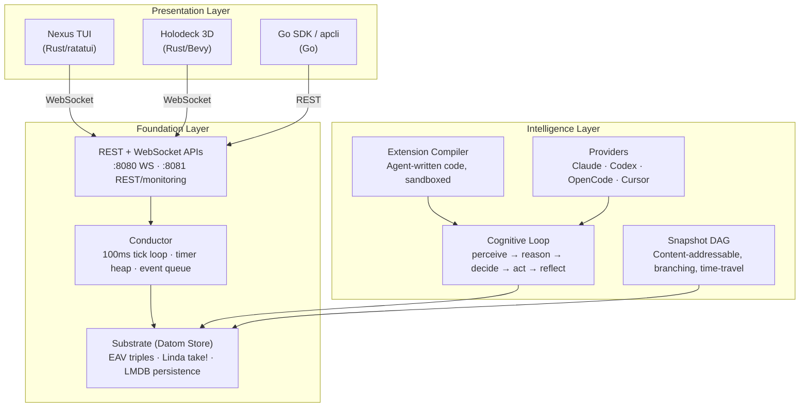

# Autopoiesis Quickstart (v2026)

A self-configuring agent platform where cognition is code and code is cognition. Built on Common Lisp's homoiconic foundation — agents can inspect, modify, and extend their own behavior at runtime.

**What you'll have running in 5 minutes:** A conductor orchestrating multiple agents, a terminal cockpit showing live thought streams, and (optionally) a 3D holodeck visualization.

---

## 1. One-Command Local Setup (5 minutes)

### Path A: Docker Compose (recommended)

```bash
git clone https://github.com/pyrex41/autopoiesis.git && cd autopoiesis

# Start the backend (REPL + HTTP server)
cd platform && docker-compose up -d

# Verify it's running
curl -s http://localhost:8081/healthz | python3 -m json.tool
```

The compose file starts two services:

| Service | Port | Purpose |
|---------|------|---------|
| `autopoiesis` | — | Interactive SBCL REPL (attach with `docker attach autopoiesis`) |
| `autopoiesis-server` | 8080, 8081 | WebSocket API + REST/monitoring endpoints |

Set your API key for Claude integration:

```bash
# In platform/docker-compose.yml or via env
export ANTHROPIC_API_KEY=sk-ant-...
docker-compose up -d
```

### Path B: Native Install (SBCL + Quicklisp + Rust)

**Prerequisites:** SBCL 2.4+, Quicklisp, Rust 1.75+ (for Nexus/Holodeck).

```bash
# 1. Install SBCL (macOS)
brew install sbcl

# 1. Install SBCL (Debian/Ubuntu)
# apt-get install sbcl

# 2. Install Quicklisp (if not already present)
curl -O https://beta.quicklisp.org/quicklisp.lisp
sbcl --load quicklisp.lisp --eval '(quicklisp-quickstart:install)' --eval '(ql:add-to-init-file)' --quit

# 3. Build the Lisp platform
./platform/scripts/build.sh

# 4. Run tests (2,775+ assertions across 14 suites)
./platform/scripts/test.sh

# 5. Build the Nexus TUI cockpit
cd nexus && cargo build --release

# 6. Build the 3D Holodeck (optional, requires GPU)
cd holodeck && cargo build --release
```

### One-Liner: Start Everything

```bash
# Terminal 1: Start the Lisp backend with conductor + REST + WebSocket
sbcl --load ~/quicklisp/setup.lisp --eval '
  (push #P"platform/" asdf:*central-registry*)
  (ql:quickload :autopoiesis/api :silent t)
  (autopoiesis.substrate:with-store ()
    (autopoiesis.orchestration:start-system :monitoring-port 8081)
    (autopoiesis.api:start-api-server)
    (format t "~&Ready. REST on :8081, WebSocket on :8080~%")
    (loop (sleep 60)))'

# Terminal 2: Launch the Nexus TUI cockpit
./nexus/target/release/nexus

# Terminal 3 (optional): Launch the 3D Holodeck
./holodeck/target/release/holodeck
```

> **Pro Tip:** The Nexus TUI auto-connects to `ws://localhost:8080/ws`. Override with `--ws-url` or create `~/.nexus/nexus.toml`:
> ```toml
> [connection]
> ws_url = "ws://localhost:8080/ws"
> rest_url = "http://localhost:8081"
> ```

---

## 2. Running Your First Agent Swarm

Open an SBCL REPL with the system loaded (or attach to the Docker container with `docker attach autopoiesis`):

```lisp
;; Load the system
(ql:quickload :autopoiesis :silent t)

;; Open a substrate store (in-memory by default)
(autopoiesis.substrate:with-store ()

  ;; Start the conductor (100ms tick loop in background thread)
  (autopoiesis.orchestration:start-system)

  ;; Create three collaborating agents
  (let* ((lead (autopoiesis.agent:make-agent
                :name "architect"
                :capabilities '(:planning :code-review)))
         (coder (autopoiesis.agent:spawn-agent lead
                 :name "coder"
                 :capabilities '(:code-generation :testing)))
         (reviewer (autopoiesis.agent:spawn-agent lead
                    :name "reviewer"
                    :capabilities '(:code-review :security-audit))))

    ;; Start all three agents
    (autopoiesis.agent:start-agent lead)
    (autopoiesis.agent:start-agent coder)
    (autopoiesis.agent:start-agent reviewer)

    ;; Run a cognitive cycle on each agent
    ;; Each cycle: perceive -> reason -> decide -> act -> reflect
    (autopoiesis.agent:cognitive-cycle lead
      '(:task "Design a REST endpoint for user profiles"))
    (autopoiesis.agent:cognitive-cycle coder
      '(:task "Implement the endpoint per architect's plan"))
    (autopoiesis.agent:cognitive-cycle reviewer
      '(:task "Review the implementation for security issues"))

    ;; Check thought streams
    (format t "Architect thoughts: ~a~%"
      (autopoiesis.core:stream-length
        (autopoiesis.agent:agent-thought-stream lead)))

    ;; Take a snapshot of the entire system state
    (let ((snap (autopoiesis.snapshot:make-snapshot
                 :metadata '(:label "after-first-swarm"))))
      (format t "Snapshot: ~a~%" (autopoiesis.snapshot:snapshot-id snap))))

  ;; Clean shutdown
  (autopoiesis.orchestration:stop-system))
```

If the Nexus TUI is running, you'll see these agents appear in the left panel with their thought streams updating in real time.

### Using CLI Providers for Real LLM Integration

For agents backed by actual LLM providers (Claude, Codex, OpenCode, Cursor):

```lisp
;; Register a Claude Code provider
(let ((claude (autopoiesis.integration:make-claude-code-provider
               :name "claude"
               :default-model "claude-sonnet-4-20250514"
               :skip-permissions t)))
  (autopoiesis.integration:register-provider claude))

;; Create a provider-backed agent
(let ((agent (autopoiesis.integration:make-provider-backed-agent
              :name "claude-dev"
              :provider (autopoiesis.integration:find-provider "claude")
              :system-prompt "You are a senior Common Lisp developer.")))
  ;; Invoke a one-shot task
  (autopoiesis.integration:provider-agent-prompt agent
    "Write a function that computes the Fibonacci sequence using memoization."))
```

---

## 3. Opening the Nexus TUI Cockpit + Holodeck

### Launching the Cockpit

```bash
# Default: connects to ws://localhost:8080/ws
nexus

# Offline demo mode (no backend needed)
nexus --offline

# Custom backend
nexus --ws-url ws://myhost:9090/ws --rest-url http://myhost:9091
```

### Layout Modes

Cycle layouts with `Space l`:

| Mode | Description | Best For |
|------|-------------|----------|
| **Cockpit** (default) | Agent list (20%) + detail/thoughts (50%) + secondary panel (30%) | Multi-agent monitoring |
| **Focused** | Full-width single agent with expanded thought stream + chat | Deep-diving one agent |
| **Monitor** | 4 equal columns showing agents side-by-side | Dashboard view |

### Leader-Key Shortcuts

The leader key is **Space**. Press it, then the next key(s):

| Sequence | Action |
|----------|--------|
| `Space l` | Cycle layout (Cockpit -> Focused -> Monitor) |
| `Space h` | Toggle help overlay |
| `Space d` | Toggle Holodeck viewport |
| `Space v` | Cycle voice mode (Off -> Push-to-Talk -> Voice Activated) |
| `Space a c` | Create new agent |
| `Space a s` | Start selected agent |
| `Space a p` | Pause selected agent |
| `Space a x` | Stop selected agent |
| `Space a t` | Step one cognitive cycle |
| `Space a i` | Inject thought into agent |

**Global shortcuts (no leader key):**

| Key | Action |
|-----|--------|
| `Tab` / `Shift+Tab` | Cycle focus between panes |
| `j` / `k` | Navigate lists (vim-style) |
| `?` | Toggle help overlay |
| `:` | Enter command mode |
| `Ctrl+Q` | Quit |
| `PageUp` / `PageDown` | Scroll thought stream |

### Opening the Holodeck Viewport

The Holodeck renders a 3D Tron-aesthetic visualization of your agent swarm. Two ways to use it:

**Embedded in Nexus TUI** (terminal graphics):

Press `Space d` to toggle the viewport. Protocol auto-detected:

| Terminal | Protocol | Quality |
|----------|----------|---------|
| Kitty, Ghostty, WezTerm, iTerm2 | Kitty graphics | Full color, 30fps |
| mlterm, foot, tmux, screen | Sixel | 64-color palette |
| Any other with color | Half-block (Unicode) | 2-pixel-per-char |

**Standalone 3D window** (requires GPU):

```bash
cd holodeck && cargo run
```

This opens a Bevy window with custom shaders (grid, agent shells, energy beams, holograms), GPU particle effects, orbit camera, and egui panels.

> **Pro Tip:** Both the standalone Holodeck and the Nexus TUI connect to the same WebSocket backend. Run them simultaneously for a TUI + 3D dual-view setup.

---

## 4. Understanding the 3-Layer Mental Model



**Foundation:** The substrate stores all mutable state as EAV datoms. The conductor's tick loop drains the event queue using Linda-style `take!` (atomic claim-and-update). LMDB provides crash-safe persistence.

**Intelligence:** Agents run a 5-phase cognitive loop. They can extend themselves via the sandboxed extension compiler. External LLMs are accessed through a unified provider protocol. The snapshot DAG enables branching ("what if?") and time-travel debugging.

**Presentation:** Multiple frontends connect over the same WebSocket/REST APIs. The Nexus TUI is the primary operator interface. The Holodeck provides spatial visualization. The Go SDK enables programmatic access from external systems.

---

## 5. Your First Self-Extension (Autonomous Code Writing)

This is the "magic" of Autopoiesis: agents can write, compile, and install new capabilities at runtime. The extension compiler validates code against a sandbox whitelist before compilation.

### Human-Orchestrated Path

```lisp
;; Define new capability source as an S-expression
(let ((source '(lambda (n)
                 (labels ((fib (x)
                            (if (<= x 1) x
                                (+ (fib (- x 1)) (fib (- x 2))))))
                   (fib n)))))

  ;; Compile it (validates against sandbox, then byte-compiles)
  (multiple-value-bind (extension errors)
      (autopoiesis.core:compile-extension
       "fibonacci"
       source
       :author "human"
       :sandbox-level :strict)

    (if errors
        (format t "Compilation failed: ~{~a~^, ~}~%" errors)

        ;; Success! Register and invoke it
        (progn
          ;; Register makes it available system-wide
          (autopoiesis.core:install-extension extension)

          ;; Invoke it
          (let ((result (autopoiesis.core:execute-extension extension)))
            ;; The compiled lambda is now a first-class function
            (format t "fib(10) = ~a~%" (funcall result 10)))))))

;; Output: fib(10) = 55
```

### Fully Autonomous Path (Agent Self-Extension)

Using the built-in self-extension tools that agents can invoke during their cognitive loop:

```lisp
;; Create an agent with self-extension capabilities
(let ((agent (autopoiesis.agent:make-agent
              :name "self-extending-agent"
              :capabilities '(:define-capability :test-capability :promote-capability))))

  (autopoiesis.agent:start-agent agent)

  ;; The agent uses the define-capability-tool to write new code:
  ;; This is what happens inside the agentic loop when Claude/Codex
  ;; decides to create a new tool:
  (autopoiesis.integration:define-capability-tool
   :name "word-count"
   :description "Count words in a string"
   :params '((:text :string "The text to count words in"))
   :source '(lambda (&key text)
              (length (cl-ppcre:split "\\s+" text))))

  ;; Agent tests its own creation
  (autopoiesis.integration:test-capability-tool
   :name "word-count"
   :test-input '(:text "hello world foo bar"))
  ;; => 4

  ;; If tests pass, promote to permanent capability
  (autopoiesis.integration:promote-capability-tool
   :name "word-count"))
```

**Success criteria:** After promotion, the new capability is:
1. Registered in the global capability registry
2. Available as a tool for all agents in the system
3. Persisted across snapshots
4. Callable via REST API at `POST /api/agents/:id/invoke`

> **Pro Tip:** The sandbox has three levels: `:strict` (only whitelisted CL operations), `:moderate` (adds I/O), and `:trusted` (unrestricted). Production agents should always use `:strict`. The full whitelist is in `platform/src/core/extension-compiler.lisp`.

---

## 6. Scaling Considerations & Production Readiness

### Current Architecture: Single-Process

Autopoiesis currently runs as a **single SBCL process** with:
- In-memory datom store with optional LMDB persistence (256MB default map size)
- Single conductor thread (100ms tick loop)
- `bordeaux-threads` for concurrent workers (Claude CLI, providers)
- All state in one process — no distributed coordination

This is intentional. For most agent workloads (< 100 concurrent agents, < 10M datoms), single-process is the right choice. SBCL's performance characteristics:

| Metric | Current Capability |
|--------|-------------------|
| Datom writes | ~50,000/sec (in-memory), ~10,000/sec (LMDB) |
| Entity lookups | O(1) from entity cache |
| Linda `take!` | O(1) via inverted value index |
| Concurrent agents | Tested up to 50 (thread-per-worker model) |
| Snapshot overhead | < 5% (content-addressable deduplication) |

### Running the Test Suite as a Benchmark

```bash
# Full test suite: 2,775+ assertions across 14 suites + holodeck
./platform/scripts/test.sh

# Or from the REPL for more control:
sbcl --load ~/quicklisp/setup.lisp --eval '
  (push #P"platform/" asdf:*central-registry*)
  (ql:quickload :autopoiesis/test :silent t)
  (time (asdf:test-system :autopoiesis))'
```

The test suite exercises substrate transact/query, conductor tick processing, provider subprocess management, extension compilation, and full end-to-end agent workflows. Use `time` to get your hardware baseline.

### When to Scale Beyond Single-Process

| Signal | Recommended Action |
|--------|--------------------|
| > 10M datoms or > 256MB LMDB | Increase LMDB map size: `(open-lmdb-store path :map-size (* 1024 1024 1024))` |
| > 50 concurrent Claude workers | Move to external job queue (Redis/RabbitMQ) feeding multiple SBCL workers |
| Multi-region / multi-tenant | Shard substrate by tenant; each tenant gets own LMDB store |
| Need event replay across nodes | Add event sourcing layer (Kafka/NATS) in front of substrate |

### Production Deployment Checklist

The Docker image includes health checks and monitoring:

```bash
# Health endpoint (used by K8s probes)
curl http://localhost:8081/healthz

# Prometheus metrics
curl http://localhost:8081/metrics

# Available metrics:
# autopoiesis_up, autopoiesis_memory_bytes,
# autopoiesis_http_requests_total, autopoiesis_agent_status,
# autopoiesis_snapshot_operations_total
```

See `platform/docs/DEPLOYMENT.md` for the full Kubernetes manifest, Docker Compose configuration, and production checklist.

> **Pro Tip:** The conductor tracks failure counts per task with exponential backoff (2^n seconds, capped at 300s). For production, monitor the `conductor/status` endpoint at `GET /conductor/status` to detect stuck workers.

---

## 7. Multi-Language Architecture & How to Navigate It

### Language Map

```
autopoiesis/
├── platform/          ← Common Lisp (core + orchestration + API)
│   ├── src/
│   │   ├── substrate/     Datom store, LMDB, Linda coordination
│   │   ├── core/          S-expr utils, extension compiler
│   │   ├── agent/         Agent class, cognitive loop, spawner
│   │   ├── orchestration/ Conductor, timer heap, Claude worker
│   │   ├── integration/   Providers, tools, MCP, agentic loops
│   │   ├── snapshot/      Content-addressable DAG
│   │   ├── api/           REST (Hunchentoot) + WebSocket (Clack/Woo)
│   │   ├── viz/           2D terminal timeline
│   │   └── holodeck/      CL-native ECS visualization (cl-fast-ecs)
│   ├── test/              FiveAM test suites
│   ├── scripts/           build.sh, test.sh
│   ├── Dockerfile
│   └── docker-compose.yml
│
├── nexus/             ← Rust (TUI cockpit)
│   ├── src/main.rs        Entry point (clap CLI)
│   └── crates/
│       ├── nexus-tui/     ratatui app, layouts, widgets, keybinds
│       ├── nexus-protocol/ WebSocket/REST client, codec
│       └── nexus-holodeck/ Headless Bevy renderer for TUI viewport
│
├── holodeck/          ← Rust (standalone 3D visualization)
│   └── src/               Bevy app with custom shaders, particles, egui
│
└── sdk/go/            ← Go (external SDK + CLI)
    ├── apclient/          REST client library
    └── cmd/apcli/         CLI tool (20 commands)
```

### Decision Matrix: When to Touch Which Language

| Task | Language | Where |
|------|----------|-------|
| Add agent behavior, new cognitive patterns | Common Lisp | `platform/src/agent/` |
| New substrate queries or indexes | Common Lisp | `platform/src/substrate/` |
| Add a new LLM provider | Common Lisp | `platform/src/integration/provider-*.lisp` |
| New REST/WebSocket endpoint | Common Lisp | `platform/src/api/routes.lisp` |
| New self-extension capabilities | Common Lisp | `platform/src/core/extension-compiler.lisp` |
| Modify TUI layout, add widgets | Rust | `nexus/crates/nexus-tui/` |
| Add TUI keybindings | Rust | `nexus/crates/nexus-tui/src/keybinds.rs` |
| Modify 3D visualization | Rust | `holodeck/src/` |
| External integration / scripting | Go | `sdk/go/apclient/` |

### Cross-Language Example: Go SDK Calling a Lisp Agent

```go
package main

import (
    "fmt"
    "github.com/pyrex41/autopoiesis/sdk/go/apclient"
)

func main() {
    // Connect to the running Lisp backend
    client := apclient.NewClient("http://localhost:8081", "")

    // Create an agent
    agent, _ := client.CreateAgent("go-orchestrated")
    fmt.Printf("Created agent: %s\n", agent.ID)

    // Start and run a cognitive cycle
    client.StartAgent(agent.ID)
    result, _ := client.CognitiveCycle(agent.ID, map[string]any{
        "task": "Analyze the system architecture",
    })
    fmt.Printf("Cycle result: %+v\n", result)

    // Read back thoughts
    thoughts, _ := client.GetThoughts(agent.ID, 10)
    for _, t := range thoughts {
        fmt.Printf("  [%s] %s\n", t.Type, t.Content)
    }

    // Take a snapshot for time-travel
    snap, _ := client.TakeSnapshot(agent.ID)
    fmt.Printf("Snapshot: %s\n", snap.ID)
}
```

Or from the command line:

```bash
# Set connection
export AP_URL=http://localhost:8081

# Create, start, and cycle an agent
AGENT_ID=$(apcli create-agent go-cli-agent | jq -r .id)
apcli start-agent $AGENT_ID
apcli cycle $AGENT_ID '{"task":"analyze architecture"}'
apcli thoughts $AGENT_ID
```

### Recommended Development Workflow

**For most work (Lisp core):**
1. Open SBCL with SLIME/SLY in your editor
2. `(ql:quickload :autopoiesis)` — live-reload on save
3. Run tests incrementally: `(5am:run! 'autopoiesis.test::core-tests)`
4. The REPL is your IDE — inspect running agents, modify behavior live

**For TUI/Holodeck (Rust):**
1. `cargo watch -x check` in the nexus or holodeck directory
2. The backend doesn't need to restart — Rust frontends reconnect automatically
3. Run `nexus --offline` for pure UI work without a backend

**Minimizing context switching:** The Lisp backend and Rust frontends communicate only via WebSocket JSON messages. You rarely need to touch both in the same task. The message protocol is defined in `nexus/crates/nexus-protocol/src/codec.rs` (Rust side) and `platform/src/api/handlers.lisp` (Lisp side).

---

## 8. Next Steps & Where to Go Deeper

### Documentation

| Document | Path | Description |
|----------|------|-------------|
| Architecture Overview | `platform/docs/specs/00-overview.md` | Vision, principles, key differentiators |
| Core Architecture | `platform/docs/specs/01-core-architecture.md` | Package design, S-expression foundation |
| Cognitive Model | `platform/docs/specs/02-cognitive-model.md` | Agent architecture, thought representation |
| Snapshot System | `platform/docs/specs/03-snapshot-system.md` | DAG model, branching, diffing |
| Human Interface | `platform/docs/specs/04-human-interface.md` | Human-in-the-loop protocol |
| Visualization | `platform/docs/specs/05-visualization.md` | ECS architecture, holodeck design |
| Integration | `platform/docs/specs/06-integration.md` | Claude bridge, MCP integration |
| Deployment | `platform/docs/DEPLOYMENT.md` | Docker, Kubernetes, production config |
| User Stories | `platform/docs/user-stories.md` | 15 practical examples |
| CLAUDE.md | `CLAUDE.md` | Complete function signatures and conventions |

### Task Management with SCUD

The project uses SCUD for task tracking:

```bash
scud warmup         # Session orientation
scud next           # Find next available task
scud show <id>      # View task details
scud set-status <id> in-progress
scud commit -m "message"  # Task-aware git commits
```

### Contribution Workflow

1. Read `CLAUDE.md` for code conventions and function signatures
2. Run the full test suite: `./platform/scripts/test.sh`
3. Use the extension compiler's `:strict` sandbox for any agent-facing code
4. The conductor's `queue-event` / `take!` pattern is the canonical way to add async work

---

## Troubleshooting

### Port Conflicts

```
Error: Address already in use (8080)
```

The WebSocket server defaults to 8080, REST/monitoring to 8081. Either stop the conflicting process or override:

```lisp
;; Lisp backend
(autopoiesis.orchestration:start-system :monitoring-port 9081)
;; WebSocket port is configured in the API server
```

```bash
# Docker
APP_PORT=9080 MONITORING_PORT=9081 docker-compose up -d
```

```bash
# Nexus TUI
nexus --ws-url ws://localhost:9080/ws --rest-url http://localhost:9081
```

### Quicklisp Not Found

```
Error: ~/quicklisp/setup.lisp not found
```

Install Quicklisp:

```bash
curl -O https://beta.quicklisp.org/quicklisp.lisp
sbcl --load quicklisp.lisp \
     --eval '(quicklisp-quickstart:install)' \
     --eval '(ql:add-to-init-file)' \
     --quit
```

Then re-run `./platform/scripts/build.sh`.

### Holodeck Viewport Shows Nothing / Garbled Output

The embedded Holodeck viewport requires a terminal that supports graphics protocols. Check your terminal:

| Terminal | Support | Notes |
|----------|---------|-------|
| Kitty | Best | Native Kitty graphics protocol |
| Ghostty | Good | Kitty protocol compatible |
| WezTerm | Good | Kitty protocol compatible |
| iTerm2 | Good | Kitty protocol compatible |
| Alacritty | Fallback | Half-block characters only |
| macOS Terminal.app | Fallback | Half-block characters only |

For best results, use Kitty or Ghostty. If the viewport is garbled, the terminal protocol detection may have failed — check `$TERM`, `$TERM_PROGRAM`, and `$KITTY_WINDOW_ID` environment variables.

For the standalone Holodeck (`holodeck/`), you need a GPU and a windowed environment (not SSH).
