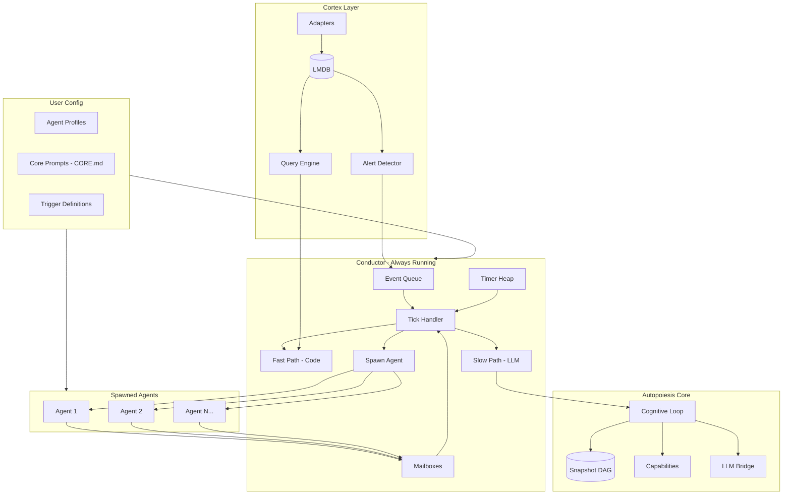

# Autopoiesis + Cortex Synthesis Plan

**Status**: Draft  
**Created**: 2026-02-04  
**Overview**: Synthesize Autopoiesis and Cortex into a unified autonomous agent platform with a Conductor orchestrator - a dual-mode meta-agent that combines programmatic execution (fast) with LLM reasoning (slow).

## Vision

Create a unified autonomous agent platform with an **Orchestrator** - a continuously-running meta-agent that combines programmatic control flow with agentic reasoning. The orchestrator supervises the entire system, spawns agents, executes scheduled work, and decides when LLM reasoning is needed vs. when pure code suffices.

**Core Insight**: The orchestrator operates in two modes:
- **Fast path** (programmatic) - Pure code checks, milliseconds, no LLM
- **Slow path** (agentic) - LLM reasoning when complexity requires it, seconds

## Orchestrator Patterns Considered

### 1. Event Loop (Node.js style)
Single-threaded loop processing events from multiple sources. Non-blocking.
- **Pros**: Simple mental model, predictable ordering
- **Cons**: Single point of failure, can't parallelize

### 2. Actor Model (Erlang/Akka)
Independent actors with mailboxes, message passing, supervision trees.
- **Pros**: Natural for agent spawning, fault isolation, "let it crash"
- **Cons**: Complexity of message routing, debugging distributed state

### 3. Blackboard Architecture (AI Planning)
Shared knowledge structure that multiple "knowledge sources" read/write.
- **Pros**: Natural for multi-agent coordination, incremental refinement
- **Cons**: Contention on shared state, ordering ambiguity

### 4. OODA Loop (Military Decision-Making)
Observe → Orient → Decide → Act, continuously cycling.
- **Pros**: Proven for adversarial/dynamic environments, maps to cognitive loop
- **Cons**: Assumes single decision-maker

### 5. Workflow/Saga Pattern (Temporal, Airflow)
Durable execution with checkpoints, compensating actions on failure.
- **Pros**: Reliability, long-running processes, automatic retries
- **Cons**: Heavy infrastructure, declarative constraints

### 6. Control Theory (Feedback Loops)
Measure → Compare to setpoint → Adjust. PID controllers, stability.
- **Pros**: Self-regulating, mathematical foundations
- **Cons**: Requires well-defined metrics and setpoints

## Chosen Synthesis: Conductor Pattern

Combine the best of each:

```
┌─────────────────────────────────────────────────────────────────┐
│                        CONDUCTOR                                 │
│  (Always-running orchestrator with dual-mode execution)          │
├─────────────────────────────────────────────────────────────────┤
│                                                                  │
│   ┌──────────────┐    ┌──────────────┐    ┌──────────────┐      │
│   │  Event Queue │    │  Timer Heap  │    │   Mailboxes  │      │
│   │  (external   │    │  (scheduled  │    │  (agent      │      │
│   │   signals)   │    │   actions)   │    │   messages)  │      │
│   └──────┬───────┘    └──────┬───────┘    └──────┬───────┘      │
│          │                   │                   │               │
│          └───────────────────┴───────────────────┘               │
│                              │                                   │
│                              ▼                                   │
│                     ┌────────────────┐                           │
│                     │  Tick Handler  │                           │
│                     │  (fast path)   │                           │
│                     └────────┬───────┘                           │
│                              │                                   │
│              ┌───────────────┼───────────────┐                   │
│              ▼               ▼               ▼                   │
│     ┌────────────┐   ┌────────────┐   ┌────────────┐            │
│     │ Programmatic│   │  Spawn     │   │  Invoke    │            │
│     │ Action      │   │  Agent     │   │  LLM       │            │
│     │ (code)      │   │  (actor)   │   │  (slow)    │            │
│     └────────────┘   └────────────┘   └────────────┘            │
│                                                                  │
└─────────────────────────────────────────────────────────────────┘
```

## Architecture



## Key Components

### 1. Conductor (`src/conductor/conductor.lisp`)

The conductor is the meta-agent orchestrating everything:

```lisp
(defstruct conductor
  event-queue      ; External events (Cortex alerts, webhooks, IPC)
  timer-heap       ; Scheduled actions (cron-style)
  mailboxes        ; Messages from spawned agents
  running-agents   ; Active child agents being supervised
  pending-results  ; Async work awaiting completion
  prompt-queue     ; LLM invocations waiting to run
  state)           ; Blackboard shared state

(defun conductor-loop (conductor)
  "Main orchestrator loop - always running."
  (loop
    ;; Gather all sources of work (fast, no blocking)
    (let ((work-items (collect-pending-work conductor)))
      
      ;; Process each work item
      (dolist (item work-items)
        (case (work-item-type item)
          ;; FAST PATH: Pure programmatic, no LLM
          (:timer-fired     (execute-scheduled-action item))
          (:event-received  (route-event-to-handler item))
          (:agent-completed (handle-agent-result item))
          (:agent-failed    (handle-agent-failure item))
          
          ;; SLOW PATH: Needs LLM reasoning
          (:needs-triage    (spawn-triage-agent item))
          (:prompt-ready    (invoke-llm item))
          (:needs-decision  (run-cognitive-cycle item)))))
    
    ;; Brief sleep to prevent busy-waiting
    (sleep 0.1)))

(defun collect-pending-work (conductor)
  "Non-blocking check of all work sources."
  (nconc
    ;; Check event queue
    (drain-queue (conductor-event-queue conductor))
    ;; Check timer heap for due items
    (pop-due-timers (conductor-timer-heap conductor))
    ;; Check agent mailboxes
    (collect-agent-messages (conductor-mailboxes conductor))
    ;; Check pending async results
    (collect-completed-futures (conductor-pending-results conductor))))
```

### 2. Work Item Classification

The conductor must decide: **code or cognition?**

```lisp
(defstruct work-item
  id
  type            ; :timer-fired, :event-received, :needs-decision, etc.
  source          ; Where it came from
  payload         ; The actual data
  requires-llm-p  ; Does this need LLM reasoning?
  priority        ; For ordering
  deadline)       ; Optional time constraint

(defun classify-work-item (raw-event)
  "Decide if work can be handled programmatically or needs LLM."
  (cond
    ;; Known patterns -> fast path
    ((scheduled-action-p raw-event)
     (make-work-item :type :timer-fired :requires-llm-p nil))
    
    ;; Agent completion -> fast path (just routing)
    ((agent-result-p raw-event)
     (make-work-item :type :agent-completed :requires-llm-p nil))
    
    ;; Simple webhook -> fast path if handler registered
    ((and (webhook-p raw-event)
          (handler-registered-p (webhook-type raw-event)))
     (make-work-item :type :event-received :requires-llm-p nil))
    
    ;; Unknown or complex -> slow path
    (t (make-work-item :type :needs-triage :requires-llm-p t))))
```

### 3. Agent Spawner (Actor Model)

Conductor can spawn child agents for parallel work:

```lisp
(defun spawn-agent (conductor profile task)
  "Spawn a child agent with its own cognitive loop."
  (let ((agent (make-agent
                 :profile profile
                 :task task
                 :mailbox (make-mailbox)
                 :parent conductor)))
    ;; Register for supervision
    (push agent (conductor-running-agents conductor))
    ;; Start in separate thread/process
    (bt:make-thread 
      (lambda () (agent-run agent))
      :name (format nil "agent-~a" (agent-id agent)))
    agent))

(defun handle-agent-result (work-item)
  "Agent completed - process result and maybe spawn follow-up."
  (let* ((agent-id (work-item-source work-item))
         (result (work-item-payload work-item)))
    ;; Snapshot the agent's final state
    (snapshot-agent-state agent-id)
    ;; Check if result triggers further action
    (when (result-requires-response-p result)
      (schedule-response-action result))))

(defun handle-agent-failure (work-item)
  "Agent failed - decide: retry, escalate, or compensate."
  (let ((agent-id (work-item-source work-item))
        (error (work-item-payload work-item)))
    ;; Supervision decision (programmatic first)
    (case (classify-failure error)
      (:transient   (retry-agent agent-id))
      (:permanent   (mark-failed agent-id))
      (:unknown     (escalate-to-llm agent-id error)))))
```

### 4. Timer Heap (Scheduled Actions)

Cron-style scheduling without external dependencies:

```lisp
(defstruct scheduled-action
  id
  name
  cron-spec         ; "*/5 * * * *" or nil
  interval          ; Alternative: run every N seconds
  next-run-time     ; When to fire next
  action            ; Lambda or action keyword
  requires-llm-p)   ; Most scheduled actions are programmatic

(defun schedule (conductor &key name cron interval action requires-llm)
  "Schedule a recurring or one-time action."
  (let ((scheduled (make-scheduled-action
                     :id (gensym "sched-")
                     :name name
                     :cron-spec cron
                     :interval interval
                     :next-run-time (compute-next-run cron interval)
                     :action action
                     :requires-llm-p requires-llm)))
    (heap-insert (conductor-timer-heap conductor) scheduled)))

;; Example scheduled actions
(schedule conductor
  :name "health-check"
  :interval 30  ; Every 30 seconds
  :action (lambda () (ping-all-services))
  :requires-llm nil)  ; Pure code

(schedule conductor
  :name "daily-summary"
  :cron "0 9 * * *"  ; 9am daily
  :action :generate-summary
  :requires-llm t)  ; Needs LLM to write summary
```

### 5. Event Queue (External Signals)

Events from Cortex, webhooks, IPC, user input:

```lisp
(defstruct event-source
  name
  type      ; :cortex, :webhook, :ipc, :user-input
  handler)  ; How to route events from this source

(defun setup-event-sources (conductor)
  "Initialize all event input channels."
  ;; Cortex alerts (ZMQ subscription)
  (cortex-subscribe-alerts
    (lambda (alert)
      (queue-event conductor :cortex alert)))
  
  ;; Webhook endpoint (HTTP)
  (start-webhook-server
    :port 4007
    :handler (lambda (req)
               (queue-event conductor :webhook req)))
  
  ;; IPC from child agents (mailbox)
  ;; Already handled via mailboxes
  
  ;; User input (blocking-input via terminal)
  (when *interactive-mode*
    (start-input-listener
      (lambda (input)
        (queue-event conductor :user-input input)))))
```

### 6. Blackboard State (Shared Knowledge)

Shared mutable state that all components can read/write:

```lisp
(defstruct blackboard
  entities       ; Known entities (from Cortex)
  hypotheses     ; Current theories about state
  pending-tasks  ; Work that needs doing
  agent-states   ; Status of all spawned agents
  metrics        ; Counters, gauges for self-monitoring
  memory)        ; Long-term learned patterns

(defun blackboard-update (conductor key value)
  "Thread-safe blackboard write."
  (bt:with-lock-held ((conductor-lock conductor))
    (setf (gethash key (blackboard-memory 
                         (conductor-state conductor)))
          value)))

(defun blackboard-query (conductor pattern)
  "Query blackboard for matching entries."
  (loop for key being the hash-keys of 
          (blackboard-memory (conductor-state conductor))
        using (hash-value value)
        when (pattern-match-p pattern key value)
        collect (cons key value)))
```

### 7. Core Prompts (user-editable, like NanoClaw's CLAUDE.md)

Directory structure:
```
profiles/
├── conductor/
│   └── CORE.md           # The conductor's own decision-making guidance
├── infrastructure-watcher/
│   ├── CORE.md           # Main behavior prompt
│   └── capabilities.lisp # What can be done
├── research-agent/
│   ├── CORE.md
│   └── capabilities.lisp
└── global/
    └── CORE.md           # Shared across all profiles
```

Example `profiles/conductor/CORE.md`:
```markdown
# Conductor

You are the orchestrator. Your job is to decide what needs attention
and whether to handle it programmatically or invoke deeper reasoning.

## Decision Criteria

When an event arrives, ask:
1. Is there a registered handler? -> Run it (fast path)
2. Is this a known pattern? -> Use cached response
3. Is this urgent? -> Prioritize and maybe wake LLM
4. Is this complex/novel? -> Spawn reasoning agent

## Supervision Policy

When a child agent fails:
- Transient errors (network, timeout): Retry up to 3x
- Permanent errors (bad input, logic): Escalate to human
- Unknown errors: Invoke LLM to diagnose

## Self-Monitoring

Track these metrics:
- Events processed per minute
- LLM invocations (should be low)
- Agent spawn rate
- Error rate
```

Example `profiles/infrastructure-watcher/CORE.md`:
```markdown
# Infrastructure Watcher

You monitor infrastructure health via Cortex observability.

## When to Act
- Alert detected with severity >= warning
- Deployment detected (ArgoCD sync)
- Error rate spike (> 5% in 5 minutes)

## How to Act
1. Query related entities from Cortex
2. Form hypothesis about root cause
3. If confident (> 0.8), propose remediation
4. If uncertain, gather more data or escalate

## Human Approval Required For
- Pod restarts
- Scaling changes
- Configuration modifications
```

### 8. Cortex Integration (`src/integration/cortex-bridge.lisp`)

Direct S-expression integration (tight coupling):

```lisp
(defun cortex-query-recent-events (&key (since 300) entity-type)
  "Query Cortex for events in the last N seconds."
  (cortex:query-events cortex:*image*
    :since (- (get-universal-time) since)
    :entity-type entity-type))

(defun cortex-get-entity-graph (entity-id &key (depth 2))
  "Get entity and its relationships."
  (cortex:query-traverse cortex:*entity-graph* entity-id :max-depth depth))

(defun cortex-subscribe-alerts (handler)
  "Subscribe to Cortex alert events."
  (cortex:add-alert-handler handler))

;; Bridge Cortex events to conductor event queue
(defun start-cortex-bridge (conductor)
  "Connect Cortex event stream to conductor."
  (cortex-subscribe-alerts
    (lambda (alert)
      (queue-event conductor 
        (make-work-item
          :type :event-received
          :source :cortex
          :payload alert
          :requires-llm-p (> (alert-severity alert) :warning)
          :priority (severity-to-priority (alert-severity alert)))))))
```

### 9. Trigger System (`src/conductor/triggers.lisp`)

Triggers are now part of the conductor's timer heap and event routing:

```lisp
;; Event-based triggers (reactive)
(defun register-trigger (conductor trigger)
  "Register a trigger with the conductor."
  (case (trigger-type trigger)
    ;; Scheduled -> goes to timer heap
    (:scheduled 
     (schedule conductor
       :name (trigger-name trigger)
       :cron (trigger-cron trigger)
       :action (trigger-action trigger)
       :requires-llm (trigger-requires-llm-p trigger)))
    
    ;; Condition-based -> goes to event handlers
    (:condition
     (register-event-handler conductor
       (trigger-event-type trigger)
       (trigger-condition trigger)
       (trigger-action trigger)))))

;; Define triggers declaratively
(deftrigger infrastructure-alert
  :type :condition
  :event-type :cortex
  :condition (lambda (event)
               (and (eq (event-type event) :alert)
                    (>= (event-severity event) :warning)))
  :action :spawn-incident-agent
  :requires-llm t)

(deftrigger periodic-health-check
  :type :scheduled
  :cron "*/5 * * * *"
  :action (lambda () (ping-all-services))
  :requires-llm nil)  ; Pure programmatic check
```

### 10. Agent Profiles (`src/conductor/profiles.lisp`)

Profiles define what spawned agents can do:

```lisp
(defstruct agent-profile
  name
  core-prompt-path        ; Path to CORE.md (for LLM guidance)
  enabled-capabilities    ; What this profile can do
  human-approval-actions  ; Actions requiring approval
  max-runtime             ; Timeout before killing
  retry-policy)           ; What to do on failure

(defparameter *builtin-profiles*
  (list
    (make-agent-profile
      :name :infrastructure-watcher
      :core-prompt-path "profiles/infrastructure-watcher/CORE.md"
      :enabled-capabilities '(cortex-query shell-readonly send-notification)
      :human-approval-actions '(restart-pod scale-service modify-config)
      :max-runtime 300
      :retry-policy '(:max-retries 3 :backoff :exponential))
    
    (make-agent-profile
      :name :research-agent
      :core-prompt-path "profiles/research-agent/CORE.md"
      :enabled-capabilities '(web-search web-fetch file-write)
      :human-approval-actions '()
      :max-runtime 3600
      :retry-policy '(:max-retries 1 :backoff :none))))
```

## Integration Points

### Cortex → Autopoiesis (Perception)

- `trace-event` → `make-observation :source :cortex`
- `entity` → Focus in context window
- `alert` → High-priority observation triggering cycle
- `checkpoint` → Cross-linked to Autopoiesis snapshot

### Autopoiesis → Cortex (Action)

- `action` thought → Logged to Cortex event store
- Snapshot created → Checkpoint ID stored in metadata
- Branch created → Cortex checkpoint for comparison

## File Changes Required

### New Files

- `src/conductor/conductor.lisp` - Main conductor struct and loop
- `src/conductor/work-items.lisp` - Work item classification
- `src/conductor/spawner.lisp` - Agent spawning and supervision
- `src/conductor/scheduler.lisp` - Timer heap and cron parsing
- `src/conductor/events.lisp` - Event queue and routing
- `src/conductor/blackboard.lisp` - Shared state management
- `src/conductor/triggers.lisp` - Trigger registration and evaluation
- `src/conductor/profiles.lisp` - Agent profile definitions
- `src/integration/cortex-bridge.lisp` - Cortex query/subscribe interface
- `profiles/conductor/CORE.md` - Conductor's own decision guidance
- `profiles/infrastructure-watcher/CORE.md` - Infra watcher prompts
- `profiles/research-agent/CORE.md` - Research agent prompts
- `profiles/global/CORE.md` - Shared prompt content

### Modified Files

- `src/agent/cognitive-loop.lisp` - Add `perceive-from-cortex` method, allow conductor to invoke
- `src/agent/spawner.lisp` - Integrate with conductor's supervision
- `src/snapshot/snapshot.lisp` - Add `cortex-checkpoint-id` slot
- `autopoiesis.asd` - Add conductor module, cortex as dependency
- `CLAUDE.md` - Document conductor architecture

## Communication Protocol

Prefer **ZMQ wire protocol** over MCP for this integration because:
- Both systems are CL, can use native S-expressions
- Lower latency than JSON-RPC
- Cortex already has ZMQ agent protocol
- Can stream events (not just request/response)

```lisp
;; Autopoiesis sends to Cortex
(zmq-send *cortex-socket* 
  '(query :entity-type :ecs-task :since 300))

;; Cortex responds with S-expressions
(zmq-recv *cortex-socket*)
;; => (:ok :events ((...) (...) ...))

;; Cortex pushes alerts to Autopoiesis
(zmq-subscribe *alert-socket* :alert)
```

## Migration Path

### Phase 1: Conductor Core
- Add `src/conductor/` module with main loop
- Implement work item classification
- Implement timer heap (no external deps)
- Basic event queue
- Conductor runs but does nothing interesting

### Phase 2: Cortex Bridge
- Add `src/integration/cortex-bridge.lisp`
- Connect Cortex alerts to conductor event queue
- Implement query interface
- Conductor now perceives infrastructure

### Phase 3: Agent Spawning
- Implement spawner with supervision
- Integrate with existing `src/agent/` code
- Conductor can now delegate to agents
- Basic failure handling (retry, escalate)

### Phase 4: Core Prompts
- Create `profiles/` directory structure
- Implement CORE.md loading and injection
- Conductor's behavior is user-editable
- Agent profiles are user-editable

### Phase 5: Full Integration
- Blackboard shared state
- Snapshot integration for time-travel
- Holodeck visualization of conductor and agents
- Multi-agent coordination scenarios

## Design Decisions (Defaults)

1. **Process model**: Single process initially (import Cortex as library), add ZMQ protocol later for production deployment flexibility
2. **Trigger persistence**: S-expression files in `profiles/` directory - version-controllable, human-readable, fits CL ecosystem
3. **Approval UX**: Autopoiesis's existing `blocking-input` terminal UI - leverage existing infrastructure
4. **Threading model**: Bordeaux-threads for spawned agents - lightweight, shared heap, faster spawn. Can add process isolation later for untrusted work.

## Implementation Todos

- [ ] Create `src/conductor/` module with main loop, work-item classification, event queue, timer heap
- [ ] Create `src/integration/cortex-bridge.lisp` - connect Cortex alerts/queries to conductor
- [ ] Implement agent spawning with supervision (retry, escalate, compensate)
- [ ] Create `profiles/` directory structure with CORE.md files for conductor and agent types
- [ ] Implement `deftrigger` macro for scheduled and condition-based triggers
- [ ] Create shared blackboard state for multi-agent coordination
- [ ] Modify `cognitive-loop.lisp` to support conductor invocation and Cortex perception
