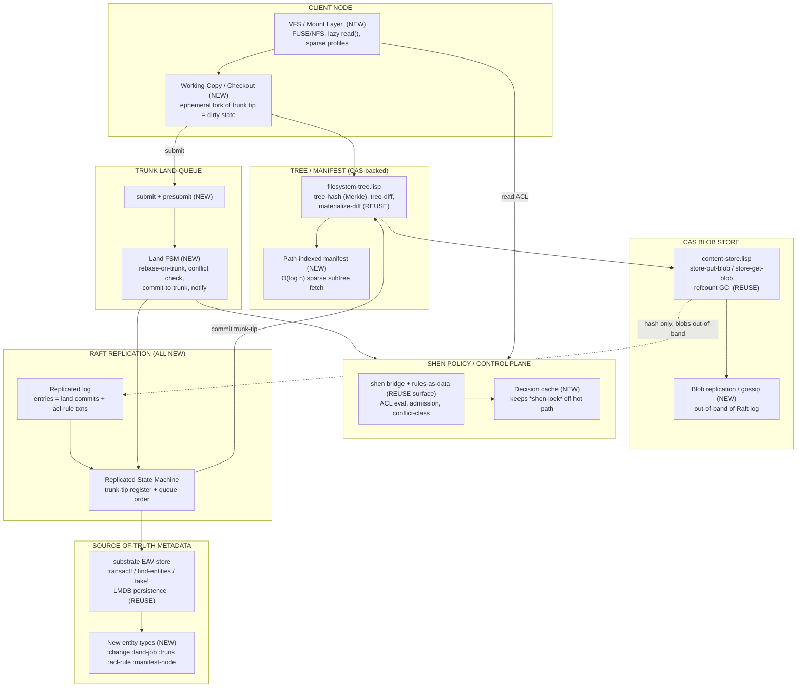
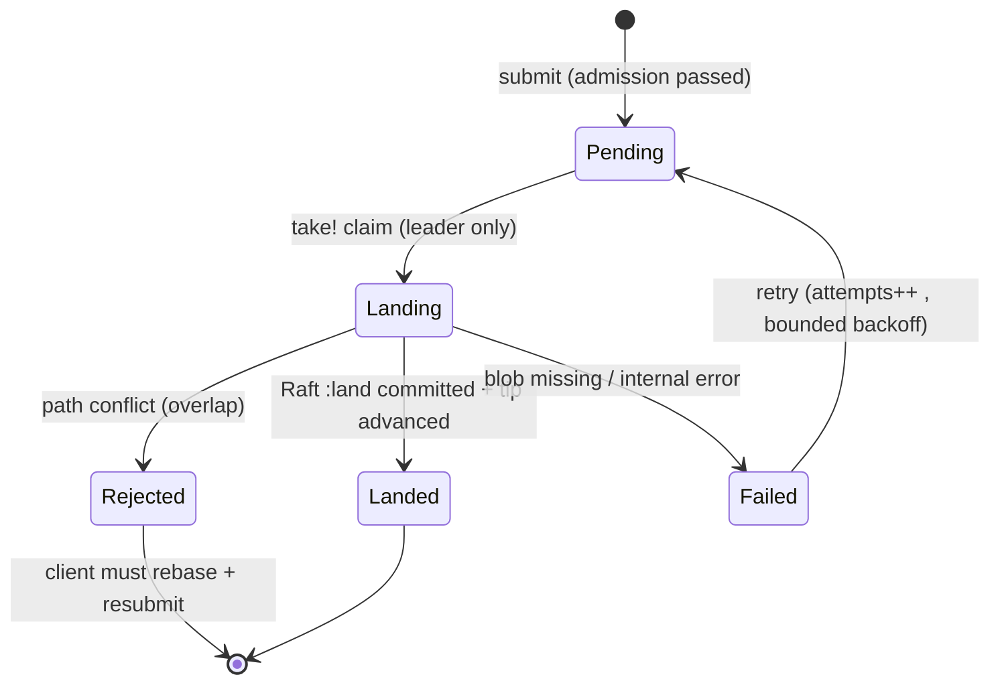

# Architecture: Distributed Trunk-Based DVCS Virtual Filesystem (`metavfs`)

**Git Commit**: bb99c19
**Branch**: main
**Status**: DESIGN ONLY — no implementation code in this document.

> Working name for the system: **metavfs** (CAS-backed, trunk-only, monorepo VFS).

---

## 0. TL;DR / Reading Guide

We build an EdenFS/Sapling/Piper-class system on top of the Autopoiesis substrate. The product is a **single linear trunk** monorepo: there is no branching, only a **serialized land queue**. Content is **content-addressed** (we reuse the existing `content-store` and `filesystem-tree` Merkle layers almost verbatim). A **Raft replicated state machine** makes the trunk-tip pointer and the land queue linearizable and fault-tolerant across nodes. Immutable CAS blobs replicate **out of band** of the Raft log (only their hashes go into the log). **Shen** owns the declarative *policy* control plane (path-scoped ACL evaluation, submit-admission predicates, land-eligibility/conflict-class rules) but is kept entirely off the hot per-blob path and behind a decision cache. A **VFS mount** lazily materializes the working copy.

The single most important architectural inversion versus the existing repo: today the snapshot DAG is a *branching* structure with O(1) forking (`branch.lisp`, persistent agents). The product **forbids branching**. We therefore demote the DAG to a **strictly linear append-only chain** whose tip is the *only* mutable pointer in the system, and that pointer is the Raft replicated state machine's principal register. Forking does not disappear conceptually — a developer's *uncommitted local edits* are an ephemeral fork of the trunk tip — but a fork can never become part of the durable history except by **landing**, which serializes through Raft.

---

## 1. Overview, Goals, Non-Goals

### 1.1 Goals

1. **Content-addressable storage** for all file bytes and all tree/manifest structure. Identical content stored once, globally.
2. **Single linear trunk, no branches.** The only durable write path is *submit → land*. History is a chain, not a DAG.
3. **Monorepo at scale.** Millions of files. Clients never materialize the whole tree; sparse/lazy checkout is the default.
4. **Path-scoped ACLs** enforced on read (in the VFS) and on submit/land (in the queue admission).
5. **Linearizable trunk and queue** across a fault-tolerant cluster (Raft). Survives leader loss and minority-node loss without losing committed lands or producing split-brain.
6. **Declarative control plane** (Shen) for policy: ACLs, admission, conflict-eligibility — expressed as facts + rules, hot-swappable, auditable.

### 1.2 Non-Goals

- **No branches, no merges, no rebasing of published history.** `merge-branches` is deliberately left as the unimplemented stub it already is (`branch.lisp:63`).
- **No multi-master writes.** Exactly one leader accepts lands at a time (Raft).
- **No general distributed transactions across repos.** One trunk, one log.
- **Not a general FUSE filesystem product** — VFS is scoped to presenting the trunk working copy with lazy fetch. (SBCL FUSE realism is addressed in §8.)
- **Strong Prolog/unification reasoning is a non-goal.** Per `thoughts/shared/research/2026-03-30-does-prolog-earn-its-keep.md`, full Prolog is overkill; we use Shen for rules-as-data + a CL/Datalog fallback, not for backtracking search.

### 1.3 Requirement → Bone Mapping

| Requirement | Existing "bone" (reuse) | Greenfield (NEW) |
|---|---|---|
| Content-addressable blobs | `content-store.lisp:86` `store-put-blob` (SHA-256), `:98` `store-get-blob`, refcount GC `:54`/`:63` | Cluster-wide blob replication/gossip; per-node blob locality |
| Content-addressable trees/manifests | `filesystem-tree.lisp:224` `tree-hash` (Merkle root), tree-entry S-expr format `:8-10`, `tree-diff:258` | Path-indexed manifest for O(log n) sparse fetch on millions of files |
| Linear history (commits/changes) | `snapshot.lisp:11` snapshot class (`parent`, `tree-root`); demote DAG → chain | `landed-change` record; trunk-tip register; **no branch registry** |
| Single trunk, no branches | repurpose `branch.lisp` `head` concept as the single trunk tip | Delete/forbid multi-branch registry, `switch-branch`, `merge-branches` |
| Submission/land queue | `conductor.lisp:140` `queue-event` + `:151` `process-events` + Linda `take!` (`linda.lisp:39`) | Land FSM, presubmit validation, conflict check, retry/idempotency |
| Source-of-truth metadata | substrate EAV store: `transact!` (`store.lisp:118`), `find-entities` (`query.lisp:16`), entity types (`builtin-types.lisp`) | New entity types: `:change`, `:land-job`, `:trunk`, `:acl-rule`, `:manifest-node` |
| Atomic queue claim | `linda.lisp:39` `take!` (Linda `in()`) | Land-job claim wrapped under Raft single-leader (see §5) |
| Persistence | `lmdb-backend.lisp:15` LMDB; `content-store` is in-memory + needs LMDB blob DB (`blob.lisp:16`) | Raft log persistence; CAS blob durability spans nodes |
| Path-scoped ACL | `permissions.lisp:212` `check-permission`, `resource` class `:64`, `with-permission-check` `:270` | Hierarchical *path* resource model; inheritance down the tree |
| Audit | `audit.lisp:183` `audit-log`, `:214` `with-audit` | Audit on land decisions + ACL denials |
| Declarative policy | `shen/src/bridge.lisp` (`shen-query` `:141`), `rules.lisp` (`define-rule` `:36`), rules-as-data `:255` | ACL/admission/conflict rule sets; decision cache to bypass `*shen-lock*` |
| Distribution/consensus | — (NONE today) | **Entire Raft layer is NEW** |
| Virtual filesystem mount | `materialize-tree` `:310`, `materialize-diff` `:345`, `lazy-loading.lisp` (paginated DAG) | FUSE/NFS mount, lazy blob fetch on `read()`, sparse profiles |
| Land-queue worker | `conductor.lisp:313` tick loop, capture/rebind pattern `:342-349` | Land worker driven by Raft leadership, not bare tick loop |

---

## 2. Layered Architecture



**Layer → package map:**

| Layer | Package / file | Status |
|---|---|---|
| VFS / mount | NEW `packages/metavfs/src/mount/` | NEW |
| Working-copy / checkout | NEW `packages/metavfs/src/checkout/` (builds on `materialize-diff` `filesystem-tree.lisp:345`) | NEW (thin) |
| Tree / manifest | `packages/core/src/snapshot/filesystem-tree.lisp` + NEW path index | REUSE + extend |
| CAS blobs | `packages/core/src/snapshot/content-store.lisp` + `packages/substrate/src/blob.lisp` | REUSE + replicate |
| Source-of-truth metadata | `packages/substrate/src/` (`store.lisp`, `query.lisp`, `linda.lisp`, `lmdb-backend.lisp`) | REUSE |
| Trunk land-queue | NEW `packages/metavfs/src/land/` (pattern from `conductor.lisp:140-191`) | NEW |
| Shen control plane | `packages/shen/src/` (`bridge.lisp`, `rules.lisp`) | REUSE surface |
| Raft replication | NEW `packages/raft/src/` | NEW |

---

## 3. Data Model

### 3.1 Content blobs (REUSE, unchanged)

A blob is raw file bytes addressed by SHA-256: `store-put-blob` (`content-store.lisp:86`) → hex hash; `store-get-blob` (`:98`). The blob store is content-addressed and de-duplicated; the refcount table is shared across S-exprs and blobs (`content-store.lisp:22`), so `store-gc` (`:63`) sweeps both. Blobs are **immutable** — this immutability is the lever that lets them replicate out-of-band of consensus (§5.4).

### 3.2 Tree / manifest (REUSE format, extend indexing)

We adopt the existing tree-entry S-expr format verbatim (`filesystem-tree.lisp:8-10`, constructors `:18-26`):

```lisp
(:file      "src/foo.lisp" :hash "ab12…" :mode 33188 :size 1234 :mtime 1711324800)
(:directory "src"          :mode 16877)
(:symlink   "bin/cur"      :target "v2/bin" :mode 41471)
```

The Merkle root over a sorted entry list is `tree-hash` (`filesystem-tree.lisp:224`), which hashes the concatenation of `canonical-entry-string` (`:237`, format `F:path:hash:mode:size`). Determinism comes from the path sort in `scan-directory` (`:66`).

**Greenfield change for monorepo scale.** The existing tree is a **flat sorted list** of every entry. At millions of files that is unusable for sparse checkout (you cannot fetch one subtree without the whole list, and `tree-hash` rehashes everything on any change). We therefore introduce a **recursive content-addressed manifest tree** (Sapling/Git "tree object" style), stored as its own CAS S-exprs via `store-put` (`content-store.lisp:36`):

```lisp
;; A manifest-node is itself content-addressed; children reference child nodes by hash.
(:manifest-node
  :entries ((:file "foo.lisp" :blob "ab12…" :mode 33188 :size 1234)
            (:dir  "sub"      :node "cd34…")        ; child manifest-node hash
            (:symlink "cur"   :target "v2" :mode 41471)))
```

- The **root manifest-node hash** is the canonical trunk content identity (replaces the flat `tree-hash` as the system-of-record root; the flat `tree-hash` is retained only for whole-tree integrity checks and the small-tree fast path).
- A subtree fetch for path `a/b/c` walks `root → a → b → c`, fetching O(depth) nodes, not O(total files). This is the standard Sapling manifest and is mandatory for the monorepo non-goal of never materializing the whole tree.
- `tree-diff` (`filesystem-tree.lisp:258`) still operates on flattened entry lists for a *given subtree*; conflict detection (§4.4) diffs at the manifest-node level so unchanged subtrees compare by hash equality in O(1).

### 3.3 Landed change (linear commit)

We repurpose the snapshot class (`snapshot.lisp:11`) into a strictly linear `landed-change`. A snapshot already has `parent` (`:20`), `tree-root` (`:28`), `metadata` (`:36`), `hash` (`:40`). We constrain `parent` to *exactly one* predecessor and add land metadata. Represented as a substrate entity of new type `:change`:

```lisp
(define-entity-type :change
  :change/seq          ; monotonic trunk sequence number (the linear index)
  :change/parent       ; hash of predecessor change (nil only for genesis)
  :change/root-node    ; root manifest-node hash (the content identity)
  :change/author       ; agent-id / principal
  :change/timestamp
  :change/message
  :change/paths-touched ; sorted list of paths (for conflict + ACL scoping)
  :change/hash)        ; content hash of the change record itself (sexpr-hash)
```

A change's `:change/hash` is `sexpr-hash` over the canonical change record (so changes are themselves content-addressed and tamper-evident). Because `parent` is single-valued and `seq` is monotonic, the "DAG" collapses to a list; all of `time-travel.lisp`'s multi-parent path-finding (`find-common-ancestor:50`, `find-branch-point:146`) reduces to trivial parent-chain or seq-range walks (we keep `find-snapshots-since:196`/`find-snapshots-between:187` as `seq`-range queries; we drop `find-common-ancestor`/`find-branch-point` as dead under a single trunk).

> **Persistence gap to close (flagged by research):** `snapshot-to-sexpr` (`persistence.lisp:69`) currently omits `tree-root`/`tree-entries`. Our `:change` entity stores `:change/root-node` explicitly in the substrate datom, so this gap does not bite us — but we must NOT route `:change` durability through the legacy snapshot serializer; we use `transact!` + LMDB (`store.lisp:181`).

### 3.4 The trunk (single mutable pointer)

The trunk is **one** entity, type `:trunk`, with the only mutable pointer in the durable system:

```lisp
(define-entity-type :trunk
  :trunk/tip-seq       ; current head sequence number
  :trunk/tip-hash      ; current head :change/hash
  :trunk/tip-root-node) ; current head root manifest-node hash (read fast-path)
```

This single register is what Raft replicates and linearizes (§5.2). `branch.lisp`'s `head` slot (`:15`) is the conceptual ancestor; `*branch-registry*` (`:33`), `switch-branch` (`:45`), `current-branch` (`:59`) and `merge-branches` (`:63`) are **removed from the product surface** — they encode multi-branch semantics we forbid.

### 3.5 Replicated trunk log entry (Raft)

Each Raft log entry is one of a small command set. The log is the linearizable ordering authority:

```lisp
;; Raft log entry payloads (applied in order by every replica's RSM)
(:land   :seq N :change-hash H :parent-hash P :root-node R :paths (…) :author A)
(:acl    :op :put|:del :rule-id ID :rule <sexpr>)   ; policy change, also linearized
(:noop   :term T)                                    ; leader-establishment barrier
(:config :add-node|:remove-node :node-id …)          ; membership change
```

Crucially the log entry carries **only hashes** (`change-hash`, `root-node`, plus the blob hashes are reachable *through* the manifest, not enumerated in the log). Blob bytes never enter the log (§5.4).

---

## 4. The Trunk Submission Queue

This is the heart of the product: the only durable write path.

### 4.1 Pipeline

```mermaid
sequenceDiagram
    participant Dev as Client (working copy)
    participant API as Submit API (any node)
    participant Shen as Shen policy
    participant Lead as Raft leader (land worker)
    participant RSM as Replicated SM (trunk)
    participant CAS as CAS blobs (OOB)

    Dev->>CAS: upload new blobs (content-addressed, idempotent)
    Dev->>API: submit(parent-seq, root-node, paths, author, idempotency-key)
    API->>Shen: admission predicate (acl-can-submit? + rule eligibility)
    Shen-->>API: admit | reject(reason)
    API->>RSM: enqueue :land-job (status :pending) via substrate transact!
    Note over Lead: leader's land worker drains queue in seq order
    Lead->>RSM: take! :land-job :pending -> :landing (atomic claim)
    Lead->>Lead: rebase check: is job.parent == trunk.tip?
    alt parent == tip (fast path)
        Lead->>Shen: land-eligibility (final ACL on paths-touched)
        Lead->>RSM: propose Raft :land entry (seq = tip+1)
        RSM-->>Lead: committed on majority
        Lead->>RSM: advance trunk tip; mark job :landed
        Lead-->>Dev: notify landed(seq)
    else parent != tip (conflict window)
        Lead->>Lead: conflict check (path-overlap vs lands since parent)
        alt no path overlap
            Lead->>Lead: auto-rebase parent -> tip, recompute root-node
            Lead->>RSM: propose :land entry
        else overlap
            Lead->>RSM: mark job :rejected(conflict); requeue policy
            Lead-->>Dev: notify needs-rebase(conflicting-paths)
        end
    end
```

### 4.2 Submit → presubmit

`submit` writes a `:land-job` entity (mirrors `queue-event` `conductor.lisp:140`):

```lisp
(define-entity-type :land-job
  :land-job/status      ; :pending :landing :landed :rejected :failed
  :land-job/parent-seq  ; trunk seq the client based its work on
  :land-job/root-node   ; proposed new root manifest-node hash
  :land-job/paths       ; sorted paths-touched (conflict + ACL key)
  :land-job/author
  :land-job/idempotency-key  ; client-chosen, unique per logical submission
  :land-job/created-at
  :land-job/attempts
  :land-job/error)
```

**Presubmit validation (off the linearized path, runs on the receiving node):**
1. All referenced blob hashes are present in CAS (or being fetched) — reject early if the client forgot to upload.
2. The proposed `root-node` is well-formed and its sub-manifests resolve.
3. **Admission predicate via Shen** (`acl-can-submit?`, §6): does the author hold `:write` on every path in `:land-job/paths`? Cached decision (§6.3).
4. **Idempotency:** `find-entities :land-job/idempotency-key K` (`query.lisp:16`). If a job with this key already exists, return its current status instead of enqueuing a duplicate. This gives **at-most-once landing** per idempotency key across retries and client reconnects.

### 4.3 Serialized land

The land step is serialized two ways, layered:

- **Intra-node atomic claim:** `(take! :land-job/status :pending :new-value :landing)` (`linda.lisp:39`). Linda `in()` semantics guarantee exactly one worker thread claims a given job; losers re-read and see `:landing`. This is the same primitive `process-events` already uses (`conductor.lisp:153`).
- **Cluster-wide serialization:** only the **Raft leader** runs a land worker (§5.3). The leader applies lands in **strict `seq` order**: it picks the lowest-`created-at` (or an explicit priority attr) pending job, because — important caveat from the orchestration research — `take!` itself is **unordered** (it claims *any* matching entity). We therefore **sort candidate jobs by `(parent-seq, created-at)` and select the head before claiming**, rather than relying on `take!` ordering. The Raft log's append order is the final, durable total order; `seq = tip + 1` is assigned at propose time, never by the client.

### 4.4 Conflict detection (monorepo, path-overlap)

A job was based on `parent-seq`. By land time the trunk tip may be `tip > parent-seq`. Define the **interfering set** = all changes with `parent_seq < change.seq <= tip` (the lands that happened in the client's conflict window). Conflict = **path overlap** between `job.paths` and the union of `paths-touched` of the interfering set.

- **Manifest-node-level fast path:** if the job's root-node and the trunk tip's root-node share the same child node hash for every subtree the job *did not* touch, there is no overlap (O(touched-subtrees) comparison via the recursive manifest, not O(files)). This is structural-sharing-aware conflict detection.
- **No overlap → auto-rebase:** re-parent the job onto `tip`, recompute the root-node by replaying the job's `tree-diff` (`filesystem-tree.lisp:258`) onto the tip's manifest. The blobs are unchanged (content-addressed), so rebase is a manifest re-stitch, not a byte copy.
- **Overlap → reject with `needs-rebase`**, returning the conflicting paths. The client re-syncs and resubmits (new idempotency key for the new content; same key would be honored as the already-rejected job).

This is **optimistic concurrency**: clients submit assuming no conflict; the serialized lander detects and either auto-rebases (the common monorepo case, since most lands touch disjoint paths) or rejects.

### 4.5 Land FSM, failure, retry, idempotency



- **At-most-once landing:** a job transitions to `:landed` exactly once because (a) `take!` admits one claimer, (b) the Raft `:land` entry carries `change-hash`; if the leader crashes *after* commit but *before* marking the job `:landed`, the new leader's RSM apply re-derives "this change-hash is already at `seq`" and marks the job `:landed` idempotently (the apply function is a pure function of the log, so replaying it is safe).
- **Retry:** `:failed` (transient — e.g. a blob fetch was racing) re-enters `:pending` with `attempts++` and exponential backoff, reusing the conductor's backoff formula `(min 300 (expt 2 count))` (`conductor.lisp:252`). `:rejected` (conflict) does **not** auto-retry — it requires client rebase, because the content is stale.
- **Ordering:** the durable total order is the Raft log append order; the queue's job-selection order only affects *which* pending job is attempted next, never the committed history's order.

---

## 5. Raft Layer (NEW — designed in detail)

There is no Raft in the repo today. This is the largest greenfield component (`packages/raft/src/`).

### 5.1 Why Raft and what it protects

The land queue and the trunk tip must be **linearizable** and survive node/leader failure without split-brain or lost lands. Raft gives us a single elected leader, a replicated append-only log, and majority-commit durability. We replicate the *decisions* (which change landed at which seq, and ACL rule changes), not the bytes.

### 5.2 Replicated State Machine (RSM)

The RSM is deterministic and small. Its state:

```lisp
;; RSM state (rebuilt by replaying the committed log from the last snapshot)
(:trunk-tip-seq   N)
(:trunk-tip-hash  H)
(:trunk-tip-root  R)
(:acl-rules       <pmap rule-id -> rule-sexpr>)   ; linearized policy
(:landed-keys     <set of idempotency-keys / change-hashes already applied>)
```

Apply function (pure):
- `:land` entry → if `seq == tip+1` and `change-hash` not in `landed-keys`: advance tip to `(seq, change-hash, root-node)`, add to `landed-keys`. Then, **as a substrate side effect on the leader and followers**, `transact!` the `:change` entity and update the `:trunk` entity (`store.lisp:118`). The substrate write is downstream of and slaved to the RSM; the RSM register is the source of truth, the substrate is the queryable projection.
- `:acl` entry → update `acl-rules` pmap; mirror into the substrate `:acl-rule` entities and invalidate the Shen decision cache (§6.3).
- `:noop` / `:config` → leadership/membership bookkeeping.

**Determinism requirement:** apply must be a pure function of the log. We forbid wall-clock or RNG in apply (timestamps are taken at *submit* time and carried in the log entry, never generated at apply time).

### 5.3 Leadership and the land worker

- Standard Raft leader election (randomized election timeouts, terms, `RequestVote`/`AppendEntries`).
- **Only the leader runs the land worker.** Followers reject submits-to-land by redirecting to the leader (clients cache leader identity; on `not-leader` they retry against the hinted leader). The land worker is *not* the conductor tick loop; it is gated on `am-i-leader?`. We still reuse the conductor's thread capture/rebind pattern (`conductor.lisp:342-349`) so the worker thread sees `autopoiesis.substrate:*substrate*` and `*store*`.
- A leader, before serving lands in a new term, appends a `:noop` barrier and waits for it to commit (standard Raft "establish leadership" step) so it knows the true current tip before assigning `seq`.

### 5.4 CAS blobs replicate OUT OF BAND

This is the explicit design requirement and the crux of scalability.

- **The Raft log never carries blob bytes.** It carries the `root-node` hash and (transitively, via manifests) blob hashes. A blob is immutable and content-addressed, so any replica can fetch it from any peer and verify it by re-hashing — there is no consensus needed about blob *content*, only about *which root-node is the trunk tip*, which is exactly what the log decides.
- **Blob distribution:** a separate replication plane. On submit, the client pushes new blobs to the node it contacts; that node lazily **pull-replicates** to peers (or peers pull on first read). We use a pull/gossip model: a node that needs blob `H` (because the manifest references it) fetches `H` from any peer that has it (`store-blob-exists-p` `content-store.lisp:102` to check, `store-put-blob`/`store-get-blob` to move). Because blobs are immutable, **eventual** consistency of blob presence is sufficient and safe.
- **Land safety w.r.t. blobs:** a land does **not** require every replica to already hold the blobs. It requires the *leader* to have verified the blobs exist (presubmit step 1, §4.2). Followers will lazily fetch referenced blobs on demand (on first VFS read or via background prefetch). The committed log is valid even if a follower is temporarily missing a referenced blob — the metadata is consistent, the bytes are fetch-on-demand.
- **GC interaction:** refcount GC (`store-gc` `content-store.lisp:63`) must be **trunk-reachability-aware** cluster-wide: a blob is collectable only if no trunk manifest from `tip` back to the GC horizon references it. GC runs as a periodic job that walks reachable manifests from the committed tip; it must never collect a blob reachable from any change at or after the retention horizon. This is a coordinated operation (leader-proposed GC horizon) to avoid a follower GC-ing a blob the leader just landed.

### 5.5 Log compaction / snapshotting

- The Raft log grows with every land. We snapshot the RSM (trunk tip + acl-rules + landed-keys window) and truncate the log prefix, standard Raft snapshotting.
- **The RSM snapshot is tiny** (a handful of hashes + the acl ruleset + a bounded `landed-keys` window) precisely because the heavy state (manifests, blobs) lives in CAS and is referenced by hash. This is the payoff of out-of-band blobs: snapshots are cheap.
- `landed-keys` is bounded: we only need to dedup idempotency keys/change-hashes within a window large enough to cover the maximum client retry horizon; older keys are pruned (a duplicate beyond the window would re-land, but by then the client's parent-seq is ancient and the conflict/rebase machinery catches it — we accept this as the documented bound).
- We reuse the **conceptual** pattern of `event-log.lisp` `compact-events` (`:83`, "create checkpoint, truncate preserving recent") for the in-CL snapshot-and-truncate, though Raft snapshotting has stricter index/term bookkeeping than `event-log.lisp` provides.

### 5.6 Read consistency options (be concrete)

| Read type | Mechanism | Guarantee |
|---|---|---|
| **Trunk tip (authoritative)** | Leader read with a **read lease** (leader confirmed it still holds leadership via heartbeat quorum within the lease) | **Linearizable** |
| **Trunk tip (cheap)** | Follower read of its applied RSM tip | **Bounded-stale** (≤ replication lag); may be behind |
| **Read-your-writes after land** | Client holds the `seq` returned by its own land; reads require `applied-seq >= my-seq` (wait or redirect) | **Read-your-writes** |
| **Historical change `seq=k`** | Any node, immutable | **Linearizable trivially** (immutable history is the same everywhere once committed) |
| **Blob bytes** | Any node, fetch-by-hash + verify | **Linearizable per object** (content-addressed; a hash names exactly one byte string) |

**What is and isn't linearizable:**
- **Linearizable:** the trunk tip via leader-lease read; every committed `:change` and its content; every blob (by hash); the order of lands.
- **NOT linearizable (by design):** follower reads of the tip (bounded-stale); blob *presence* on a given follower (eventually consistent — but blob *content* under a hash is always correct or absent, never wrong).

---

## 6. Shen Control Plane

### 6.1 Responsibilities (the Shen/CL boundary — chosen, not enumerated)

**Shen owns declarative policy. CL owns mechanism, state, and the hot path.** Specifically Shen owns three predicate families, all expressed as rules-as-data (`rules.lisp:255` `rules-to-sexpr`, so they survive serialization, fork, and time-travel):

1. **`acl-can-read?(principal, path)`** — path-scoped read authorization (§7).
2. **`acl-can-submit?(principal, paths)`** / **`acl-can-land?(principal, paths)`** — submit-admission and final land-eligibility.
3. **`conflict-class(pathset-a, pathset-b)`** — declares which path patterns are *land-eligible together* vs. *mutually exclusive* (e.g. a rule that two changes both touching `BUILD` files in the same package must serialize even without literal path overlap; or that generated files never conflict). This is policy ON TOP of the structural path-overlap check in §4.4 — structural overlap is computed in CL; *additional* eligibility is declared in Shen.

**CL owns:** the Raft state machine and RPCs, the land FSM, `take!` claiming, substrate transactions, blob movement, the VFS, manifest walking, and structural path-overlap. None of these call Shen.

**The boundary rule:** *Shen is consulted to make a policy DECISION about a (principal, pathset) tuple. Shen is never on a per-blob, per-byte, or per-manifest-node path, and never inside the Raft apply function (apply must be deterministic and Shen has global mutable state).*

### 6.2 How CL calls into Shen

Via the existing bridge: `shen-query` (`bridge.lisp:141`) wraps a query as `(prolog? <query> (return true))`; rules are defined with `define-rule` (`rules.lisp:36`) and queried with `query-rules` (`:233`). Rules are authored as S-expressions and compiled into Shen on demand (`rules.lisp:75`). ACL facts (rule grants) are themselves substrate `:acl-rule` entities, converted into Shen rules at load (or, per the research recommendation, evaluated by the substrate **Datalog** engine `q`/`q-rules` `datalog.lisp:784`/`rules.lisp:71` as a fallback when Shen is unavailable — `verifier.lisp:116` already demonstrates this three-tier Shen→Datalog→CL fallback).

### 6.3 Avoiding the `*shen-lock*` bottleneck (critical)

**The hard constraint:** Shen uses global mutable state serialized by a single non-recursive lock `*shen-lock*` (`bridge.lisp:14-15`); *every* `shen-eval`/`shen-query` across all threads contends on it (`:127`, `:141`). On a hot land path this is a cluster-wide serialization point and is unacceptable per-request.

**Mitigations (all three applied):**
1. **Consult Shen for policy, not per-operation.** A land asks Shen at most a constant number of policy questions (admission, land-eligibility, conflict-class for its pathset) — never per file, per blob, or per manifest node.
2. **Decision cache (NEW).** Wrap every Shen policy call in a memoized cache keyed by `(predicate, principal, pathset-fingerprint, acl-ruleset-version)`. The cache lives in CL, lock-free for reads (an `fset` pmap / atomic pointer). Cache is **invalidated by version bump** whenever an `:acl` entry commits through Raft (§5.2) — the `acl-ruleset-version` is the Raft index of the last `:acl` entry, so it is globally consistent. Steady-state lands hit the cache and never touch `*shen-lock*`.
3. **Precompile / fallback to Datalog.** Per `2026-03-30-does-prolog-earn-its-keep.md`, the substrate Datalog engine (`q-rules` `rules.lisp:71`) is a sufficient and lock-free engine for the recursive path-inheritance and join queries ACLs actually need. We **prefer Datalog for ACL evaluation on the hot path** (no global lock, guaranteed termination) and reserve the Shen Prolog engine for richer offline policy authoring/verification where its rules-as-data ergonomics help. This makes Shen the *authoring/verification* surface and Datalog the *evaluation* engine — directly honoring the research conclusion that "the substrate is already 80% of a Datalog engine."

> **Opinionated call:** the Shen *lock* never sits on the synchronous land path. If `*shen-lock*` is held (e.g. someone is recompiling rules), the cache + Datalog fallback serve the decision. Shen is the policy *compiler/authority*; its compiled output (Datalog rules + cached decisions) is what the hot path consults.

---

## 7. VFS / Virtual Filesystem Layer (NEW)

EdenFS-style: present the trunk working copy as a normal directory tree; materialize lazily on access.

### 7.1 Presentation model

- The mount root maps to the trunk tip's root manifest-node. Directory listings come from manifest nodes (`store-get` of the `:manifest-node` S-expr); file metadata (mode/size) comes from manifest entries.
- **Lazy blob fetch on `read()`:** a file's bytes are *not* materialized at checkout. On the first `read()` of a file, the VFS resolves its blob hash from the manifest and pulls it via `store-get-blob` (`content-store.lisp:98`), fetching cross-node if absent (§5.4). Reuses `materialize-diff` (`filesystem-tree.lisp:345`) for incremental write-out when the user pins/checks out a subtree.
- **Inode/attr cache:** an LRU (`lru-cache.lisp:34`) over manifest nodes and resolved attrs so directory traversal of a million-file tree doesn't re-fetch.

### 7.2 Sparse / lazy checkout for a monorepo

- A client declares a **sparse profile**: a set of path globs it wants visible (e.g. `src/team-x/**`, `BUILD`, `tools/**`). The VFS only walks/materializes manifest subtrees intersecting the profile. The recursive manifest (§3.2) makes this O(profile size), not O(repo size).
- Paths outside the profile are presented as **lazy placeholders** (EdenFS "loading" semantics) or hidden entirely, per profile policy. A `read()` of a hidden path either faults it in (fetch its subtree manifest + blob) or denies, based on the sparse policy.

### 7.3 Mount protocol choice for SBCL (realism)

**Recommendation: NFSv3 loopback server in SBCL, not in-kernel FUSE.** Rationale:
- SBCL has no first-class, well-maintained FUSE low-level binding; writing a libfuse FFI that is correct under SBCL's GC/thread model is high-risk. NFS is a pure userspace TCP/UDP protocol we can serve from Lisp (the same approach EdenFS itself moved toward with its NFS backend on macOS, and Sapling uses on platforms where FUSE is awkward).
- We run a loopback NFS server (in `packages/metavfs/src/mount/`) speaking NFSv3; the OS mounts `localhost`. The server answers `LOOKUP`/`READDIR`/`GETATTR` from manifests and `READ` by lazy blob fetch.
- **Phase-1 fallback (even more realistic):** a **`materialize-on-demand` CLI/checkout** (no kernel mount at all) that writes a sparse subtree to a real directory via `materialize-tree`/`materialize-diff` (`filesystem-tree.lisp:310`/`:345`) and re-syncs on `pull`. This delivers the lazy/sparse semantics without any mount protocol, and is what we ship first; the NFS mount is a later phase. **We do not promise in-kernel FUSE.**

### 7.4 Write path from the VFS

The VFS is **read-mostly**. Local edits accumulate in a client-side working copy (an ephemeral fork of the tip — the only "fork" allowed). The user `submit`s; nothing is durable until landed (§4). The VFS never writes to the trunk directly.

---

## 8. ACL Model (path-scoped, hierarchical)

### 8.1 Model

Extend the existing `resource`/`permission` machinery (`permissions.lisp`) from flat resource IDs to **hierarchical paths**:

- A `:path` resource type (joining the existing `:snapshot :agent :file …` types at `permissions.lisp:39-58`). `resource-id` becomes a repo path (`resource` class `:64`, has `type`/`id`/`owner`).
- Actions reuse the existing matrix (`+action-read+ :read`, `+action-write+ :write`, etc. `permissions.lisp:12-28`); `:write` governs submit/land on a path; `:read` governs VFS visibility/read.
- **ACL rules as substrate entities** (`:acl-rule`): `(principal-or-group, path-prefix, actions, allow|deny)`.

### 8.2 Hierarchical inheritance (the new part)

ACLs **inherit down the tree**: a grant on `src/team-x/` applies to everything beneath unless a more specific deny overrides. This is exactly recursive-rule territory, which is why it lives in the declarative plane:

```lisp
;; Conceptual rule (authored as Shen rules-as-data, evaluated by substrate Datalog on hot path)
(define-rule :can-read
  '(((can-read Principal Path) <--
      (acl-grant Group Prefix :read allow)
      (member-of Principal Group)
      (prefix-of Prefix Path)
      (not (acl-deny-more-specific Principal Path :read)))))
```

Longest-prefix-match with explicit-deny-wins is the resolution policy. The recursive `prefix-of` / group-membership join is evaluated by `q-rules` (`rules.lisp:71`) — terminating Datalog, not unbounded Prolog (research-backed choice).

### 8.3 Enforcement points

- **Read (VFS):** every `LOOKUP`/`READ`/`READDIR` checks `acl-can-read?(principal, path)` via the decision cache (§6.3) before returning manifest entries or blob bytes. Denied subtrees are invisible (not just unreadable) to avoid leaking structure.
- **Submit/land:** `acl-can-submit?` at presubmit (§4.2 step 3) and `acl-can-land?` at land time (final check against the latest ruleset version). Both go through the cache; both wrap in `with-permission-check` (`permissions.lisp:270`) semantics, falling back to `check-permission` (`:212`) for non-path resource types.
- **Audit:** every ACL denial and every land decision is recorded via `audit-log` (`audit.lisp:183`) / `with-audit` (`audit.lisp:214`) — denials as `:failure`, lands as `:success` with the seq + paths in `details`.

---

## 9. Consistency & Fault Model (pre-empting the Jepsen reviewer)

### 9.1 Stated invariants

1. **I1 — Single linear trunk.** Every committed `:change` has exactly one parent and a unique monotonically increasing `seq`; `seq` has no gaps and no forks. (Enforced: only the leader assigns `seq = tip+1`; Raft guarantees one leader per term and majority commit.)
2. **I2 — Land totally ordered.** The committed Raft log order is the durable land order; all replicas apply in the same order. (Raft log-matching + state-machine-safety.)
3. **I3 — At-most-once landing.** A given content change lands at most once; idempotency-key + `change-hash` dedup in `landed-keys` (§5.2) makes leader-crash replays idempotent.
4. **I4 — No lost committed land.** Once a land is acknowledged to a client (committed on majority), it survives any minority failure and any leader change. (Raft durability.)
5. **I5 — Content integrity.** A hash names exactly one byte string / one tree; tampering is detectable (re-hash). (Content addressing, `blob-hash` `content-store.lisp:79`, `tree-hash` `:224`.)
6. **I6 — ACL monotonic visibility.** A read never returns content the principal is not authorized to read at the ruleset version current at the read's linearization point.

### 9.2 Behavior under faults

- **Leader failure:** in-flight uncommitted lands are lost (the client never got an ack → it retries with the same idempotency key → no double-land per I3). Committed lands survive (I4). New leader appends `:noop`, learns the true tip, resumes the land worker.
- **Network partition:** the majority side keeps a leader and keeps landing. The minority side **cannot elect a leader** (no quorum) → cannot land → **no split-brain** (I1). Minority nodes can still serve *bounded-stale* follower reads and historical/blob reads (explicitly labeled stale, §5.6).
- **Split-brain prevention:** Raft's quorum requirement + single-leader-per-term + leader read-lease. A stale leader that lost quorum cannot serve linearizable reads (its lease expires) and cannot commit lands (no majority `AppendEntries`).
- **Duplicate submits / client retries:** idempotency-key dedup at presubmit (§4.2) and `landed-keys` at apply (§5.2). A retry after an ack returns the existing `:landed` status; a retry after a non-ack either lands once or returns the in-flight job.
- **Blob absence on a follower:** a follower may lack a referenced blob temporarily. Metadata reads are still consistent; blob reads fault-in from a peer. A blob can be *absent* but never *wrong* (I5).

### 9.3 Where invariants COULD be violated (honest)

- **`take!` durability gap:** `take!` mutates the in-memory cache/value-index/tx-counter but **bypasses hooks and LMDB persistence** (`linda.lisp:39` impl; the research explicitly flags this). If a leader crashes after `take!`-claiming a job (`:landing`) but before the Raft `:land` commits, the job is stuck `:landing` in memory but the durable substrate may still show `:pending` after restart. **Mitigation:** the leader must persist the claim by routing the status transition through `transact!` (durable, LMDB) **not** raw `take!`, OR treat `:landing` as advisory and reconcile against the Raft log on leader startup (the Raft log is the source of truth; any job not represented by a committed `:land` is re-`pending`ed). We choose **reconcile-against-log on startup** as primary, with `transact!`-backed claims as belt-and-suspenders.
- **RSM/substrate divergence:** the substrate projection (`:change`/`:trunk` entities) is written as a side effect of Raft apply. If a node's substrate write fails after the log commits, the projection lags the RSM. **Mitigation:** the RSM register (in-memory + Raft snapshot) is authoritative; the substrate projection is rebuildable by replaying the log, and a startup consistency pass (modeled on `consistency.lisp` `run-consistency-checks:504`) repairs it.
- **Determinism of apply:** if any Shen call or wall-clock leaks into apply, replicas diverge. **Mitigation:** apply is Shen-free and clock-free by construction (§5.2). This is a code-review invariant, not just a runtime one.
- **`landed-keys` window pruning:** a duplicate submission older than the dedup window could re-land. **Mitigation:** bounded by the conflict/rebase check (its ancient `parent-seq` forces a rebase) and a window sized to exceed max client retry horizon. Documented residual risk.
- **GC vs. land race:** a follower GC-ing a blob the leader just made reachable. **Mitigation:** leader-proposed GC horizon (§5.4); GC only collects below the committed horizon.

---

## 10. Failure Modes & Open Questions (the hard, unsolved parts)

1. **`take!` is not durable and not Raft-aware.** It is perfect for intra-node single-claim but it is *not* a cluster primitive and it skips LMDB. The honest position: `take!` is a leader-local optimization; the *authority* is the Raft log. Getting the reconciliation between "in-memory claimed `:landing`" and "durably committed `:land`" exactly right on every leader transition is the single fiddliest correctness problem and needs a dedicated test suite (Jepsen-style fault injection).
2. **Substrate is single-node.** The substrate (`store.lisp`, LMDB `lmdb-backend.lisp`) is a per-process store with a single lock; it is **not** itself replicated. We layer Raft *above* it and treat each node's substrate as a local projection. This is sound but means the substrate is never the cross-node source of truth — a conceptual inversion of how the rest of the platform treats the substrate, and a source of confusion to guard against.
3. **Shen global lock under rule recompilation.** Even with the decision cache, an `:acl` change forces a Shen recompile under `*shen-lock*` (`bridge.lisp:14`). If policy churn is high, recompiles serialize. Open question: do we precompile ACL rules to Datalog at land time (off the lock) and treat Shen purely as the authoring front-end? (Leaning yes — see §6.3.)
4. **NFS/FUSE in SBCL is genuinely hard.** A correct, performant userspace NFS server in Lisp under load is non-trivial (caching, attribute coherence, large directory `READDIR`). Phase 1 ships the no-mount checkout; the mount is a real research-grade subproject.
5. **Recursive-manifest migration.** The existing tree is a flat list (`scan-directory:66`); building and GC-ing a recursive content-addressed manifest at monorepo scale (and round-tripping it through LMDB, which the current `snapshot-to-sexpr` does NOT do, `persistence.lisp:69`) is substantial new storage work.
6. **Cross-node blob availability SLO.** Pull-on-read is correct but a cold follower reading a never-fetched subtree pays a cross-node round trip per blob. Prefetch heuristics (sparse-profile-driven warming) are an open performance question.
7. **Cluster-wide GC correctness.** Trunk-reachability GC across nodes with in-flight lands is the classic "distributed GC during mutation" problem; the leader-horizon approach is conservative (may retain garbage) but we have not proven it never collects live blobs under all interleavings.

---

## 11. Phased Build Sequence

Each phase delivers something testable and is ordered by dependency. Test suites to extend are named.

| Phase | Deliverable (testable) | Builds on | Extend test suite |
|---|---|---|---|
| **P0 — Recursive manifest + CAS round-trip** | Content-addressed recursive `:manifest-node` tree; sparse subtree fetch; LMDB round-trip of manifests + blobs (close the `persistence.lisp:69` gap). | `content-store.lisp`, `filesystem-tree.lisp`, `blob.lisp` | `snapshot-tests`, `core-tests` |
| **P1 — Linear trunk + `:change` model** | Single-trunk entity types; demote DAG to chain; submit→land **single-node** with `take!` claim + `transact!`-durable status; idempotency; conflict (path-overlap) detection + auto-rebase. No Raft yet. | `snapshot.lisp`, `branch.lisp` (repurpose `head`), `conductor.lisp` queue pattern, `linda.lisp` | `snapshot-tests`, `orchestration-tests`, new `land-queue-tests` |
| **P2 — Path-scoped ACL (Shen/Datalog)** | `:path` resource type; hierarchical inherit-down rules; enforce on submit/land; decision cache + version invalidation; Datalog evaluation with Shen authoring. | `permissions.lisp`, `audit.lisp`, `shen/rules.lisp`, substrate `q-rules` | `security-tests`, new `acl-path-tests` |
| **P3 — Raft RSM (single command set)** | Raft library: leader election, log replication, `:land`/`:acl`/`:noop`/`:config` apply, snapshot/compaction; trunk-tip register; leader-only land worker; **out-of-band blob pull**. Make trunk + queue linearizable. | NEW `packages/raft`, P1 land FSM | new `raft-tests`, **`raft-jepsen-tests`** (fault injection) |
| **P4 — Read consistency + cluster GC** | Leader-lease linearizable reads; follower bounded-stale; read-your-writes; trunk-reachability GC with leader horizon. | P3, `consistency.lisp` patterns | extend `raft-jepsen-tests`, `snapshot-tests` (GC) |
| **P5 — VFS checkout (no mount)** | Sparse-profile `materialize-on-demand` checkout; lazy blob fetch cross-node; LRU manifest cache. | `filesystem-tree.lisp` materialize, `lru-cache.lisp` | new `vfs-checkout-tests` |
| **P6 — NFS loopback mount** | Userspace NFSv3 server: `LOOKUP`/`READDIR`/`GETATTR`/lazy `READ`; ACL-gated visibility. | P5, P2 | new `vfs-mount-tests` |
| **P7 — Hardening** | Membership changes, backpressure, prefetch heuristics, audit completeness, operational runbooks. | all | extend all above |

**Critical-path dependency:** P0 → P1 → P3 is the spine (you cannot land linearizably without the manifest and the single-node FSM first). P2 can proceed in parallel after P1. VFS (P5/P6) is independent of Raft correctness and can lag.

---

## Appendix A — Key file:line citations (single index)

**CAS:** `content-store.lisp:36` store-put, `:86` store-put-blob, `:98` store-get-blob, `:54`/`:63` GC, `:79` blob-hash, `:106` store-stats, `:22` shared refcount.
**Manifest/tree:** `filesystem-tree.lisp:8-10` entry format, `:18-26` constructors, `:66` scan-directory, `:224` tree-hash, `:237` canonical-entry-string, `:258` tree-diff, `:310` materialize-tree, `:345` materialize-diff.
**Snapshot/DAG:** `snapshot.lisp:11` class (`:20` parent, `:28` tree-root, `:40` hash), `:46` make-snapshot; `persistence.lisp:69` snapshot-to-sexpr (tree-fields gap); `time-travel.lisp:50` find-common-ancestor (dead under trunk), `:187`/`:196` seq-range queries kept; `event-log.lisp:83` compact-events (compaction pattern); `consistency.lisp:504` run-consistency-checks; `lru-cache.lisp:34` make-lru-cache; `branch.lisp:15` head (repurpose), `:33`/`:45`/`:59`/`:63` removed.
**Substrate:** `store.lisp:118` transact!, `:181` LMDB write in transact, `:261` with-store; `query.lisp:16` find-entities; `linda.lisp:39` take! (and durability caveat); `lmdb-backend.lisp:15` open-lmdb-store; `blob.lisp:16` store-blob; `datalog.lisp:784` q; `rules.lisp:71` q-rules; `builtin-types.lisp` entity types.
**Orchestration:** `conductor.lisp:140` queue-event, `:151` process-events, `:153` take! claim, `:252` backoff, `:313` tick loop, `:342-349` thread capture/rebind.
**Shen:** `bridge.lisp:14-15` *shen-lock*, `:127` shen-eval, `:141` shen-query; `rules.lisp:36` define-rule, `:233` query-rules, `:255` rules-to-sexpr; `verifier.lisp:116` Shen→Datalog→CL fallback.
**Security:** `permissions.lisp:12-28` actions, `:39-58` resource types, `:64` resource class, `:212` check-permission, `:270` with-permission-check; `audit.lisp:183` audit-log, `:214` with-audit.
**Research basis:** `thoughts/shared/research/2026-03-30-does-prolog-earn-its-keep.md` (Datalog over Prolog), `2026-03-26-shen-prolog-eval-orchestration-integration.md` (Shen control-plane surfaces, lock bottleneck), `2026-03-23-shen-ap-integration-surface-analysis.md` (single-lock serialization is the shipped model).
