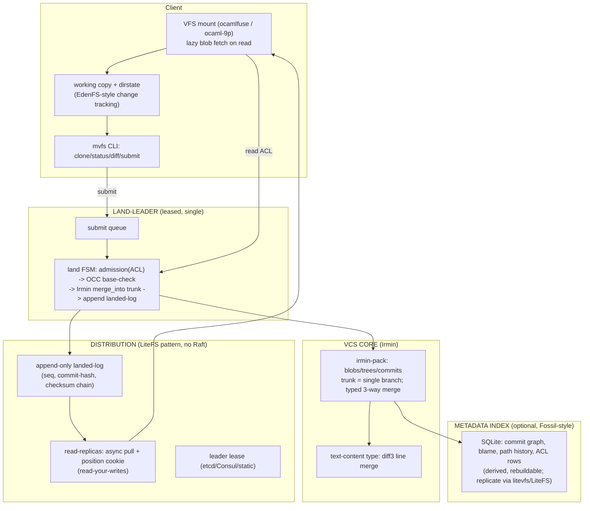

# Direction Brief: `mvfs` — a clean OCaml/Irmin trunk-only DVCS-VFS (moderate scale)

This brief proposes a **clean-room build**, not a continuation of the Autopoiesis CL design. From
Autopoiesis we keep the **ideas and the review corpus** (the four reviews already mapped the
landmines); we keep **none of the CL code**. The system is sized for the stated target —
**moderate scale (hundreds of developers)** — which removes Raft, parallel landing, and hyperscale
virtualization from scope. Working name: **`mvfs`**.

> This document is written to be **attacked** by the review panel (Aphyr, Torvalds, Fukamachi,
> Minsky). It makes decisions; the open risks for each reviewer are listed in §9.

---

## 1. The one-paragraph thesis

Build the version control core on **Irmin** (OCaml), which already provides exactly the layers the
CL plan spent pages reinventing — content-addressed blob/tree storage, a commit history, **typed
3-way merge**, GC, and push/pull replication, production-proven on Tezos. Add the three things
Irmin does *not* provide: a **trunk submission queue** (single-leader land, serialized, OCC), real
**line-level text merge** (a custom Irmin content type wrapping diff3), and **path-scoped ACLs**.
For distribution at moderate scale, **drop Raft entirely** and use the **LiteFS pattern** — one
leased land-leader, an append-only checksum-chained log of landed commits, and async read-replicas
with a position cookie for read-your-writes. Present the working copy through an **OCaml FUSE/9P
mount** with lazy blob fetch (a no-mount sparse checkout ships first). Optionally keep a
**Fossil-style SQLite index** of the commit graph for fast queries — and *that* SQLite database is
where your `litevfs` distributed-SQLite work is directly reusable.

---

## 2. Why this shape (tracing each reviewer's verdict to a decision)

| Prior finding | This design's answer |
|---|---|
| Torvalds #1 **no merge** | Irmin typed 3-way merge + a diff3 text-content type. Merge is core, not bolted-on. |
| Torvalds #2 **O(repo) status, no dirstate** | Dirstate is a first-class P1 deliverable, fed by the FUSE write-tracking once mounted (EdenFS model). |
| Torvalds #3 **virtualization last/infeasible in SBCL** | OCaml has *maintained* FUSE (`ocamlfuse`) + 9P (`ocaml-9p`). The mount is real, not research-grade; no-mount checkout still ships first. |
| Torvalds **stacked changes / change-id** | Local Irmin commits are cheap; a stable Change-Id rides in commit metadata. Stacks are a client concern over Irmin history. |
| Fukamachi **3 Blockers** (NFS-in-SBCL, global store-lock, dynamic-var threads) | All three are CL-substrate artifacts. Gone. OCaml FUSE exists; Irmin's store model + Eio replace the global lock and the special-var threading. |
| Fukamachi **shen-cl liability**, Torvalds **cut Shen** | **Shen is cut.** Path ACLs are ~a few hundred lines of OCaml predicates (or a tiny Datalog). The whole Shen thread was a CL artifact. |
| Aphyr **4 Criticals** (claim/idempotency dual authority, byte durability, ACL TOCTOU, lease linearizability) | Mostly dissolved or reshaped by dropping Raft for a single-leader lease at moderate scale (see §6/§9). The *land idempotency* and *failover data-loss window* concerns survive and are addressed explicitly. |

---

## 3. Architecture

**Layer → component:**

| Layer | Component | Build vs. reuse |
|---|---|---|
| CAS blobs + trees + commits + history + GC + merge | **Irmin / irmin-pack** | **reuse (library)** |
| Line-level text merge | custom Irmin `Contents` type wrapping diff3/libgit2-xdiff | build (small) |
| Trunk submission queue / land FSM | OCaml | build |
| Path-scoped ACLs | OCaml predicates (or tiny Datalog) over path-prefix grants | build (small) |
| Land-leader lease + landed-log + replica sync | OCaml, **LiteFS/LTX pattern** | build (pattern reuse) |
| VFS mount + lazy fetch + dirstate | **ocamlfuse** / **ocaml-9p** + OCaml | reuse binding + build |
| Metadata query index | **SQLite** (Fossil model); replicate via the `litevfs` work | reuse + build |
| Consensus (Raft) | — | **out of scope at moderate scale** |

---

## 4. Data model

- **Blob** = file content, content-addressed by Irmin (SHA-256). Identical content stored once.
- **Tree** = Irmin node; directories are nodes, files are contents. Irmin's lazy trees give
  O(depth) subtree access — the sparse-fetch property, for free.
- **Commit (= landed change)** = an Irmin commit on the **single trunk branch**. Metadata carries:
  `change-id` (stable across review revisions, Gerrit-style), `author`, `message`, `parent`
  (single — trunk is linear), `landed-seq` (monotonic), `paths-touched` (for ACL + conflict).
- **No branches in durable history.** A developer's local work is local Irmin commits (a stack);
  they become trunk only by **landing**. (Irmin *supports* branches; we restrict the durable model
  to one trunk branch — a restriction, trivially enforced.)
- **Landed-log** = the LiteFS-inspired append-only, checksum-chained log: each entry
  `(seq, commit-hash, prev-checksum, post-checksum)`; entry N+1.prev == entry N.post. This is the
  replication + read-your-writes substrate, and the audit trail.

---

## 5. The trunk submission queue (the heart)

1. **Client** builds local Irmin commits; `submit`s a change (base-commit, paths, change-id,
   idempotency-key).
2. **Admission** (off the serialized path): ACL check (`can-submit?(author, paths)`); presence of
   referenced blobs.
3. **Land (serialized, leader-only):** claim head of queue → **OCC base-check**: is `base == trunk
   tip`? If yes, fast-path. If no, attempt **Irmin merge** of the change onto tip (this is where
   the typed/text 3-way merge runs — *real merge*, not path-overlap bounce). Clean merge → commit
   to trunk, assign `landed-seq = tip+1`, append landed-log entry, notify. Conflict → reject with
   the conflicting paths/hunks for the developer to resolve.
4. **Idempotency:** the `idempotency-key` and `change-id` live in the **landed-log / Irmin commit
   metadata** (the single source of truth), not a side table — so a retry is deduped by reading
   trunk history, consistently. (This is the clean version of Aphyr's Finding 1, made trivial by
   having exactly one authority — Irmin trunk — at moderate scale with one leader.)

**Conflict model — the upgrade from the CL design:** conflict is decided by the **3-way merge
result**, not path-overlap. Two disjoint-line edits to one file **merge** (no bounce); a real
textual conflict is surfaced as a conflict to resolve (not "resubmit from scratch"). This directly
fixes Torvalds' Showstopper #2-adjacent complaint.

**Throughput (moderate scale):** single-leader serialized landing is *fine* for hundreds of
developers (LiteFS tolerates ~100 TPS through FUSE; native Irmin commit is faster). No parallel
landing needed. We state this rather than name-drop hyperscale.

---

## 6. Distribution & consistency (no Raft)

- **One land-leader**, leased (etcd/Consul, or a static primary for a single-DC deploy). Only the
  leader lands. Replicas are read-only.
- **Replication** = replicas async-pull the **landed-log** + the new Irmin objects (Irmin push/pull
  or a thin LTX-style stream). **Read-your-writes** via a `landed-seq` position cookie: a read
  waits until the replica's applied seq ≥ the client's last landed seq, else redirects to leader.
- **Consistency, stated honestly:**
  - **Trunk landing is linearizable** *because there is one leader and one append-only trunk* —
    not because of consensus. The price: **failover has a data-loss window** (a landed commit not
    yet pulled by any replica can be lost if the leader's disk dies before durability spreads).
  - **Mitigation at moderate scale:** the leader fsyncs the Irmin commit + landed-log entry
    **before** acking the client (durable-on-leader), and optionally waits for **1 replica ack**
    (durability width 2) before ack if the deployment wants to survive single-node loss. This is a
    config knob, not a consensus protocol. (Aphyr's byte-durability Finding 2, sized down.)
  - **Reads** off replicas are **bounded-stale**; the leader serves linearizable reads trivially.
- **Why this is legitimate here:** the original Raft design existed to make a *multi-writer-safe*
  linearizable trunk across a fault-tolerant cluster. At moderate scale with a single leased writer,
  a leader + async replicas + a durability-width knob is the right-sized answer, and it's the proven
  LiteFS model. If the project later needs multi-DC HA, *that's* when Raft (or Irmin-over-Raft)
  returns — deferred, not designed-in.

---

## 7. ACLs, VFS, dirstate

- **ACLs:** path-scoped, hierarchical (grant on `src/team/` inherits down; longest-prefix,
  deny-wins). Evaluated in plain OCaml (typed predicates; or a tiny Datalog if rules grow).
  Enforced at **VFS read** (deny → invisible) and at **land admission**. Stored as rows in the
  SQLite metadata index. **No Shen.**
- **VFS:** `ocamlfuse` (or `ocaml-9p`) presents the trunk tip; directory listings from Irmin trees,
  file bytes lazily fetched from Irmin (cross-node if needed) on first `read()`. **Sparse profiles**
  use Irmin's lazy trees → O(profile), not O(repo). **Ships second**; P1 is a **no-mount
  materialize-on-demand checkout** (the honest, low-risk default).
- **Dirstate:** a real index `(path, size, mtime, ctime, inode, blob-hash)`; `status`/`diff` stat
  and only re-hash changed entries → **O(changes)**. Once the mount exists, FUSE write-tracking
  feeds the dirstate (EdenFS model). First-class in P1 — not "someday."

---

## 8. What we deliberately do NOT build (scope discipline at moderate scale)

- **No Raft / consensus.** Single leased leader + async replicas + durability knob.
- **No Shen / Prolog runtime.** ACLs are OCaml.
- **No NFS server.** OCaml FUSE or 9P, both maintained.
- **No page-as-storage.** Irmin blobs/trees, not SQLite pages. SQLite is a *derived* index only.
- **No parallel disjoint-path landing, no delta/CDC blobs (yet).** Single-leader serial landing and
  whole-blob CAS are fine at moderate scale; Irmin-pack already dedups. Revisit only if measured.
- **No in-kernel mount promise beyond FUSE/9P.**

---

## 9. Open risks (for the panel to attack)

1. **Irmin at VFS read scale.** Tezos proves irmin-pack for sequential single-writer ledger writes,
   *not* for thousands of concurrent client reads of different path subsets. Is irmin-pack's
   read/concurrency story adequate behind a FUSE mount? (For Minsky/Fukamachi.)
2. **Lwt↔Eio bridge.** Irmin is Lwt-internally; the server wants Eio (io_uring, multicore). The
   `lwt_eio` bridge in a long-lived multi-domain server — operational hazard? (Minsky/Fukamachi.)
3. **Text merge as an Irmin content type.** Is wrapping diff3/libgit2-xdiff as an `Irmin.Contents.S`
   with a `merge` function the right seam, or does it fight Irmin's per-path merge model on renames/
   deletes? (Torvalds/Minsky.)
4. **Failover data-loss window.** Async replication means a leader-crash can drop a just-landed
   commit. Is the "fsync-on-leader + optional 1-replica-ack" knob an honest substitute for
   consensus at this scale, or a footgun that will surprise users? (Aphyr.)
5. **Idempotency across leader handoff.** With the key in trunk metadata, is dedup actually
   race-free when a client retries during a lease handoff? (Aphyr.)
6. **Dirstate without a mount.** P1 ships no-mount; can dirstate be fast (O(changes)) *before* the
   FUSE write-tracking exists, or is P1 `status` still doing a stat-walk of a huge tree? (Torvalds.)
7. **OCaml as the bet.** Is OCaml+Irmin genuinely lower total risk than a focused Rust build (Rust
   has the litevfs precedent, better FUSE/perf story, but no Irmin)? (Minsky especially — does the
   FP/type story pay off, and is Irmin's API churn an acceptable dependency?)
8. **Where does `litevfs` actually plug in?** If it's LiteFS-lineage, it replicates the *SQLite
   metadata index*, not the Irmin object store — is that worth the second replication system, or
   should the landed-log replicate everything and SQLite be a pure local cache? (All.)

---

## 10. Phased plan (moderate scale, OCaml)

| Phase | Deliverable | Reuse |
|---|---|---|
| **P0 — Irmin spine** | irmin-pack store; trunk = one branch; commit model w/ change-id metadata; CLI clone/log. | Irmin |
| **P1 — VCS that's nice on one machine** | local commits + stacks; **dirstate + O(changes) status/diff**; **text 3-way merge** content type; no-mount sparse checkout. | Irmin merge, diff3 |
| **P2 — Trunk land-queue (single node)** | submit→admission→OCC→merge_into trunk→landed-log; idempotency in trunk metadata; conflict surfacing. | Irmin |
| **P3 — Path ACLs + metadata index** | path-scoped ACLs (OCaml); SQLite Fossil-style commit-graph/blame/ACL index. | SQLite |
| **P4 — Distribution (LiteFS pattern)** | leased leader; landed-log replica streaming; read-your-writes cookie; durability-width knob. **`litevfs` reused here** for replicating the SQLite index if wanted. | LiteFS pattern, litevfs |
| **P5 — VFS mount** | ocamlfuse/9p lazy mount; FUSE write-tracking → dirstate; sparse profiles. | ocamlfuse |
| **P6 — Hardening** | failover drills, backpressure, audit, ops runbooks. | — |

Critical path **P0→P1→P2** is a genuinely usable single-node trunk VCS *with merge and fast
status* — the thing Torvalds said to prove first. Distribution and mount come after it's nice.

---

## Appendix — relationship to the prior documents
- Supersedes the *foundation* assumption of `00-architecture.md` (CL substrate) and its Raft-centric
  `02/05` plans **for the moderate-scale target**; the reviews `01/03/04` remain the landmine map and
  every finding is traced in §2/§9.
- `06-grounding-research.md` is the evidence base.
