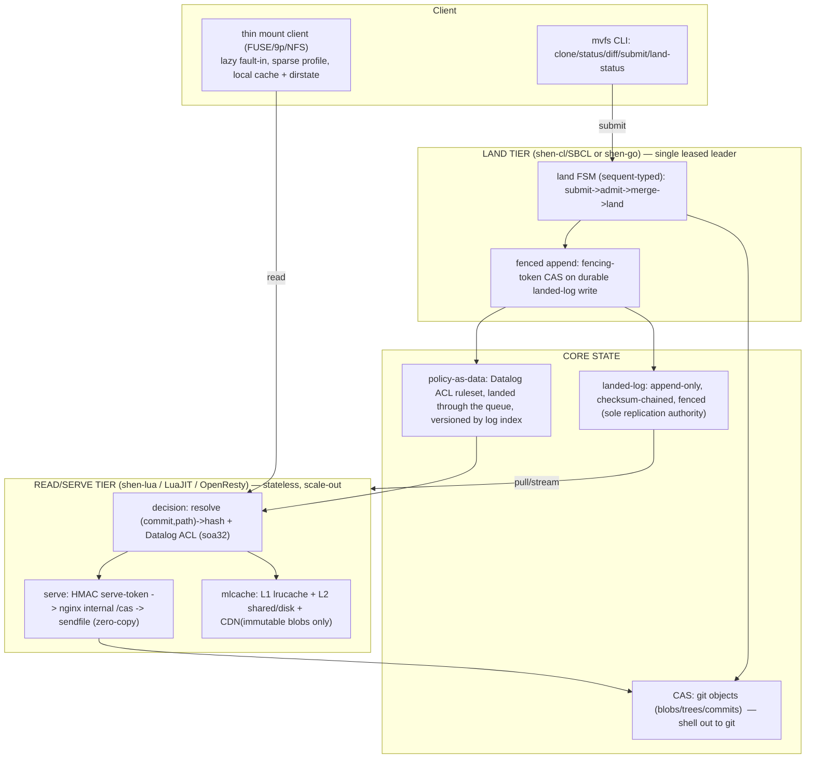

# mvfs — Design Overview (keystone)

> Working name **`mvfs`** (provisional). This is the committed design after the full exploration
> (`../00`–`../32`). It is the single source of truth for **decisions, names, invariants, and the
> cross-document contracts**; every other `spec/` doc builds on this one and must not contradict it.

## 1. What we are building

A **content-addressable, trunk-only (no branches), monorepo distributed version-control system with a
virtual filesystem**, at **moderate scale** (hundreds of developers). The sole durable write path is a
**serialized trunk land-queue**. Reads are lazy/virtualized (EdenFS/Sapling/Piper-class).

**Decided stack (see `../32`):** built in **Shen**, compiled per-path on the author's own toolchain —
**shen-lua → LuaJIT** for the read/serve hot path, **shen-cl/SBCL (or shen-go)** for the serialized
land tier — **shelling out to `git`** for content storage and 3-way merge. The Datalog control plane
runs on shen-lua's **native `soa32` inference substrate** (int32 FFI arrays; already 8.9× / −93%
alloc vs legacy).

## 2. The governing principle: **proven brain, trusted shell**

- **Proven brain (Shen):** all *decisions* — the land FSM, authorization, conflict-eligibility,
  ordering/idempotency — are expressed in Shen so they are statically or decidably checkable:
  - **Sequent-calculus types** make illegal land/lease/merge states unrepresentable (compile-time).
  - **Decidable Datalog** makes ACL/policy properties exhaustively analyzable (build/land-time).
- **Trusted shell (oracles):** the *mechanism* — `git` (CAS + 3-way merge), the filesystem, nginx,
  LuaJIT itself, the OS — is delegated to battle-tested tools we do **not** prove. The Shen↔shell
  boundary is a **small, explicit, audited** set of side-effecting primitives.
- **Net:** decisions are provable; effects are delegated. The Shen program doubles as an **executable
  specification + conformance oracle** for any later reimplementation (differential test against it).

## 3. Architecture at a glance



**Layer → spec doc:**

| Layer | Spec doc |
|---|---|
| Data model: CAS/git objects, trunk, landed-log entry, change/Change-Id/stacks, idempotency | `01-data-model-and-storage.md` |
| **The novel core**: land FSM, leased leader, fencing protocol, OCC + git merge, durability acks | `02-land-queue-kernel.md` |
| Policy/ACL: Datalog on soa32, path model, admission, conflict-class, policy-as-data | `03-policy-and-acl.md` |
| Read boundary: consistency (as-of/RYW/monotonic) **and** security (serve tokens/tiers/revocation) | `04-read-boundary-consistency-security.md` |
| Serving + VFS: read tier (shen-lua/OpenResty), thin mount, sparse, latency budget | `05-serving-and-vfs.md` |
| Product edges: workflows, stacked changes/restack, conflict UX, monorepo, ACL admin, CLI, non-goals | `06-product-edges.md` |
| Build plan: phased on the Shen stack, spikes, milestones, test strategy | `07-build-plan.md` |

## 4. Canonical invariants (referenced by ID across all docs)

| ID | Invariant | Enforced by (doc) |
|---|---|---|
| **I1** | Single linear trunk: every change has exactly one parent and a monotonic, gapless `seq` | leader assigns `seq=tip+1`; `02` |
| **I2** | Total land order = landed-log append order; all replicas apply in that order | `02`, `04` |
| **I3** | At-most-once landing per `idempotency-key` (and stable `change-id`) | dedup in the log/RSM; `02` |
| **I4** | No lost *acked* land: an ack implies durable on the leader at the stated **durability width** | fenced fsync-before-ack; `02`, `04` |
| **I5** | Content integrity: a hash names exactly one byte string / tree; tamper-evident | content addressing; `01` |
| **I6** | ACL soundness: a land/read is authorized against the **acl-version** current at its linearization point; no stale-allow | fence land on acl-version; decidable Datalog; `03`, `04` |
| **I7** | Fenced authority: a non-leader / stale-leader **cannot** land (type-level `lease-witness` + storage fencing token) | `02` |
| **I8** | Read-your-writes + monotonic reads under the scale-out read tier | enforced `as-of` basis; `04` |
| **I9** | Authorization on every byte path: no content reachable by hash alone | HMAC serve tokens; `04`, `05` |

## 5. Cross-document contracts (freeze these so docs cohere)

These shapes are normative; downstream docs refine but must not redefine them.

### 5.1 Landed-log entry (the spine; `01`/`02`)
```
landed-entry := {
  seq            : u64        ; monotonic, gapless (I1/I2)
  change-id      : id         ; stable across revisions/rebase (Gerrit-style)
  commit-hash    : hash       ; git commit object for this landed change
  parent-hash    : hash       ; predecessor commit (single parent; trunk is linear)
  root-tree      : hash       ; git tree = content identity of the trunk at this seq
  paths-touched  : sorted[path]
  author         : principal
  acl-version    : u64        ; log seq of the policy entry this land was authorized against (I6)
  fence          : u64        ; fencing token = leader lease epoch; CAS'd on durable append (I7)
  prev-checksum  : u64        ; == prior entry post-checksum (chain integrity)
  post-checksum  : u64        ; rolling checksum after this entry
  ts             : i64        ; taken at submit time (apply must be clock-free)
}
```
A **policy entry** is a distinguished landed-entry whose payload is a Datalog ruleset delta;
`acl-version` is the `seq` of the most recent committed policy entry (`03`).

### 5.2 `as-of` basis (the consistency token; `04`)
A read carries `as-of := (seq, acl-version)`. The serving node MUST have `applied-seq ≥ seq` and
evaluate ACLs at `acl-version` (or refuse/redirect). The pair is also what a client holds after its
own land to get read-your-writes (I8). Client tracks a session high-water-mark for monotonicity.

### 5.3 Serve token (the byte-path capability; `04`/`05`)
`serve-token := HMAC_k( hash, principal, acl-version, expiry )`, single-use, minted **only** in an
authorized resolve step. The nginx `internal` `/cas/<hash>` location serves bytes **only** on a valid
fresh token (fail closed). A hash alone never authorizes a read (I9).

### 5.4 The Shen↔shell boundary (the trusted surface; `00`/`02`/`05`)
The audited side-effecting primitives the proven brain may call: `git` (hash-object, cat-file,
mktree/read-tree, merge-file/merge-tree, write commit), durable append+fsync to the landed-log,
fencing-token CAS, blob read for serve, mount IO. Everything else is pure Shen.

## 6. Scope

**In:** trunk-only linear history; serialized fenced land queue; content-addressed storage (git);
real 3-way merge (git); stacked local changes + stable Change-Id + restack-on-land; path-scoped
Datalog ACLs as landed policy-as-data; lazy/sparse virtualized reads; single-leader + async
read-replicas (no Raft); proven-brain/trusted-shell.

**Out (non-goals):** branches/merraging of published history; multi-master writes; Raft/consensus
(moderate scale); proving the shelled-out oracles (git/fs/nginx are trusted); hyperscale (10k-eng)
parallel landing; an in-kernel FUSE *requirement* (mount is a thin client; checkout-first is fine).

## 7. How the exploration maps in (so nothing is lost)
- Verdict + premises corrected for the toolchain author: `../25`, `../32`.
- Consistency obligations (now I6/I8): `../08`, `../17`, `../29`.
- Security obligations (now I9): `../22`, `../30`.
- Merge reality (use git, not a library's gap): `../18`, `../19`.
- Read-tier perf pattern + fixes: `../26`, `../27`, `../31`.
- Datomic-shaped spine (single transactor, value-oriented, reads-need-no-coordination): `../24`.
