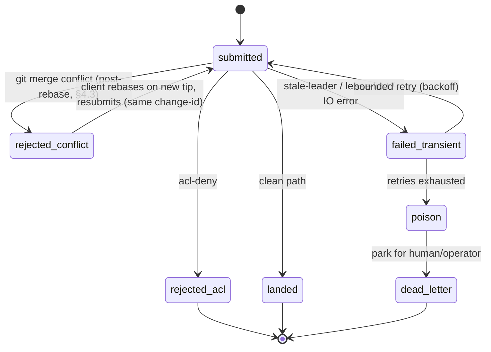

# 02 — The Land-Queue Kernel (the novel core)

> This is the centerpiece of `mvfs`. It specifies the sole durable write path: the **serialized,
> fenced, single-leased-leader trunk land queue**. It honors the keystone (`00-overview.md`) names,
> invariants **I1–I9**, and the §5 frozen contracts, and it discharges the Aphyr v2 Critical
> ("a lease is not a fence") at the **storage append**, where the reviews demand it.
>
> Reading order: keystone §3 (architecture), §4 (invariants), §5 (contracts) first. This document
> refines §5.1 (landed-entry), §5.4 (Shen↔shell boundary) and is the enforcer of **I1, I2, I3, I4,
> I7** (and the land half of **I6**).

---

## 0. The thesis in one paragraph

Trunk landing is linearizable **whenever the lease provides a single writer; when it does not**
(GC pause + clock skew + lease-TTL handoff) **a stale leader's land is converted into a hard
write-time failure, not a silently-discarded fork.** We achieve this with two orthogonal mechanisms
that the reviews insist must not be conflated:

1. **A type-layer capability (`lease-witness`)** that makes an *application-originated* stale-leader
   land **a program that does not typecheck** (I7, compile-time). This is the Minsky/Shen dividend.
2. **A storage-layer fencing token = lease epoch**, threaded into the landed-log entry
   (keystone §5.1 `fence`) and **compare-and-swapped on the durable append** so that a *truly
   concurrent / paused-then-resumed* stale leader's append **fails the CAS at write time** (I7,
   run-time). This is the Aphyr fix, placed **at the storage append, not in the lease**.

The type layer kills the easy class (we shipped a stale land). The storage CAS kills the hard class
(two nodes momentarily believe they hold the lease). **Both are required; neither substitutes for the
other.** (`08 §Finding 1`; `17 §F1, §F4`.)

---

## 1. The land FSM as Shen sequent-typed datatypes

### 1.1 Goal (I7, compile-time half)

Make four illegal programs **unconstructible** — they must not typecheck:

- **land-without-admission**: a `landed` cannot be produced from a `submitted` (must pass through
  `admitted`, which requires an `acl-proof`).
- **land-without-merge**: a `landed` cannot be produced from an `admitted` (must pass through
  `merged`/`based`, which is OCC-checked against the tip the merge resolved onto).
- **land-without-a-held-lease**: `land` demands a `lease-witness`, and a `lease-witness` is minted
  **only** inside `with-leadership`, cannot escape its dynamic extent, and cannot be forged or stored.
- **admit-without-an-acl-proof**: `admit` demands an `acl-proof`, and an `acl-proof` is minted **only**
  by the Datalog evaluator (`03-policy-and-acl.md`), tagged with the `acl-version` it was decided at.

Shen's sequent calculus (`datatype`) lets us write each transition as a **rule** whose premises are
the *typed* preconditions and whose conclusion is the *next state type*. If a premise is absent, the
sequent has no proof, so the term has no type, so the program does not compile.

### 1.2 The state types — each carries exactly its data

Each land state is a **distinct type**. A value of one state cannot be passed where another is
expected; there is no subtyping that would let a `submitted` masquerade as `merged`.

```shen
\* The four FSM states. Each is a distinct nullary type constructor used as a tag;
   the carried record is held in the verified judgement (see §1.3). *\

(datatype land-state
  ____________________
  submitted : land-state;

  ____________________
  admitted  : land-state;

  ____________________
  based     : land-state;     \* OCC-resolved onto a concrete tip (post-merge) *\

  ____________________
  merged    : land-state;     \* alias retained for keystone prose; == based + clean tree *\

  ____________________
  landed    : land-state;)
```

The *payload* of each state is carried in a sequent **judgement** `(change S P)` — "this change-id,
in state `S`, carries payload `P`". The payload shape per state (keystone §5.1 fields in scope at
that state):

```shen
(datatype payload
  \* SUBMITTED: what the client proposed; no authority yet. *\
  if (element? X (@p change-id Cid base Base paths Paths idem Key author Who content Tree ts T))
  _______________________________________________________________________________
  X : (payload submitted);

  \* ADMITTED: carries an unforgeable acl-proof tagged with the acl-version it was decided at. *\
  if (element? X (@p change-id Cid base Base paths Paths author Who acl-proof Pf acl-version Av))
  _______________________________________________________________________________
  X : (payload admitted);

  \* BASED: carries the concrete trunk tip the merge resolved onto, and the merged tree hash.
     base-resolved == the seq this OCC/merge was computed against (NOT yet seq+1). *\
  if (element? X (@p change-id Cid onto-seq Onto onto-tree OntoTree merged-tree MTree
                     commit-hash Ch parent-hash Ph acl-version Av acl-proof Pf))
  _______________________________________________________________________________
  X : (payload based);

  \* LANDED: carries the assigned gapless seq and the fence under which it was durably appended. *\
  if (element? X (@p change-id Cid seq Seq commit-hash Ch parent-hash Ph root-tree Rt
                     paths Paths acl-version Av fence Fence post-checksum Post))
  _______________________________________________________________________________
  X : (payload landed);)
```

### 1.3 The capabilities — `acl-proof` and `lease-witness` are abstract and unforgeable

```shen
\* acl-proof: produced ONLY by the Datalog evaluator (03). It is opaque: there is no
   public constructor, only [acl-decide] returns it, and it is stamped with the acl-version
   it was decided at, so a stale proof is detectable by carried data, not by convention. *\
(datatype acl-proof
  if (acl-decide Subject Paths Action  >>  (acl-allow Av))     \* the only inhabitant rule *\
  _______________________________________________________________________
  (acl-allow Av) : acl-proof;)

\* lease-witness: produced ONLY inside [with-leadership]; carries the lease epoch (the fence).
   It is rank-2 / region-scoped: it cannot be returned out of the [with-leadership] body,
   cannot be stored in a global, cannot be reconstructed. A non-leader has no rule to
   conclude (held E), so [land] is unprovable for it. *\
(datatype lease-witness
  if (leading-now  >>  (held E))           \* discharged only by with-leadership, see §2 *\
  _______________________________________________________________________
  (held E) : lease-witness;)
```

`leading-now` is **not** a value the program can fabricate; it is a hypothesis introduced by the
`with-leadership` combinator (§2.2) for the *dynamic extent of the callback only*. Outside that
extent there is no proof of `leading-now`, hence no `lease-witness`, hence no `land`.

### 1.4 The transitions — total functions whose preconditions are types

```shen
\* ADMIT: requires an acl-proof. No proof ⇒ no rule ⇒ admit is unconstructible here. *\
(datatype transitions
  if (change submitted X)                        \* premise: a submitted change *\
  if (X : (payload submitted))
  if (Pf : acl-proof)                            \* premise: an acl-proof (unforgeable) *\
  ___________________________________________________________________
  (admit X Pf) : (change admitted _);

  \* BASE/MERGE: requires admission + a concrete tip + a CLEAN git 3-way merge onto that tip.
     The merge is total (returns merged | conflict); only the [merged-clean] judgement
     (produced by §4.3) admits the [based] conclusion. A conflict has NO rule to [based]. *\
  if (change admitted X)
  if (X : (payload admitted))
  if (merged-clean X Onto MTree Ch Ph)           \* premise: git merge resolved clean onto Onto *\
  ___________________________________________________________________
  (base X Onto MTree Ch Ph) : (change based _);

  \* LAND: requires a based change AND a held lease-witness.
     No witness ⇒ no rule ⇒ [land] is unconstructible: this is I7 at compile time. *\
  if (change based X)
  if (X : (payload based))
  if (W : lease-witness)                         \* premise: (held E) for the current epoch *\
  ___________________________________________________________________
  (land W X) : (change landed _);)
```

**`land` is total in its inputs but partial in *effect*** — it can still *fail* at run-time on the
storage CAS (§3). The type guarantees only that *you held a lease-witness when you called it* and
*the change was admitted and based*. The fence CAS is what makes the run-time concurrency case safe;
the type is what makes the *programming-error* case impossible. (`17 §F1` insists on exactly this
division of labour.)

### 1.5 Proof that the two dangerous programs are unconstructible

- **"land without admission."** `land` requires `(change based X)`. The only rule concluding
  `(change based _)` is `base`, which requires `(change admitted X)`. The only rule concluding
  `(change admitted _)` is `admit`, which requires `Pf : acl-proof`. There is **no other** rule
  concluding `based` or `admitted`. Therefore any closed term of type `(change landed _)` contains,
  as a sub-derivation, a use of `admit` with an `acl-proof`. A program that lands a `submitted`
  directly has no derivation → it does not typecheck. ∎
- **"land without a held lease."** `land` requires `W : lease-witness`. The only rule concluding
  `lease-witness` discharges the hypothesis `leading-now`, which is introduced **only** by
  `with-leadership` and **only** for the extent of its callback (the witness is region-scoped and
  cannot escape, §2.2). A program that calls `land` outside `with-leadership` has no `leading-now` in
  scope, cannot conclude `lease-witness`, cannot apply the `land` rule → it does not typecheck. ∎

This is the keystone **I7** discharged at compile time for the *application*. The storage fence (§3)
discharges I7 for the *runtime race*. Both are needed; see §0.

---

## 2. Single leased leader

### 2.1 Lease source (single-DC, moderate scale; no Raft)

- **Production:** a TTL lease in **etcd** (lease-grant + keep-alive) or **Consul** (session). The lease
  exposes a **monotonic epoch** we use as the fence (§3.1): etcd `lease.ID`-bound CAS via a key whose
  `mod_revision` is strictly monotone, or Consul session `ModifyIndex`. The fence is sourced from the
  **lease KV's monotonic counter, never from the local trunk tip** (`17 §F4.1`: tip-derived tokens
  collide across two would-be leaders; epoch-derived ones do not).
- **Single-DC static fallback:** a `static` lease provider for dev / one-node deploys: epoch is a file
  bumped on start, fence still CAS'd on append. Same code path; only the epoch source changes.

The lease provider implements exactly one Shen↔shell primitive group (keystone §5.4):

```shen
\* All four are the audited trusted-shell surface for leadership. Pure Shen never renews a lease. *\
(lease-acquire   Provider)        \* -> (ok Epoch) | (error not-leader)            *\
(lease-renew     Provider Epoch)  \* -> (ok Epoch) | (error lost)  (keep-alive)    *\
(lease-valid?    Provider Epoch)  \* -> true | false  (re-check; used post-fsync)  *\
(lease-release   Provider Epoch)  \* -> ok                                         *\
```

### 2.2 `with-leadership` — the only minter of `lease-witness`

```shen
(define with-leadership
  { lease-provider --> (lease-witness --> A) --> (ok A) | (error leadership) }
  Provider Body ->
  (let Acq (lease-acquire Provider)
    (if (ok? Acq)
        (let Epoch (snd Acq)
             W     (mk-witness Epoch)        \* discharges (held Epoch) for THIS extent only *\
             R     (Body W)                  \* W is region-scoped; cannot escape this let *\
          (do (lease-release Provider Epoch) (ok R)))
        (error leadership))))
```

`mk-witness` is **private** to this module; no other definition can call it. `W` is consumed by `land`
and never returned (the type of `Body` is `(lease-witness --> A)` with `A` not mentioning
`lease-witness`; a leaked witness is a type error, the rank-2 guard Minsky prescribed, `11 §2`).

### 2.3 Only the leader runs the land worker; followers/replicas redirect

- The **land worker** (the loop in §4.6) runs **iff** `with-leadership` succeeds on this node. There is
  exactly one land worker cluster-wide *in the common case*; the fence (§3) is what makes the
  *uncommon* case (two believe they lead) safe.
- **Followers / async replicas** accept **no** `submit`. A `submit` to a follower returns
  `(redirect leader-endpoint)`. A read replica serves reads under the `as-of` basis (keystone §5.2),
  never a land. (Keystone arch diagram: "followers/replicas redirect".)
- **Leader-served linearizable reads** (if offered) are **lease-validated reads**: re-confirm
  `lease-valid?` *at read time* before answering tip, or redirect. (`08 §Finding 6`; not "trivially
  linearizable".) Detailed in `04-read-boundary-consistency-security.md`; named here for completeness.

---

## 3. The fencing protocol — THE fix (I7 / I4)

> This section is the load-bearing one. Aphyr v2 (`08 §Finding 1`) and the backend head-to-head
> (`17 §F1, §F4`) both make the same demand: **the fence must live at the storage append**, be sourced
> from the **lease epoch** (not the tip), be **CAS'd against the durable head** (not a per-process
> counter), and the leader must **re-validate the lease after fsync and before client ack**.

### 3.1 Definition

```
fence : u64   ; == the current lease epoch, sourced from the lease KV's monotonic counter
              ; carried in the lease-witness (§1.3) and written into the landed-entry (keystone §5.1)
```

Properties required (all from `17 §F4`):
- **Monotone across leadership changes.** Each successful lease acquisition yields a strictly larger
  epoch than any previously granted. A new leader's fence is always `> ` any prior leader's fence.
- **Not the tip.** Two would-be leaders both compute `tip+1` for *seq*; they must NOT both compute the
  same fence. The fence comes from the epoch, so the stale leader's fence is strictly smaller.
- **CAS'd on the durable head, atomic with the durable write.** The fence comparison reads the
  **durable log head** fresh (post-pause) and the compare-and-set is the *same* operation as the
  durable append — the append's linearization point. It is **not** an in-memory `s.fenceHead`
  (the per-process-counter trap `17 §F1(b)`/`§F4.2` calls out).

### 3.2 The exact fenced-append pseudocode (the storage primitive)

This is one of the keystone §5.4 trusted-shell primitives: `durable append+fsync to the landed-log`
fused with `fencing-token CAS`. It runs in the land tier (shen-cl/SBCL or shen-go).

```
\* durable-append-fenced! is THE storage primitive. It owns the log file. The CAS, the write,
   and the fsync are one critical section on the single-writer durable medium. *\

durable-append-fenced!(Entry, Witness, Provider):
    # Entry.fence == epoch carried by Witness (§1.3); enforced by the type of the caller.
    LOCK(log)                                  # single-writer; no two appends interleave on this node
    Head      := READ_DURABLE_HEAD(log)        # fresh read of the durable head AFTER any pause
    LastFence := Head.fence                    # the fence of the last durably-appended entry
    LastSeq   := Head.seq
    LastPost  := Head.post_checksum

    # ---- THE FENCE CAS: append succeeds ONLY IF fence >= last-fence (keystone §5.1) ----
    if Entry.fence < LastFence:                # a STRICTLY smaller fence == a stale/deposed leader
        UNLOCK(log)
        return (error stale-leader Entry.fence LastFence)   # HARD FAILURE, not a fork

    # gapless seq is assigned HERE, under the lock, against the fresh durable head (I1)
    Entry.seq           := LastSeq + 1
    Entry.parent_hash   := Head.commit_hash
    Entry.prev_checksum := LastPost
    Entry.post_checksum := chain_checksum(LastPost, Entry)   # rolling chain (keystone §5.1)

    WRITE(log, Entry)                          # append the bytes
    FSYNC(log)                                 # durable on THIS node now (width 1)

    # ---- RE-VALIDATE THE LEASE AFTER FSYNC, BEFORE ACK (Aphyr 08 §F1.c / 17 §F4.2) ----
    if not lease-valid?(Provider, Entry.fence):
        # We fsync'd, but during the write our lease may have been lost (pause/handoff).
        # If a NEWER leader has since advanced the durable head past us, our entry is
        # already shadowed; if not, we must not ACK as durable. Mark for reconciliation.
        UNLOCK(log)
        return (error lease-lost-post-fsync Entry.seq)   # client sees UNKNOWN, not landed (§5.3)

    UNLOCK(log)
    return (ok Entry.seq Entry.fence Entry.post_checksum)  # caller now advances tip + acks (§6)
```

Two subtleties that make the CAS a *distributed* fence and not a per-process counter (`17 §F4.2`):

1. `READ_DURABLE_HEAD` reads the **durable medium**, not a cached variable, so a leader resuming from
   a pause sees any head a successor advanced.
2. The CAS + write + fsync are serialized through the **single-writer lease**: a non-leader cannot have
   advanced the durable head because it cannot acquire the lease (and therefore cannot have produced a
   larger fence and a larger seq). The compare is against the durable head; the lease guarantees the
   compare's `Head` is authoritative for any *committed* state. Combined with the **post-fsync lease
   re-validation**, a stale leader either (a) finds its fence `< LastFence` and fails the CAS, or
   (b) appends but fails `lease-valid?` and returns `unknown` rather than acking. There is no path that
   acks a stale land as durable. ∎

> **Why `>=` and not `>` in the CAS?** A leader may legitimately append multiple entries under the
> *same* epoch (the common case — one leader, many lands). So the rule is **`fence >= last-fence`**
> (keystone §5.1: "append succeeds only if `fence ≥ last-fence`"). Monotonicity across *leadership*
> is what matters; a deposed leader has a strictly smaller epoch and fails `<`. A successor that won
> the lease has a strictly larger epoch and trivially passes.

### 3.3 The fence lives at the append, not just in the lease — explicitly

The `lease-witness` (§1.3) makes the *application* unable to call `land` without a witness. But a
witness minted **before** a pause is still in scope **after** the pause — the brain has no way to know
wall-clock moved (`17 §F1` step 5, `11 §2` caveat). Therefore the witness **cannot** be the fence.
The fence must be enforced **where the durable bytes are written**, against the **durable head**,
**after** the pause. That is precisely `durable-append-fenced!`. The lease gives *likely* single
writer; the storage CAS gives *fenced* single writer. (`08 §F1`; `17 §F1`.)

### 3.4 Walking the stale-leader / partition / handoff interleaving

The canonical Aphyr history (`08 §F1`), now closed by the fence:

1. Cluster: **L1** leader (epoch/fence = **7**), replicas R2, R3. trunk tip = seq 100, durable head
   fence = 7, post-checksum `C100`.
2. L1 accepts submit for change **H**, runs admission + OCC (base == 100, clean), then **stop-the-world
   GC-pauses** before its `durable-append-fenced!`.
3. L1's lease TTL elapses in real time. etcd/Consul releases it. **R2 acquires the lease → epoch/fence
   = 8** (strictly larger). R2 lands a different change **H'** at seq 101 via
   `durable-append-fenced!`: its fence 8 `>= ` durable head fence 7 → CAS passes; durable head becomes
   `{seq:101, fence:8, post:C101'}`. R2 re-validates lease (still holds) → acks its client
   "landed seq 101, width w".
4. **L1 resumes.** Its in-scope witness still says fence = 7. It calls
   `durable-append-fenced!(Entry{fence:7, ...}, W7, …)`.
   - `READ_DURABLE_HEAD` returns the **fresh** durable head `{seq:101, fence:8}`.
   - The CAS checks `Entry.fence (7) < LastFence (8)` → **true** → **`return (error stale-leader 7 8)`**.
   - L1's land **fails to commit**. L1 returns `(error stale-leader)` up through `land`'s caller. The
     client of L1 gets a **hard error**, not a false "landed" ack.
5. There is **no fork.** The durable log has exactly one seq-101 (`H'`, fence 8). H was never appended.
   No checksum-chain divergence to detect, no resync-discard, no silently-vanished acked commit.

Compare to the keystone-rejected baseline (Consul TTL + checksum chain alone): there, step 4 *appends*
and *acks*, the fork is *detected at replication*, and L1's H is *discarded on resync* — detection +
data loss, which is **not** what we ship. The fence converts step 4 from "commit-then-discard" into
"fail-to-commit-then-honest-error". (`08 §F1`; `17 §F3`.) ∎

**Partition variant (minority cannot lead).** If L1 is partitioned into the minority, it cannot renew
its lease (the lease KV quorum is on the majority side); its epoch expires; it cannot mint a *fresh*
witness; any in-flight witness fails the post-fsync `lease-valid?` or the CAS against the majority's
advanced head. The minority **cannot land** → no split-brain land (keystone I7; `08` "minority can't
lead"). The majority side acquires a larger epoch and proceeds.

**Clean handoff variant.** L1 voluntarily releases (deploy/restart). R2 acquires epoch 8, reads durable
head, continues seq from the durable head. No gap (I1), no overlap (fence strictly increases). Any
*uncommitted* work L1 had is re-pending (the client never got an ack ⇒ retries under §5).

---

## 4. The land pipeline

### 4.1 Stages

```
submit
  → admission         (ACL via Datalog → acl-proof; 03)              [type: submitted → admitted]
  → OCC base-check    (is job.parent == trunk.tip?)
      ├─ yes (fast)   → assign nothing yet; go to durable append
      └─ no           → rebase via git 3-way merge (shell out)
                          ├─ clean   → based on tip                  [type: admitted → based]
                          └─ conflict→ rejected(conflict) → client rebase (§7)
  → fenced durable append   (durable-append-fenced!; seq = tip+1 under the lock; §3.2)
                                                                     [type: based → landed]
  → advance tip       (in-memory applied-seq := seq)
  → ack with durability width   (§6)
  → notify            (post seq to replica stream + side-effect bus, keyed on landed-seq; §5)
```

### 4.2 OCC base-check

`job.parent == trunk.tip?` is checked **against the leader's own authoritative durable head**, never an
async replica (keystone I6 land-half; `08` original-Critical-3 residue). On the fast path (parent ==
tip) no rebase is needed and the change's `commit-hash` is the client's commit unchanged → the
`idempotency-key`'s associated `change-id` is stable and `commit-hash` is stable.

### 4.3 Rebase via **real git 3-way merge** — and the correct conflict definition

We **shell out to git** (keystone §5.4; Torvalds `18`): the trusted shell owns merge; pure Shen owns
the *decision* about the result. We do **not** hand-roll diff3.

```
\* The trusted-shell merge primitives (keystone §5.4): *\
git merge-base <onto> <change-parent>                 # for a true 3-way base when needed
git merge-tree --write-tree <onto> <change>           # produces merged tree OR conflict report
                                                      # (modern git: structured conflict output)
\* fallback for blob-level content: *\
git merge-file -p <ours> <base> <theirs>              # 3-way file merge, conflict markers
```

`git merge-tree --write-tree` gives us a **rename-aware, recursive (ORT) tree merge** — the real
engine, not a path-overlap heuristic. The Shen side marshals its result into a **total** sum
(Minsky `11 §3`; Torvalds `18` "the brain's contribution is the unignorable sum type"):

```shen
(datatype merge-result
  if (git-merge-tree Onto Change  >>  (clean Tree))
  ___________________________________________________
  (clean Tree) : merge-result;

  if (git-merge-tree Onto Change  >>  (conflict Hunks))
  ___________________________________________________
  (conflict Hunks) : merge-result;)

\* merged-clean (the premise §1.4 [base] needs) holds IFF the merge is clean AND
   the post-rebase result manifest would NOT overwrite an unobserved value (see below). *\
```

**The conflict definition (the Torvalds correction, `18`).** A conflict is **the post-rebase
result**, *not* mere path overlap:

- **Not** "both touched path P" → that is path-overlap, which over-rejects (two disjoint edits to the
  same file merge cleanly in git).
- **Conflict iff** git's 3-way merge returns conflict hunks **for the rebased change onto the current
  tip**, i.e. the rebased result manifest would **overwrite a value the change did not observe** at its
  base. Concretely: the change was authored against `onto-tree` at `base`; trunk has since advanced to
  `tip-tree`; we replay the change's diff onto `tip-tree`; if git can produce a clean merged tree, it
  is `(clean MTree)` and we proceed; if git reports a textual or structural (rename/rename,
  delete/modify) conflict, it is `(conflict Hunks)` and we **reject** (§7).

This is why disjoint-path lands can bypass a stuck head (§7.4): two changes touching disjoint paths both
merge clean onto the tip and never conflict with each other.

### 4.4 Assign seq, fenced durable append

Seq assignment is **inside** `durable-append-fenced!`, under the log lock, against the fresh durable
head: `seq := head.seq + 1` (I1, gapless, monotone). This couples seq assignment to the fence CAS so a
stale leader can never assign a seq that collides with a successor's (it fails the CAS first).

### 4.5 Advance tip, ack, notify

On `(ok Seq Fence Post)` from the append:
- `applied-seq := Seq` (leader's in-memory tip; replicas advance on stream apply).
- Ack the client `{landed: Seq, fence: Fence, durable_on: [...], width: W}` (§6).
- Notify: append `Seq` to the replica stream; fire downstream side-effects **keyed on landed-seq**
  (CI/deploy/tag), never on the submit, so a duplicate land cannot double-fire (`08 §F3`).

### 4.6 The land worker loop (sketch)

```shen
(define land-worker
  Provider Store ->
  (with-leadership Provider                       \* mints W only while we provably lead *\
    (/. W
      (loop-forever
        (let Job (take-next-submit Store)         \* serialized queue head *\
          (land-one W Provider Store Job))))))

(define land-one
  W Provider Store Job ->
  (let A   (admit-step Store Job)                 \* submitted → admitted (acl-proof) | reject *\
    (if (rejected? A) (ack-reject Job A)
      (let B (base-step Store A)                  \* OCC + git merge → based | conflict *\
        (if (conflict? B) (ack-reject Job B)      \* rejected(conflict) → client rebase (§7) *\
          (let L (land W B)                       \* based → landed (TYPE requires W) *\
               R (durable-append-fenced! (entry-of L) W Provider)   \* the fence CAS (§3.2) *\
            (cases
              (ok? R)            (do (advance-tip Store R) (ack-landed Job R))
              (stale-leader? R)  (ack-error Job stale-leader)        \* hard failure, not fork *\
              (lease-lost? R)    (ack-unknown Job)                   \* client treats as UNKNOWN *\
              (transient? R)     (retry-or-deadletter Store Job R))))))))  \* §7 *\
```

### 4.7 Sequence diagram

```mermaid
sequenceDiagram
  autonumber
  participant C as Client (CLI)
  participant L as Leader land-worker (Shen brain)
  participant DL as Datalog ACL (soa32)
  participant G as git (trusted shell)
  participant LOG as landed-log (durable, fenced)
  participant KV as lease KV (etcd/Consul)
  participant R as replicas

  Note over L,KV: with-leadership: L holds lease epoch=7 ⇒ lease-witness W(7)
  C->>L: submit{change-id, base, paths, idem-key, commit}
  L->>L: dedup(idem-key, change-id) on committed log  (I3, §5)
  alt already landed (committed)
    L-->>C: ack{landed: prior-seq}   (no-op re-return, §5)
  else not landed
    L->>DL: acl-decide(subject, paths, action)
    DL-->>L: acl-allow(acl-version Av)  ⇒ acl-proof   (admit: submitted→admitted)
    L->>L: OCC base-check: parent == tip?
    alt parent == tip (fast path)
      L->>G: (no rebase needed)
    else parent != tip
      L->>G: git merge-tree --write-tree onto=tip change
      alt clean
        G-->>L: merged tree MTree   (based)
      else conflict (post-rebase overwrite of unobserved value)
        G-->>L: conflict hunks
        L-->>C: reject{conflict, hunks}  → client rebase (§7)
      end
    end
    L->>LOG: durable-append-fenced!(entry, W(7))
    Note over LOG: READ durable head; CAS fence 7 >= last-fence?; assign seq=tip+1;<br/>write; FSYNC (width 1)
    alt fence CAS fails (stale leader)
      LOG-->>L: error stale-leader
      L-->>C: error{stale-leader}   (hard failure, NOT a fork — §3.4)
    else appended + fsync'd
      L->>KV: lease-valid?(epoch 7)   (re-validate AFTER fsync, BEFORE ack)
      alt lease still held
        opt durability width >= 2
          LOG->>R: stream entry; await f+1 replica confirms
          R-->>LOG: confirm
        end
        L->>L: advance tip := seq
        L-->>C: ack{landed: seq, fence:7, durable_on:[...], width: W}   (I4)
        L->>R: notify seq; fire side-effects keyed on landed-seq
      else lease lost post-fsync
        L-->>C: unknown   (client queries-by-key before retry, §5)
      end
    end
  end
```

---

## 5. Idempotency & at-most-once (I3)

### 5.1 The dedup key

The dedup key is **`(idempotency-key, change-id)`** — both, because **rebase changes the
`commit-hash`** (the rebased commit is a different git object) but the `change-id` is **stable across
revisions/rebase** (Gerrit-style, keystone §5.1) and the `idempotency-key` is stable across client
retries. Keying on `commit-hash` alone would miss a rebased re-land; keying on `idempotency-key` alone
would miss a legitimately different change under a reused key. (`08 §F3`; keystone I3.)

The key lives **in the landed-log entry / RSM**, the *single authority* — not a side table
(`08` "one authority", which dissolved the original dual-authority Critical). Dedup is a query over the
**committed** log.

### 5.2 Race-free across leader handoff

The new leader reads the **committed** log on acquisition (it streams/applies the durable log up to its
durable head before serving). Therefore:

- **Committed ⇒ visible to the new leader.** A land that was durable (and thus committed) at the width
  it achieved is in the log the new leader reads → a retry deduplicates correctly.
- **Uncommitted ⇒ re-pending.** A submit that the old leader had not durably appended (or appended but
  could not ack) is simply *not in the log* → it is re-pending; the client (which got `unknown` or a
  timeout, never a `landed` ack) retries and the new leader lands it fresh. No duplicate, because the
  original never committed.

**The honest residue (`08 §F3`).** Dedup is only as consistent as the **replication of the thing you
dedup against**. A land that achieved **width 1** (leader-only fsync) and whose leader's disk dies
before any replica pulled it is **lost**; a retry under the same key on the new leader will **not** find
it and will land it — *but the original was never durable beyond the dead node*, so this is at-most-once
*relative to durable state*, and the client knew the achieved width was 1 (§6) and could have required
width ≥ 2. We state this plainly rather than claim quorum we do not have.

### 5.3 The client "unknown" state

A submit that **times out** or returns `unknown` (lease-lost-post-fsync, §3.2) is in state **unknown**,
not failed. The CLI protocol:

```
on timeout/unknown:
    res := land-status query-by-key(idem-key, change-id) on the CURRENT leader
    if res == landed(seq):   treat as success (the original landed; possibly under old leader)
    if res == not-found:     # could be genuinely-not-landed OR lost-in-handoff at width 1
        retry submit with the SAME (idem-key, change-id)
```

`not-found` on the new leader could be a real not-landed **or** a width-1 land lost in handoff; the
client cannot distinguish these without quorum, and we say so (`08 §F3`). Raising durability width
(§6) shrinks the lost-in-handoff possibility to `width-1` correlated losses.

### 5.4 At-apply idempotency & the clean-re-add hole (content-equality no-op)

`durable-append-fenced!`'s caller checks dedup **before** appending. But two further rules make landing
idempotent under content equality (`08 §F3`, original Finding 7):

1. **Present-key no-op.** If `(idem-key, change-id)` is already in the committed log, **re-return the
   original `seq`** (a no-op), do not append a second entry.
2. **Content-equal re-add (the clean-re-add hole).** If a change adds a file at path P with content C,
   and P at the current tip **already has content C** (e.g. the change was effectively already applied,
   or two clients independently produced identical content), the rebased result manifest is
   **byte-identical to the tip for those paths** → the merge is `(clean tip-tree)` with **no net diff**.
   We treat a land whose `merged-tree == onto-tree` (no observable change) as a **content-equality
   no-op**: it lands as a *zero-diff* entry (or is collapsed to a no-op returning the tip's seq, per
   policy in `06-product-edges.md`), and **fires no duplicate side-effects** (side-effects keyed on
   landed-seq, §4.5). This closes the "re-add identical content shouldn't double-count" hole.

3. **Downstream side-effects keyed on landed-seq.** CI/deploy/tag triggers fire on the **landed-seq**,
   never on the submit, so even a duplicate *submit* that collapses to the same seq cannot double-fire
   them.

---

## 6. Durability-width ack (I4)

### 6.1 The ack contract

The ack **must report the achieved durability width** so a client can tell a durable land from a
lost-able one (`08 §F2`: silence is the footgun, not async-ness).

```
ack := { landed: seq, fence: fence, durable_on: [node-ids], width: w }

width 1 := fsync-on-leader only          (durable on the leader's disk; survives a clean crash,
                                          NOT a permanent single-node disk loss)
width 2 := leader fsync + f+1 replica confirms before ack
                                          (survives 1 independent node loss of the ack set)
width w := leader + (w-1) replica confirms
```

The general rule (standard async truth): **width-`w` survives `w-1` simultaneous losses of the ack
set, and nothing more.** A client / CI gate that requires `width ≥ 2` **refuses to proceed** on a
width-1 ack.

### 6.2 Default and cost

- **Default = width 2** (`08 §F2`: "optional is not a default"). For "survive single-node loss without
  consensus", the leader waits for **one** replica confirm before acking. Cost: one extra replica RTT
  per land — acceptable at hundreds-of-devs single-leader throughput.
- Width 1 is a knob for latency-over-durability deployments, **explicitly** chosen, never implicit.

### 6.3 Durability ≠ agreement

A replica's ack of the **bytes** is **not** a vote that the leader was still leader. Width (durability)
and the fence (agreement / single-writer) are **orthogonal** (`08 §F2`, `17 §F3`). The fence (§3) is
what prevents a stale-leader land; width is what prevents single-node data loss of a *legitimately
landed* commit. The spec keeps them separate; a width-2 ack from a stale leader still fails the fence
CAS before it can ack at all.

### 6.4 The failover data-loss window, stated honestly

- **Window width:** `lease_TTL + max_clock_error + max_pause` bounds the interval in which a stale
  leader could be live; **the fence makes a stale land in that window fail rather than fork** (§3.4).
  The *residual* loss is the **durability** window, not a consistency one.
- **Width-1 loss window:** a width-1 land whose leader suffers permanent disk loss before any replica
  pulls it is **lost** (and the client knew width was 1). Width-2 closes single independent loss.
- **Correlated-failure boundary:** width-2 survives **1 independent** node loss; **correlated** loss of
  the ack set (shared rack/PDU/AZ) is **outside the model**. We name it rather than hide it (`08 §F2`).
- **Inequality to honor:** `lease_TTL > max_clock_error + max_pause + renewal_RTT`. Violating it widens
  the stale-leader-live window (but the fence still prevents the fork; it only affects how often a stale
  leader gets the *honest error* rather than not running at all). Pick numbers per deploy in
  `07-build-plan.md`.

---

## 7. Conflict / retry / dead-letter FSM

A submit that does not land cleanly takes one of these outcomes. This is a **separate FSM** from the
land-state FSM (§1) — it classifies *failures*, not *successes*.



### 7.1 rejected(conflict) → client rebase
A `(conflict Hunks)` from §4.3 is returned to the client with the hunks. The client rebases its stack
locally onto the new tip (restack-on-land, `06-product-edges.md`), preserving `change-id`, and
resubmits. The `change-id` stability means the rebased resubmit is recognized as the same logical
change; a commit in the stack already landed (by `change-id`) is **dropped** (reusing idempotency,
`18` restack). Restack quality == merge quality, and we use **real git merge** so rename-aware restack
is correct (`18` Showstopper-avoidance).

### 7.2 failed(transient) → bounded retry
`stale-leader` (the deposed leader's own client — it should re-query the new leader, §5.3),
`lease-lost-post-fsync` (→ client `unknown`, §5.3), and transient IO errors are **transient**. The land
worker retries with bounded backoff up to `max_retries`; the *client*-visible cases route through §5.3.

### 7.3 poison → dead-letter
A job that exhausts `max_retries` (e.g. a malformed commit, a persistent merge driver crash) is
**poison**: it is parked in a **dead-letter** queue with its failure reason for operator/author
attention, and **does not block the queue head** (§7.4).

### 7.4 disjoint-path lands bypass a stuck head
The land queue is serialized for *ordering* (I2), but a **poison job at the head must not wedge the
trunk**. Because a conflict is *post-rebase overwrite of an unobserved value* (§4.3) and **not** path
overlap, a subsequent submit touching **disjoint paths** (its rebased result merges clean onto the tip
and does not overwrite anything the poison job touched) can be **admitted past** the parked poison job:
the poison job is moved to dead-letter, the disjoint job lands at the next seq. This preserves liveness
without violating I2 (the *landed order* is still the append order; only the *parked* job is removed
from the queue, not reordered after a successful land). Jobs that **do** conflict with the parked job
wait or are themselves rejected for client rebase. (This is the keystone "disjoint-path lands bypass a
stuck head" requirement.)

---

## 8. Invariants & fault model

### 8.1 Invariant enforcement map (the land-tier half of I1–I7, plus I6 land-half)

| ID | Invariant | Enforced here by |
|---|---|---|
| **I1** | Single linear trunk; gapless monotone `seq`, one parent | `seq := head.seq+1` **inside** `durable-append-fenced!` under the log lock against the fresh durable head (§3.2, §4.4); `parent_hash := head.commit_hash` |
| **I2** | Total land order = landed-log append order; replicas apply in that order | single-writer serialized append (§3.2); replicas apply the streamed log in seq order and reject out-of-order / stale-fence entries (§8.2) |
| **I3** | At-most-once per `(idempotency-key, change-id)` | dedup over the **committed** log before append; present-key no-op re-returns seq; content-equality no-op; side-effects keyed on landed-seq (§5) |
| **I4** | No lost *acked* land at the stated width; ack carries width | width-2 default; ack reports `{durable_on, width}`; honest loss window stated (§6) |
| **I6** (land-half) | Land authorized against `acl-version` current at its linearization point; no stale-allow | `admit` requires `acl-proof` stamped with `acl-version`; leader reads ACLs from **its own authoritative trunk/index**, never an async replica; acl-version carried into the landed-entry (§1, §4; `03`) |
| **I7** | A non-leader / stale-leader **cannot** land | **type-level** `lease-witness` (compile-time, §1.5) **+ storage** fence CAS on durable append (run-time, §3) — both, neither alone |

### 8.2 Replica apply (the third fence enforcement point, `17 §F4.3`)

Replicas applying the streamed log **reject any entry whose `fence < their applied fence`** and any
entry whose `seq != applied-seq + 1` or whose `prev_checksum != local post_checksum`. This makes a
stale leader's stream (if it somehow reaches a replica) **rejected at apply**, not applied-then-detected
— the same fence discipline the leader applies at the durable append, applied again at the replica.
(`17 §F4.3`.)

### 8.3 Fault model — the dangerous interleavings and their resolution

| Fault | Resolution | Invariant |
|---|---|---|
| **Partition: minority leader** | minority cannot renew lease ⇒ no fresh witness; in-flight witness fails fence CAS / post-fsync re-validation against majority's advanced head ⇒ **cannot land** | I7 |
| **Leader GC pause past TTL, then resume** | resumed leader's fence `< ` successor's durable-head fence ⇒ fence CAS fails ⇒ **hard error, no fork** (§3.4) | I7, I1 |
| **Leader failover (clean)** | successor acquires larger epoch, reads committed log + durable head, continues seq gaplessly | I1, I2 |
| **Duplicate submit (same key)** | dedup over committed log ⇒ present-key no-op re-returns seq | I3 |
| **Duplicate submit across handoff (uncommitted original)** | original not in committed log ⇒ re-pending ⇒ lands once | I3 |
| **Width-1 land + permanent leader disk loss** | **lost** — but client knew width 1 and could require width ≥ 2; stated honestly | I4 (window) |
| **Stale ACL** | leader reads ACL from its own trunk, never a replica; acl-version carried; stale proof detectable by carried data | I6 |
| **Concurrent OCC base race** | both rebased onto current tip via git merge; second to the lock rebases onto the first's new tip (seq strictly increases) | I1, I2 |
| **Poison job at queue head** | dead-lettered; disjoint-path lands bypass it (§7.4) | liveness, I2 |

### 8.4 Fault-injection test plan (Jepsen-style), per invariant

Each test runs the real land tier with a fault injector around the lease KV, the durable-log fsync, the
process scheduler (pause injection), and the network. A history checker validates the named invariant.

- **I1 (gapless monotone seq):** kill-and-restart the leader mid-land repeatedly under concurrent
  submits; assert the landed-log `seq` sequence is `100,101,102,…` with **no gaps, no duplicates, no
  regressions**, and every entry's `parent_hash == prior.commit_hash`.
- **I2 (total order = append order):** stream to replicas under churn; assert every replica's applied
  prefix is a prefix of the leader's log, identical order, and replicas **reject** any injected
  out-of-order or stale-fence entry (§8.2).
- **I3 (at-most-once):** the **canonical handoff history** (`08 §F3`): land H@key K at width 1 on L1,
  kill L1 before R2 pulls, fail the client ack, client retries K on R2. Assert exactly one durable land
  of K **or** an honest `not-found`+re-land (never two durable lands of K). Run the width-2 variant and
  assert the retry **always** deduplicates. Run the content-equal re-add and assert a **no-op**
  (no second entry, no second side-effect fire).
- **I4 (durable-width ack):** width-1: land, **destroy the leader's disk** (not a clean crash) before
  any replica pulls, fail over; assert the client's ack **reported width 1** (so loss was knowable),
  and the commit is absent. width-2: same kill of the leader only; assert the commit **survives** on the
  replica and the ack **reported width 2**. Correlated-loss: kill leader+confirming-replica together;
  assert the commit is lost **and** this is the documented out-of-model boundary (the test asserts the
  ack said width 2 — i.e., the loss is correlated, not a width accounting bug).
- **I6 (no stale-allow):** interleave an ACL-revoking policy land between a principal's submit and its
  durable append; assert the revoked principal's land is **rejected** (acl-version advanced; proof
  stale), and that a leader forced to read a *stale replica's* ACLs is a configuration the code path
  **forbids** (asserted by construction: the ACL read goes to the leader's own trunk handle).
- **I7 (fenced authority — the headline test):** the **stale-leader history** (`08 §F1`, §3.4 above):
  pause L1 (epoch 7) past TTL, let R2 (epoch 8) land seq 101, resume L1, let L1 attempt its land.
  Assert L1's `durable-append-fenced!` returns **`stale-leader`** (fence 7 < 8), L1's client gets a
  **hard error** (no false ack), and the durable log has **exactly one** seq 101 (R2's, fence 8) — **no
  fork, no resync-discard**. Run the concurrent-double-leader variant: two would-be leaders append
  concurrently; assert **exactly one CAS wins**, the loser gets `stale-leader`, the chain is intact.
- **Liveness (§7.4):** park a poison job at the head; submit a disjoint-path land; assert the disjoint
  land **completes** (head does not wedge) and the poison job is in **dead-letter** with its reason.

---

## 9. The Shen↔shell boundary used here (keystone §5.4)

Pure Shen makes every *decision*; the audited trusted-shell primitives perform every *effect*. The
land-tier subset of keystone §5.4:

| Primitive (trusted shell) | Purpose | Used in |
|---|---|---|
| `lease-acquire / renew / valid? / release` | leadership + epoch (fence source); **post-fsync re-validation** | §2, §3.2 |
| `git merge-base` | true 3-way base for recursive merge | §4.3 |
| `git merge-tree --write-tree` | rename-aware ORT tree merge → clean tree or conflict | §4.3 |
| `git merge-file` | blob-level 3-way content merge (fallback) | §4.3 |
| `git hash-object / write commit / read-tree` | write the rebased commit object; read trees | §4 |
| `durable-append-fenced!` | **the fused fence-CAS + append + fsync** on the single-writer log | §3.2 |
| `read-durable-head` | fresh durable head read (post-pause) for the CAS and seq assignment | §3.2 |
| `stream-to-replica / await-confirm` | width-≥2 durability; replica apply (fence-rejecting) | §6, §8.2 |

Everything else — the land FSM, admission decision wiring, OCC logic, dedup, conflict classification,
retry/dead-letter policy, the totality of `merge-result`, the `lease-witness` discipline — is **pure
Shen** and is statically/decidably checkable. The Shen program is the **executable specification and
conformance oracle** (keystone §2): a later reimplementation differential-tests against it.

> **Boundary discipline (Minsky `11 §2`, Aphyr `17 §F1/F4`).** Two rules are non-negotiable: (1) the
> fence is enforced **inside `durable-append-fenced!`** (the trusted shell owns the append), against the
> **durable head**, not a Shen-side cached counter — otherwise it degrades to a per-process counter; (2)
> the `lease-witness` is the *application* guard and the fence CAS is the *storage* guard, and **neither
> stands in for the other**.

---

## 10. What this kernel does and does not claim

- **Claims:** linearizable trunk landing **whenever the lease provides a single writer**; when it does
  not, a stale-leader land is a **hard write-time failure (fence CAS), not a fork**; at-most-once per
  `(idempotency-key, change-id)` relative to durable state; an ack that **honestly reports its
  durability width**; gapless monotone `seq`; ACL-sound landing at the linearization point.
- **Does not claim:** consensus; survival of correlated ack-set loss; survival of width-1 loss
  (knowable from the ack); proof of the shelled-out oracles (git/fs/lease-KV are trusted). The word
  "linearizable" is used **only** with the single-writer qualifier above (`08 §F1`, `17 §F7`).

---

## Appendix A — Cross-reference to the reviews this discharges

| Review demand | Where discharged |
|---|---|
| `08 §F1` lease ≠ fence; fencing token CAS'd on durable append; lease re-validated after fsync, before ack; honest loss window | §3.1–§3.4, §6.4, §0 |
| `08 §F2` ack reports achieved durability width; default width 2; correlated-loss boundary named | §6 |
| `08 §F3` dedup keyed in the one authority; race-free across handoff (committed/uncommitted); content-equal no-op; side-effects on landed-seq; client `unknown` state | §5 |
| `17 §F4.1` fence = lease epoch, **not** the tip | §3.1 |
| `17 §F4.2` CAS against the **durable head**, atomic with the write, not a per-process counter | §3.2 |
| `17 §F4.3` replicas reject entries with fence ≤ applied | §8.2 |
| `11 §1` land-FSM as GADT; illegal transitions don't typecheck | §1 |
| `11 §2` `lease-witness` capability; stale-leader land a compile error; region-scoped, unforgeable | §1.3, §1.5, §2.2 |
| `11 §3` merge as total function returning a sum | §4.3 |
| `11 §4` ACL as unforgeable proof stamped with acl-version, consumed by admission | §1.3, §1.4, §4 |
| `18` use git's real 3-way merge (merge-tree/merge-file); conflict = post-rebase result, not path overlap; restack quality == merge quality | §4.3, §7.1, §7.4 |
