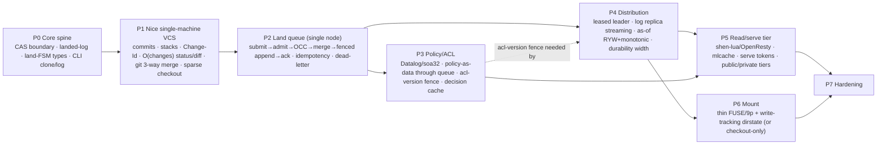

# mvfs — Build Plan (spec/07)

> Turns the committed design (`00-overview.md`, the keystone) into a **phased, buildable plan** on
> the author's own Shen toolchain (**shen-lua → LuaJIT**, **shen-cl → SBCL**, **shen-go**;
> shen-ocaml in dev). Honors honor-names, invariants **I1–I9**, and the §5 cross-document contracts.
> Where the older `../14-plan-shen.md` assumed `shen-irmin`, this plan follows the keystone's
> **shell-out-to-`git`** CAS/merge decision (§5.4) instead. The Shen program is the **reference +
> conformance oracle** (keystone §2): build for correctness first, reimplement hot edges later
> against the oracle by differential test.

The governing rule (keystone §2, **proven brain / trusted shell**): all *decisions* are Shen
(sequent-typed FSM, soa32 Datalog); all *mechanism* is delegated to audited oracles (`git`, the OS,
nginx, LuaJIT) across the small §5.4 boundary. **We build the brain; we wire the shell.**

---

## 0. Critical-path philosophy: VCS-first, value-oriented, before the edges

The ordering is deliberately **not** "stand up the fast serving tier first." Following Torvalds'
point (`../03`,`../09`) and Hickey's value-orientation (`../24`): **prove the thing is a pleasant,
correct VCS on one machine before adding distribution, before adding the LuaJIT read tier, before
adding the mount.** The spine is the landed-log (the value), the CAS boundary, and the
sequent-typed land-FSM. Everything fast or distributed hangs off that spine and is differential-
tested against it.

Dependency graph (spine is linear; edges fan out):



- **Spine (must be sequential):** `P0 → P1 → P2`.
- **`P3` (policy)** can begin in parallel once `P2` exists (it lands policy *through* the queue), but
  its `acl-version` fence must be merged before `P4` claims I6 across replicas.
- **`P5` (serve tier)** and **`P6` (mount)** both require `P4`'s `as-of` basis (I8) and the read
  boundary (`04`). They are parallelizable with respect to each other.
- **Demoable single-node VCS at end of `P2`**; demoable distributed read-your-writes at end of `P4`;
  demoable virtualized scale-out read at end of `P5`.

---

## 1. Project layout on the Shen toolchain ("start Monday")

One Shen source tree, **compiled per-path to the right host** (keystone §1, `../32` §"one provable
source → best host per path"). Pure-decision code is host-agnostic Shen; the §5.4 boundary
primitives have one implementation per host.

```
mvfs/
├── Makefile                      # targets: lua, cl, go, test, spike-*, differential
├── README.md
├── src/
│   ├── core/                     # PURE SHEN — host-agnostic, the oracle
│   │   ├── types/                # datatype sequent rules (the "brain")
│   │   │   ├── land-fsm.shen     #   submitted→admitted→merged→landed (I1..I7)
│   │   │   ├── lease.shen        #   lease-witness (opaque; I7)
│   │   │   ├── merge-result.shen #   merged-tree | merge-conflict (total)
│   │   │   └── acl-proof.shen    #   unforgeable, acl-version-tagged (I6)
│   │   ├── log/
│   │   │   ├── entry.shen        #   landed-entry shape (keystone §5.1), pure construction
│   │   │   └── checksum.shen     #   prev/post rolling checksum chain (I5-adjacent, integrity)
│   │   ├── dirstate.shen         #   O(changes) status/diff logic (pure; stats injected)
│   │   ├── change.shen           #   Change-Id, stacks, restack-on-land (pure)
│   │   ├── as-of.shen            #   (seq, acl-version) basis algebra (keystone §5.2; I8)
│   │   └── cli.shen              #   command parsing, output rendering (pure)
│   ├── policy/                   # Datalog on soa32 (control plane)
│   │   ├── acl.shen              #   path model, prefix-inherit, deny-wins, groups (I6)
│   │   ├── conflict-class.shen   #   fast admission hint (not authority — git merge is)
│   │   └── decision-cache.shen   #   keyed by (principal, path, acl-version)
│   ├── boundary/                 # THE §5.4 TRUSTED SHELL — one impl per host
│   │   ├── git.shen             #   hash-object/cat-file/mktree/read-tree/merge-tree/commit
│   │   ├── durable.shen         #   fsync'd, fence-CAS'd landed-log append (I4/I7)
│   │   ├── serve.shen           #   blob read for serve, HMAC token mint/verify (I9)
│   │   └── mount.shen           #   readdir/read/getattr request shapes
│   ├── host-lua/                 # shen-lua bindings: OpenResty/LuaJIT FFI, mlcache, resty-lock
│   ├── host-cl/                  # shen-cl bindings: sb-alien (fsync/pwrite/rename), bt-threads, usocket
│   └── host-go/                  # shen-go bindings: alternate land-tier / replica transport
├── tier/
│   ├── land/                     # land tier entrypoint (shen-cl/SBCL primary; shen-go alt)
│   ├── read/                     # read tier: shen-lua compiled into OpenResty
│   │   ├── nginx.conf            #   internal /cas/<hash>, sendfile/kTLS, trie matcher hook
│   │   └── resolve.lua           #   (compiled artifact) decision path
│   └── cli/                      # mvfs CLI binary (shen-cl)
├── spikes/                       # S0..S3, each self-contained with go/no-go harness
│   ├── s0-luajit-trace/
│   ├── s1-fencing-faults/
│   ├── s2-openresty-throughput/
│   └── s3-git-shellout-scale/
├── test/
│   ├── invariants/               # I1..I9, one suite each
│   ├── jepsen/                   # fault-injection on the land-queue kernel
│   ├── differential/             # compiled artifact vs Shen oracle
│   └── fixtures/                 # monorepo-scale corpora, conflict corpora
└── ops/
    ├── runbooks/                 # failover, dead-letter drain, replica catch-up
    └── deploy/                   # systemd/containers for land + read tiers
```

**Day-1 bring-up (literal):**
1. `shen-lua` and `shen-cl` already installed (author's toolchain). Add `Makefile` targets `lua`/`cl`
   that invoke each compiler over `src/` and emit to `build/{lua,cl}/`.
2. `src/core/types/*.shen` typecheck-only target (`make typecheck`) — the four FSM datatypes compile
   under Shen's sequent checker before any IO exists. This is the P0 type gate.
3. `src/boundary/git.shen` with the §5.4 git verbs as shell-outs (`hash-object`, `cat-file`,
   `read-tree`/`mktree`, `merge-tree`, commit write). Smoke test against a throwaway `git init` repo.
4. `tier/cli` `clone`/`log` reading the landed-log + git objects. That is P0's demo.

---

## 2. Phases — deliverables, demo, effort/risk

Effort in engineer-weeks (solo author who owns the toolchain; multiply for handoff). Risk is
shipping risk, not intellectual difficulty.

### P0 — Core spine
**Deliverables**
- Shen project skeleton on shen-lua + shen-cl; `make {lua,cl,typecheck}` green.
- **CAS boundary** (`boundary/git.shen`): the keystone §5.4 git verbs as audited shell-outs; content
  integrity assertion (`hash names exactly one byte string`, I5).
- **landed-log** (`core/log/`, `boundary/durable.shen`): append-only, **checksum-chained**
  (`prev-checksum == prior post-checksum`), **fenced durable append** (fsync-before-return,
  fence-token CAS slot present even if single-node — I4/I7 mechanism in place from day 1).
- **land-FSM datatypes** (`core/types/`): `submitted→admitted→merged→landed`, sequent-typed, plus
  `lease-witness`, `merge-result`, `acl-proof`. **The four illegal programs are asserted
  non-constructible** (see §4, test/invariants): (a) land without `lease-witness`; (b) merge a
  non-`admitted` change; (c) admit without an `acl-proof`; (d) land a tree the merge didn't bless
  (use a `merge-conflict` where `merged-tree` is required). Each is a `make typecheck` *expected
  failure*.
- CLI `clone` + `log`.

**Gating spike:** **S0** (LuaJIT trace of the read decision path) — see §3. Do S0 *before* committing
to the shen-lua read tier shape (it validates `../32`'s premise on *this* workload, not the suite).

**Demoable:** `mvfs clone <local>` then `mvfs log` printing the checksum-chained landed-log; `make
typecheck` showing the four illegal programs rejected by the compiler.
**Effort:** 4–6 wk. **Risk:** Low–Med (type-checker ergonomics, terse errors — §"risks").

### P1 — A nice single-machine VCS ("prove it's pleasant" gate)
**Deliverables**
- Local commits + **stacks** + **stable Change-Id** (Gerrit-style, survives revision/rebase).
- **dirstate + O(changes) status/diff**: index of `(path, size, mtime, ctime, inode, blob-hash)`;
  short-circuit on stat tuple; re-hash only suspects. Stats via host (`host-cl` sb-posix); diffing
  logic pure Shen. **Works without a mount.**
- **Real git 3-way merge** (`git merge-tree` / `merge-file`) + **conflict surfacing** (text hunks
  *and* structural rename/delete cases the per-path merge is blind to — detected in `merge-result`).
- **No-mount sparse checkout** (materialize a path profile to a working dir).

**Gating spike:** **S3** (git-shell-out merge/CAS throughput at monorepo scale) — see §3. Decides
whether shelling out survives to P2 or libgit2/in-proc is needed sooner.

**Demoable:** an actual developer loop — edit files, `mvfs status` (instant on a big tree), `mvfs
diff`, stack two changes, merge a conflicting change and see clean conflict output, sparse-checkout a
subtree. **This is the Torvalds gate: is it pleasant?**
**Effort:** 6–9 wk. **Risk:** Med (merge UX + dirstate correctness are where VCSes live or die).

### P2 — Land queue (single node)
**Deliverables**
- The serialized land FSM end-to-end: `submit → admission (ACL stub + blob presence + disjoint hint)
  → OCC base-check → git 3-way merge onto tip → commit → **fenced durable append** → ack`.
- **Idempotency** by `idempotency-key` + stable `change-id`, deduped inside the serialized critical
  section (I3).
- **Conflict / retry / dead-letter**: rejected lands return conflicting paths/hunks; transient
  failures retry; poison submissions go to a dead-letter queue with operator drain.
- Ack carries **achieved durability width** field (single-node: width=leader-fsync) so the contract
  exists before P4 populates it.

**Gating spike:** **S1** (fencing-token + leader-handoff under fault injection) — see §3. The
Aphyr-critical path. Even single-node, the fence slot and CAS-on-append are exercised here.

**Demoable:** concurrent `mvfs submit` from N clients → one linear gapless trunk (I1), every ack
durable (I4), duplicate submits land once (I3), conflicting submits rejected cleanly. **This is the
core of the system working on one box.**
**Effort:** 6–8 wk. **Risk:** High (the novel kernel; correctness is everything).

### P3 — Policy / ACL
**Deliverables**
- **Datalog on soa32** (`policy/acl.shen`): path-scoped grants, prefix inheritance, deny-wins,
  groups; `can-submit?`/`can-land?`/`can-read?` as one rule base, multiple enforcement points.
- **Policy-as-data landed through the queue**: ruleset deltas are distinguished `landed-entry`s
  (keystone §5.1); `acl-version` = seq of the most recent policy entry.
- **acl-version fence**: a land is authorized against the acl-version current at its linearization
  point — **no stale-allow** (I6).
- **Decision cache** keyed by `(principal, path, acl-version)` (invalidated by acl-version bump).

**Gating spike:** none new (S0 already validated soa32 trace behavior; differential tests gate the
compiled cache).

**Demoable:** land a policy change through the same queue/gate as code; show a previously-allowed
land now denied at the new acl-version; show deny-wins on an overlapping prefix.
**Effort:** 4–6 wk. **Risk:** Med (decidability/termination of rules; cache-coherence with
acl-version). **Parallelizable** with P4 prep once P2 lands.

### P4 — Distribution
**Deliverables**
- **Leased leader** (fenced lease in a host KV or static primary; the §2.2-style `lease-witness`
  type guard already prevents app-originated split-brain — storage fence handles the concurrent
  race, I7).
- **landed-log replica streaming** (the log is the *sole* replication authority, I2): replicas
  async-pull the chained log + objects, apply in append order.
- **`as-of` read-your-writes + monotonic reads** (keystone §5.2, I8): client holds
  `(seq, acl-version)` after its land; a serving node must have `applied-seq ≥ seq` or refuse/redirect;
  client tracks a session high-water-mark for monotonicity.
- **Durability-width ack** populated for real (0..N replica acks; client policy on at-risk vs durable).

**Gating spike:** **S1** again — now with real leader handoff across nodes under partition/crash.
Go/no-go is the same Jepsen-critical bar.

**Demoable:** kill the leader mid-land; a new leader takes over with a fenced token; no fork (I1),
no lost ack (I4), no double-land (I3); a client reads its own write from a replica (I8).
**Effort:** 8–12 wk. **Risk:** High (distributed correctness; the failover data-loss window must be
stated and bounded, not hidden).

### P5 — Read / serve tier
**Deliverables**
- **shen-lua compiled into OpenResty**: the resolve decision path (`(commit,path)→hash` + Datalog
  ACL on soa32) running in nginx workers; **mlcache** (L1 lrucache + L2 shared/disk), **GC64**,
  **kTLS**, **lua-resty-lock** (single-flight on cache miss), **trie matcher** for path/route.
- **Serve tokens** (keystone §5.3, I9): `HMAC_k(hash, principal, acl-version, expiry)`, single-use,
  minted only in an authorized resolve; nginx `internal /cas/<hash>` serves bytes only on a fresh
  valid token → **sendfile/kTLS zero-copy**. A hash alone never authorizes (fail closed).
- **public/private tiers**: per-principal cache partitioning vs CDN-cacheable immutable blobs
  (Ptacek's `../30` edge-cache tension resolved by tier split).

**Gating spike:** **S2** (OpenResty throughput/latency on the mlcache hit path; sendfile/kTLS) — see
§3. Also: **differential test** the compiled resolve artifact + trie matcher against the Shen oracle.

**Demoable:** scale-out stateless read nodes serving virtualized reads at target p99; an unauthorized
hash request blocked at the byte path; cache-hit latency under budget.
**Effort:** 6–9 wk. **Risk:** Med (perf is the claim of `../32`; S2 must confirm empirically).

### P6 — Mount
**Deliverables**
- **Thin FUSE/9p client** (lazy fault-in via the read tier; sparse profile) with
  **dirstate-via-write-tracking** (mount upgrades P1's dirstate by observing writes → keeps status
  O(changes) without restat).
- **Fallback:** if the host FUSE/9p binding proves too immature (the dominant Shen-on-host risk,
  `../14` §7.1), **ship checkout-only** (P1's no-mount sparse checkout is already a complete product).

**Gating spike:** none new; mount viability was probed at P0 day-1 bring-up (a libfuse/9p
hello-world via `host-cl` sb-alien). If that probe is red, P6 is descoped to checkout-only from the
start.

**Demoable:** `mount` a sparse profile; `cat` a never-fetched file faults it in lazily; `status`
stays instant via write-tracking.
**Effort:** 6–10 wk (or ~0 if checkout-only). **Risk:** High (host binding maturity) — **explicitly
optional**; do not let it block shipping.

### P7 — Hardening
**Deliverables:** failover drills as standing CI; backpressure on the land queue; audit log
completeness; type-checker compile-time budget enforced in CI; ops runbooks (failover, dead-letter
drain, replica catch-up, key rotation for serve-token HMAC); chaos schedule; perf regression gates.
**Demoable:** a green chaos dashboard and a runbook-driven failover with bounded RTO/RPO.
**Effort:** ongoing. **Risk:** Low (process).

---

## 3. Gating spikes (do these BEFORE committing the relevant phase)

Each spike is a self-contained harness in `spikes/` with an explicit **go/no-go**. A no-go does not
kill the project — it triggers the named fallback.

### S0 — LuaJIT hot-path trace confirmation (gates P0→read-tier shape)
**Question:** does the read *decision* path (resolve `(commit,path)→hash` + soa32 Datalog ACL eval)
**actually trace-compile** on this workload, or does it fall back to the interpreter? `../32` argues
the toolchain dodges every trace-killer; S0 measures it on *our* code, not the Shen test suite.
**Method:** compile the resolve path with shen-lua; drive it with a representative key distribution;
inspect under `jit.dump` (trace formation, aborts, NYIs) and `luajit -jp` (profile). Watch for
trace aborts on dispatch, boxing, or NYI in the soa32 path.
**Go:** hot path forms stable traces; no abort on the steady-state resolve+ACL loop; allocation per
resolve is flat (soa32's −93%-alloc property holds here). **No-go fallback:** move the resolve
decision to a compiled artifact earlier (shen-rust AOT kernel or shen-go), keeping Shen as oracle;
re-scope P5 to host the decision in that artifact behind the same boundary.
**Cost:** 3–5 days.

### S1 — Fencing-token + leader-handoff correctness under fault injection (gates P2 and P4)
**Question:** under partition/crash/handoff, does the fenced single-leader land queue preserve I1/I3/
I4/I7 — **no fork, no lost ack, no double-land, no stale-allow**?
**Method:** the Jepsen-style harness (§4) against the P2 single-node kernel first (fence-CAS-on-append,
fsync-before-ack, idempotency dedup), then against P4 multi-node (lease expiry, split-brain attempt,
stale-leader append rejection — *detect and refuse*, not detect and discard). Inject: process kill
mid-append, fsync stall, clock skew, partition isolating the leader, dueling leaders with a stale
fence token.
**Go:** zero invariant violations over the fault schedule; every ack is durable at its stated width;
a stale-leader append is **rejected** (CAS fails) and never lands. **No-go fallback:** the fence
protocol is wrong — fix before P2 ships; if irreducible, escalate the lease store to a stronger
primitive (but stay short of full Raft, per scope). **This is the Aphyr-critical gate; it blocks
shipping the kernel.**
**Cost:** 1.5–2.5 wk (harness reuse across P2/P4).

### S2 — OpenResty read-tier throughput/latency (gates P5)
**Question:** does the shen-lua read tier in OpenResty hit the latency/throughput budget — mlcache
**hit** path latency, miss single-flight under lua-resty-lock, sendfile/kTLS byte throughput?
**Method:** load-test the read tier with a realistic hit/miss mix; measure p50/p99 on cache-hit
resolve, miss penalty, and `/cas` sendfile/kTLS throughput; verify GC64 keeps the worker stable
under sustained load.
**Go:** p99 within budget on the hit path; miss single-flight bounded; byte throughput saturates the
NIC via sendfile. **No-go fallback:** push more of resolve into the compiled artifact (per S0
fallback), or add a CDN tier for immutable blobs earlier.
**Cost:** 1 wk.

### S3 — git-shell-out merge/CAS throughput at monorepo scale (gates P1→P2)
**Question:** is **shelling out to `git`** fast enough for merge + CAS at monorepo scale, or is
libgit2/in-process needed sooner than P7?
**Method:** drive `git merge-tree`/`merge-file` and `hash-object`/`read-tree`/`mktree` over a
synthetic monorepo (large tree, deep paths, realistic change sizes); measure per-land merge latency
and CAS round-trips; compare shell-out process-spawn overhead vs an in-proc libgit2 spike on the same
corpus.
**Go:** per-land latency acceptable for serialized landing at target submit rate; shell-out overhead
is not the bottleneck. **No-go fallback:** swap `boundary/git.shen` to a libgit2 FFI implementation
(the boundary is one module, by design — keystone §5.4) **without touching the brain**; differential-
test the new impl against the shell-out one.
**Cost:** 4–6 days.

---

## 4. Test strategy

Three pillars: **per-invariant**, **Jepsen-style fault injection**, **differential test vs the Shen
oracle**.

### 4.1 Per-invariant tests (I1–I9), `test/invariants/`
One suite per invariant; each names the doc that enforces it.

| Inv | Test (what it asserts) |
|---|---|
| **I1** | After N concurrent lands, trunk is a single linear chain; `seq` is monotonic and gapless; every change has exactly one parent. |
| **I2** | Total land order == landed-log append order; two replicas applying the log reach byte-identical trunk state. |
| **I3** | Re-submitting the same `idempotency-key`/`change-id` lands exactly once; the second returns the first's result. |
| **I4** | An ack implies durable at the stated width; kill-after-ack never loses the landed change (fsync-before-ack). |
| **I5** | A hash names exactly one byte string/tree; flipping a byte changes the hash; tamper is detected via the checksum chain. |
| **I6** | A land/read is authorized at the acl-version current at its linearization point; a grant revoked just before a land is **not** stale-allowed. |
| **I7** | A non-leader / stale-leader **cannot** land: the `lease-witness` type makes app-origin split-brain non-constructible; the fence CAS rejects the stale storage append. |
| **I8** | A client reads its own write from any replica (`as-of` seq honored); reads never go backwards (monotonic high-water-mark). |
| **I9** | No content is reachable by hash alone: `/cas/<hash>` without a fresh valid serve-token fails closed; an expired/wrong-principal/wrong-acl-version token is rejected. |

**The four illegal programs** (P0 type gate, `make typecheck` expected-failures): land without
`lease-witness`; merge a non-`admitted` change; admit without `acl-proof`; pass a `merge-conflict`
where a `merged-tree` is required. Each must **fail to compile**.

### 4.2 Jepsen-style fault-injection suite for the land-queue kernel, `test/jepsen/`
Generator → scheduler with fault injection → history → checker. Faults: process crash (esp.
mid-append and after-fsync-before-ack), fsync stall, partition isolating the leader, dueling leaders
with a stale fence, clock skew (apply must be clock-free per §5.1). The checker asserts the kernel
properties directly: **no fork** (I1), **no lost ack** (I4), **no double-land** (I3), **no
stale-allow** (I6), **fenced authority** (I7). This is the gate for S1 and a standing CI job from P2
onward.

### 4.3 Differential test vs the Shen oracle, `test/differential/`
Every **compiled / partial-eval'd artifact** (the read-tier resolve path, the trie matcher, any
later C/Rust hot edge) is run against the **pure-Shen reference** on the same inputs; outputs must be
identical. The Shen program is the executable spec/oracle (keystone §2). Coverage: random
`(commit, path, principal, acl-version)` tuples for resolve+ACL; random path sets for the trie
matcher; conflict corpora for any reimplemented merge driver. Any divergence is a bug in the fast
artifact, by definition — the oracle is ground truth.

---

## 5. The reimplement-later strategy

The Shen build is the **reference + conformance oracle**, deliberately optimized for correctness and
expressiveness, not raw speed. When a hot edge later needs C/Rust (or a different Shen backend):

- **Differential-test it against the Shen oracle** (§4.3) — the artifact ships only when it matches
  the oracle bit-for-bit on the corpus + random tuples.
- **Alternate compile targets per path** (`../32`): **shen-rust** (AOT-compiled kernel) for a hot
  resolve/merge edge; **shen-go** (bytecode VM) for the land tier or replica transport where Go's
  goroutine IO and deployment story help; **shen-lua → LuaJIT** for the in-nginx read tier;
  **shen-cl → SBCL** for the primary land tier and CLI. shen-ocaml (in dev) is a future target.
- **The §5.4 boundary makes swaps local.** Because every effect goes through one boundary module
  (`boundary/git.shen` etc.), replacing shell-out git with libgit2 (S3 fallback) or moving resolve
  into shen-rust (S0 fallback) changes one module and is gated by differential test — **the brain is
  never touched.**
- **Order of likely reimplementation:** (1) `boundary/git.shen` → libgit2 if S3 says so; (2)
  read-tier resolve → shen-rust/shen-go if S0/S2 say so; (3) everything else stays Shen indefinitely
  (it is fast enough at ~1.5× SBCL per `../32`, and it is the oracle).

---

## 6. Milestones — what's demoable at each phase

| Phase | Milestone | Demoable artifact |
|---|---|---|
| P0 | Spine compiles; CAS + log + types | `mvfs clone`/`log`; checksum-chained log; 4 illegal programs rejected by `make typecheck` |
| P1 | Pleasant single-machine VCS | edit→`status`(instant)→`diff`→stack→merge-with-conflicts→sparse-checkout loop |
| P2 | Land queue (single node) | N concurrent submits → one linear trunk; durable acks; dedup; clean conflict rejects |
| P3 | Policy/ACL | land a policy change through the queue; stale-allow blocked; deny-wins demonstrated |
| P4 | Distribution | leader kill + fenced handoff: no fork/lost-ack/double-land; read-your-writes from a replica |
| P5 | Read/serve tier | stateless scale-out reads at p99 budget; hash-without-token blocked; cache-hit fast |
| P6 | Mount (optional) | sparse mount with lazy fault-in; status stays O(changes) via write-tracking |
| P7 | Hardening | green chaos dashboard; runbook-driven bounded-RTO/RPO failover |

---

## 7. Traceability — phase → invariants → spec docs → gating spike

| Phase | Invariants satisfied | Spec docs | Gating spike(s) |
|---|---|---|---|
| **P0** | I5 (content integrity); I4/I7 *mechanism* (fence slot, fsync-before-return); land-FSM type guards for I1/I3/I6/I7 in place | `00` §5.1/§5.4, `01`, `02` | **S0** |
| **P1** | I5 (CAS); merge totality + conflict surfacing (toward I1 cleanliness) | `01`, `06` | **S3** |
| **P2** | I1 (linear gapless trunk), I2 (order=append order), I3 (at-most-once), I4 (no lost ack), I7 (fenced authority) | `02`, `01` | **S1** |
| **P3** | I6 (ACL soundness / no stale-allow) | `03`, `00` §5.1 | — (differential tests) |
| **P4** | I2 (replicas apply in order), I4 (durability width), I7 (cross-node fence/lease), I8 (RYW + monotonic) | `04`, `02` | **S1** (multi-node) |
| **P5** | I9 (auth on every byte path / serve tokens), I6 (ACL at read), I8 (as-of at serve) | `05`, `04`, `00` §5.2/§5.3 | **S2** + differential |
| **P6** | I8 (as-of reads via mount), I9 (byte-path auth via read tier) | `05` | (P0 mount probe) |
| **P7** | all I1–I9 under chaos (standing CI) | all | S1 standing |

---

## 8. Risks (effort/risk notes consolidated)

- **Biggest schedule risk: P4 distributed correctness gated by S1.** The fenced single-leader
  failover (no fork / no lost ack / no double-land / no stale-allow under partition+crash+handoff) is
  the hardest-to-prove, highest-consequence work, and it sits on the critical path with no parallel
  bypass. If S1 surfaces a fence/lease defect, it blocks the kernel from shipping and can cascade
  into P3's acl-version fence. Buffer P4 generously and run S1 early (against P2) so defects appear
  before the multi-node build, not after.
- **Mount/host-binding maturity (P6).** The CL/host FUSE/9p binding is the least-proven dependency
  (`../14` §7.1). Mitigated by making P6 explicitly optional — P1's no-mount sparse checkout is a
  complete product; probe the binding at P0 day-1 and descope to checkout-only if red.
- **Shell-out git throughput (S3).** If process-spawn overhead bites at monorepo scale, swap
  `boundary/git.shen` to libgit2 — localized by the §5.4 boundary, gated by differential test.
- **Read-tier perf assumption (`../32`/S0/S2).** The whole "Shen is fast enough on the hot path"
  premise is empirically gated by S0 (trace) and S2 (throughput); fallbacks route resolve into a
  compiled artifact while keeping Shen as oracle.
- **Type-checker ergonomics.** Shen's sequent checker is powerful but slow to compile with terse
  errors; budget the iteration loop and enforce a compile-time budget in CI (P7). It is the source of
  the P0 invariant dividend, so the cost is accepted, not avoided.
```
